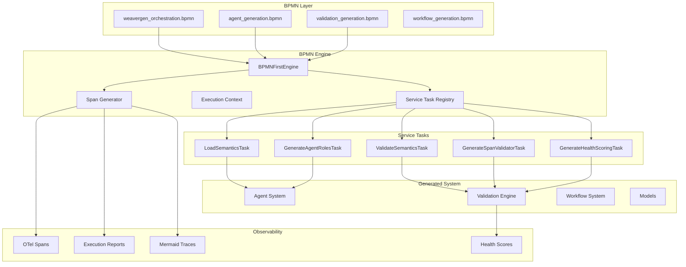
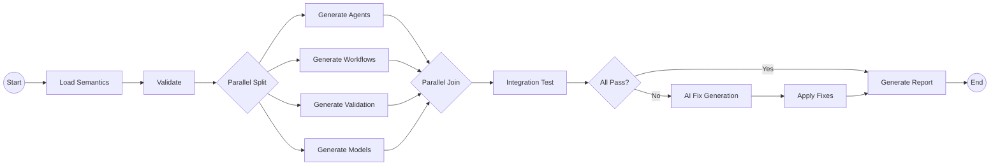
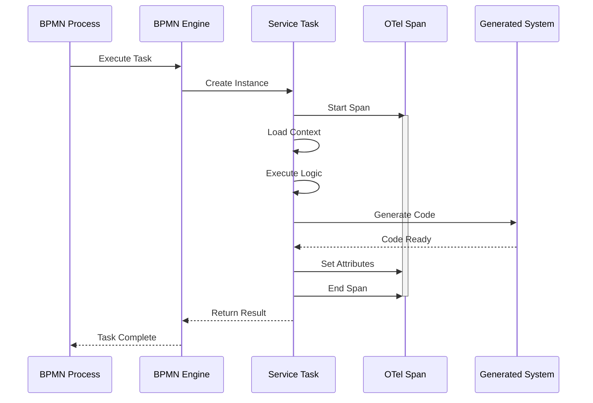
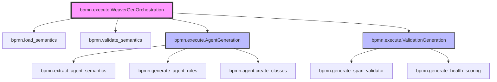
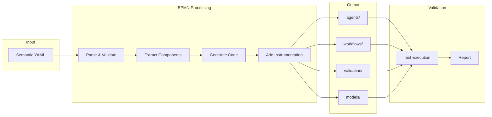

# BPMN-First Architecture Visualization

## System Architecture

## BPMN Process Flow

## Service Task Execution

## Span Hierarchy

## Data Flow

## Key Innovations

1. **BPMN as Code**: Workflows are the source of truth
2. **Visual Programming**: Design workflows in BPMN editors
3. **Full Observability**: Every task generates spans
4. **Parallel Execution**: Built-in concurrent processing
5. **AI Integration**: Service tasks can use LLMs
6. **Self-Validating**: System validates its own generation

This architecture enables teams to:
- Design complex workflows visually
- Execute them with full observability
- Scale through parallel processing
- Debug with visual traces
- Maintain with standard BPMN tools