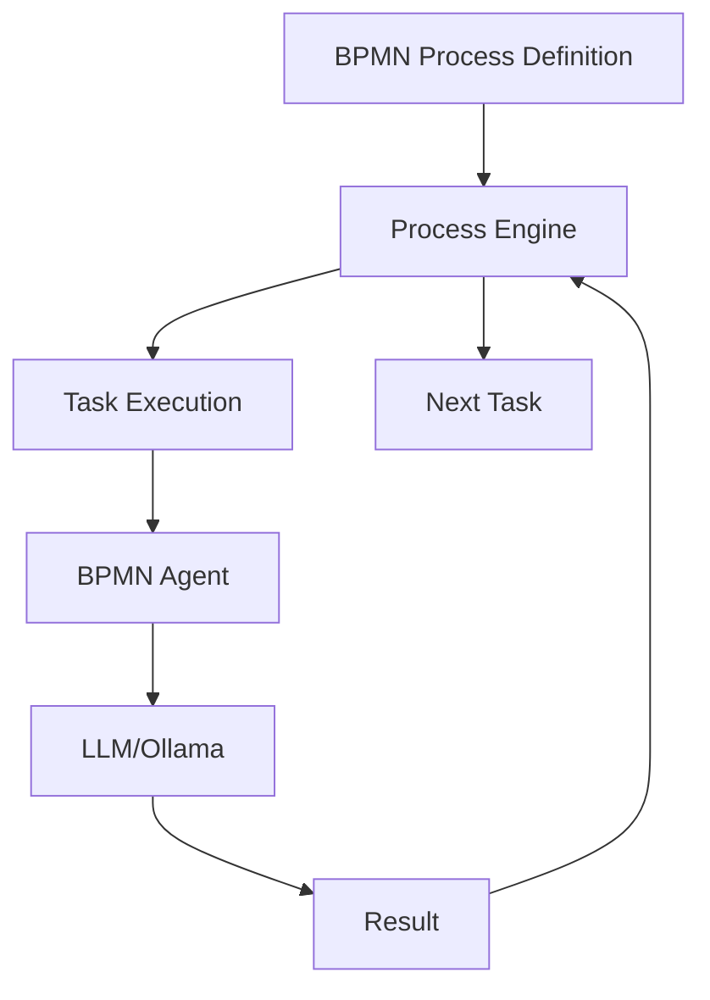

# BPMN-Driven Architecture for WeaverGen

## Core Paradigm Shift

### Before: Agent-to-Agent Communication
```python
# OLD: Agents calling agents
result = await semantic_agent.run("analyze this")
if result.valid:
    code = await python_agent.run(f"generate from {result}")  # Agent decides
```

### After: BPMN-Driven Orchestration
```xml
<!-- NEW: BPMN controls everything -->
<bpmn:serviceTask id="analyze" agent="semantic_agent"/>
<bpmn:exclusiveGateway id="check">
  <bpmn:conditionExpression>result.valid</bpmn:conditionExpression>
</bpmn:exclusiveGateway>
<bpmn:serviceTask id="generate" agent="python_agent"/>
```

## Key Architecture Principles

### 1. **BPMN Process as Controller**
- BPMN processes make ALL decisions
- Agents are pure functions: input → output
- No agent knows about other agents
- Flow control is visual and declarative

### 2. **Stateless Agent Execution**
```python
class BPMNAgent:
    async def execute_task(self, task_definition, context):
        # Agent only knows about its task
        # BPMN tells it what to do
        # Returns result to BPMN
        pass
```

### 3. **Process-Driven Data Flow**
```xml
<bpmn:dataObjectReference id="SemanticData"/>
<bpmn:serviceTask id="validate">
  <bpmn:dataInputAssociation sourceRef="SemanticData"/>
  <bpmn:dataOutputAssociation targetRef="ValidationResult"/>
</bpmn:serviceTask>
```

## Implementation Examples

### Example 1: Pure BPMN Generation
```python
# No agent coordination code!
engine = BPMNProcessEngine()
engine.register_agent("validator", validator_agent)
engine.register_agent("generator", generator_agent)
engine.load_process("generation.bpmn")
result = await engine.execute_process("generate", data)
```

### Example 2: Event-Driven BPMN
```xml
<bpmn:intermediateCatchEvent id="schemaChange">
  <bpmn:messageEventDefinition messageRef="schemaUpdated"/>
</bpmn:intermediateCatchEvent>
<!-- BPMN waits for events, then orchestrates agents -->
```

### Example 3: Hierarchical Processes
```xml
<bpmn:callActivity id="generateModels" calledElement="ModelGenProcess"/>
<bpmn:callActivity id="generateAPIs" calledElement="APIGenProcess"/>
<!-- Subprocesses also use agents, but BPMN controls -->
```

## Benefits of BPMN-First

1. **Visual Programming**
   - See the entire flow at a glance
   - Non-programmers can understand/modify
   - Debugging by following the diagram

2. **True Separation of Concerns**
   - Agents: Domain expertise (HOW)
   - BPMN: Orchestration logic (WHEN/WHAT)
   - Clear boundaries, no coupling

3. **Process Mining & Optimization**
   - Track execution paths
   - Identify bottlenecks visually
   - A/B test different flows

4. **Self-Modifying Systems**
   - BPMN processes can generate other BPMN processes
   - Agents can be "BPMN designers"
   - Meta-level programming becomes visual

## Migration Path

### Phase 1: Current State (Agents Call Agents)
```python
# Tightly coupled agents
await agent1.run_with_tools([agent2, agent3])
```

### Phase 2: BPMN Orchestration (Agents are Tasks)
```xml
<bpmn:process>
  <bpmn:serviceTask agent="agent1"/>
  <bpmn:serviceTask agent="agent2"/>
</bpmn:process>
```

### Phase 3: BPMN-Native (Process IS the Logic)
```xml
<bpmn:process>
  <!-- No code, just process -->
  <weaver:generateCode language="python"/>
</bpmn:process>
```

## Technical Architecture



## Code Structure

```
src/weavergen/bpmn/
├── __init__.py           # Package exports
├── agent.py              # BPMNAgent class
├── engine.py             # BPMNProcessEngine
├── parser.py             # BPMN XML parser
├── examples.py           # Usage examples
└── processes/            # BPMN process definitions
    ├── code_generation.bpmn
    ├── validation.bpmn
    └── optimization.bpmn
```

## Execution Model

1. **Load Process**: Parse BPMN XML into executable format
2. **Register Agents**: Map agent IDs to BPMNAgent instances
3. **Execute Process**: Engine walks through BPMN elements
4. **Task Execution**: When reaching a task, call appropriate agent
5. **Flow Control**: BPMN gateways make all decisions
6. **Data Passing**: Context flows through process

## Future Vision

### Self-Evolving Processes
```python
# BPMN process that improves itself
meta_process = load_bpmn("process_optimizer.bpmn")
improved_process = await engine.execute(meta_process, {
    "current_process": "generation.bpmn",
    "performance_data": metrics
})
```

### Visual Debugging
- Set breakpoints on BPMN elements
- Step through process execution
- Inspect context at each step
- Time-travel debugging

### Process Marketplace
- Share BPMN processes
- Compose complex flows from simple ones
- Community-driven optimization

## Conclusion

BPMN-first architecture transforms WeaverGen from a code generator into a **visual programming environment** where:
- Business logic is visible
- Agents are reusable components
- Processes can evolve themselves
- Programming becomes drawing

The future of code generation is not better templates or smarter agents—it's making code generation a visual, declarative process that anyone can understand and modify.