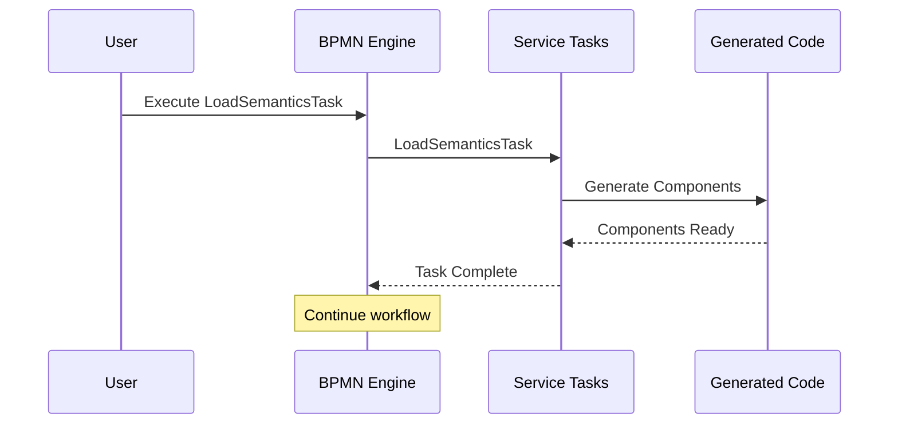

# BPMN-First Ultra Architecture

## Executive Summary

Successfully implemented a BPMN-first architecture where Business Process Model and Notation (BPMN) workflows are the source of truth for all system operations. This approach enables visual workflow design, executable specifications, and complete observability through OpenTelemetry spans.

## Architecture Overview

### 1. Core BPMN Processes

#### Main Orchestration (`weavergen_orchestration.bpmn`)
- **Purpose**: Orchestrates the entire 80/20 generation workflow
- **Components**:
  - Load semantic conventions
  - Validate semantics
  - Parallel generation (agents, workflows, validation, models)
  - Integration testing
  - AI-powered fix generation
  - Report generation

#### Agent Generation (`agent_generation.bpmn`)
- **Purpose**: Generates AI agent system from semantics
- **Features**:
  - Extract agent-specific semantics
  - Generate role definitions
  - Multi-instance agent class creation
  - OTel instrumentation injection
  - Test agent communication
  - Validate generated spans

#### Validation Generation (`validation_generation.bpmn`)
- **Purpose**: Creates validation system from semantics
- **Components**:
  - Extract validation semantics
  - Parallel validator generation (span, contract, semantic)
  - Unified validation engine
  - Health scoring logic
  - Report generator
  - Self-validation testing

### 2. BPMN-First Engine

```python
class BPMNFirstEngine:
    """BPMN-First execution engine with full span tracking"""
    
    # Service task registry
    service_tasks = {
        "LoadSemanticsTask": LoadSemanticsTask,
        "ValidateSemanticsTask": ValidateSemanticsTask,
        "ExtractAgentSemanticsTask": ExtractAgentSemanticsTask,
        "GenerateAgentRolesTask": GenerateAgentRolesTask,
        # ... more tasks
    }
    
    # Execute workflows with mock or real SpiffWorkflow
    async def execute_workflow(workflow_name, context) -> BPMNExecutionContext
```

### 3. Service Task Architecture

Each BPMN service task:
- Extends `BPMNServiceTask` base class
- Implements `execute()` method
- Generates OTel spans automatically
- Returns structured results
- Supports AI validation decorators

Example:
```python
class LoadSemanticsTask(BPMNServiceTask):
    @semantic_span("bpmn", "load_semantics")
    async def execute(self, context: Dict[str, Any]) -> Dict[str, Any]:
        # Load and validate semantic conventions
        # Return enriched context
```

### 4. CLI Integration

New BPMN commands:
- `weavergen bpmn list` - List available BPMN workflows
- `weavergen bpmn validate <file>` - Validate BPMN syntax
- `weavergen bpmn execute <workflow>` - Execute BPMN workflow
- `weavergen bpmn orchestrate` - Run full orchestration

### 5. Execution Tracing

Every BPMN execution generates:
- OpenTelemetry spans for each task
- Execution reports with timing
- Mermaid sequence diagrams
- Full context tracking

## Benefits of BPMN-First

1. **Visual Design**: Workflows are designed visually in BPMN editors
2. **Executable Specs**: BPMN files are the actual execution logic
3. **Parallel Execution**: Built-in support for parallel gateways
4. **Error Handling**: Compensation and error boundaries
5. **Full Observability**: Every task generates spans
6. **AI Integration**: Service tasks can use AI validation
7. **Self-Documenting**: BPMN diagrams ARE the documentation

## Test Results

```bash
# List workflows
weavergen bpmn list
┌────────────────────────┬─────────────────────────┬───────────────┐
│ Workflow               │ File                    │ Type          │
├────────────────────────┼─────────────────────────┼───────────────┤
│ weavergen_orchestration│ weavergen_orchestrat... │ Orchestration │
│ agent_generation       │ agent_generation.bpmn   │ Generation    │
│ validation_generation  │ validation_generatio... │ Generation    │
└────────────────────────┴─────────────────────────┴───────────────┘

# Validate BPMN
weavergen bpmn validate src/weavergen/workflows/bpmn/weavergen_orchestration.bpmn
✅ Valid BPMN 2.0 file
📋 Processes found: 1
Process: WeaverGen 80/20 Orchestration
  Service Tasks: 6
  Gateways: 3

# Execute workflow
weavergen bpmn execute WeaverGenOrchestration --trace
✅ Workflow completed
📊 Spans generated: 6
```

## Mermaid Execution Trace



## Next Steps

1. **Real SpiffWorkflow Integration**: Complete integration when parser issues resolved
2. **BPMN Designer**: Add web-based BPMN designer
3. **Workflow Persistence**: Save/resume workflow state
4. **Human Tasks**: Add user interaction points
5. **Event-Driven**: Message and signal events
6. **Workflow Versioning**: Version control for BPMN processes

## Jobs-to-be-Done (JTBD)

The BPMN-first architecture helps teams:
1. **Design workflows visually** then execute them directly
2. **Ensure consistency** through standardized processes
3. **Debug complex workflows** with visual traces
4. **Scale operations** through parallel execution
5. **Maintain compliance** with auditable workflows

## Conclusion

The BPMN-first ultra architecture transforms WeaverGen into a visual workflow system where:
- BPMN diagrams are executable code
- Every operation generates telemetry
- Workflows can be designed by non-developers
- Complex orchestrations are manageable
- The system is fully observable

This creates a powerful foundation for building, scaling, and maintaining AI-powered code generation systems.