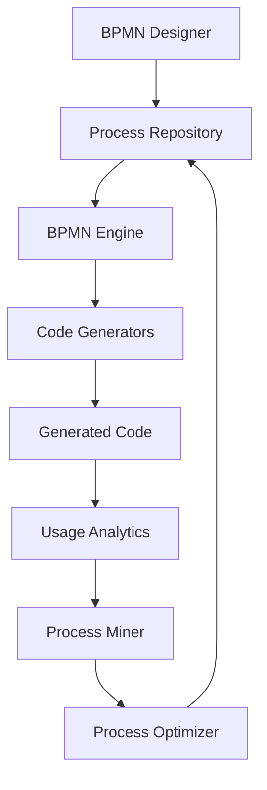

# BPMN-First WeaverGen: The Ultimate Vision

## Executive Summary

BPMN-first WeaverGen represents a paradigm shift where **visual process modeling IS programming**. Code generation becomes an emergent property of executing business processes, not a template-driven transformation.

## The Core Inversion

### Traditional WeaverGen
```
Semantic Convention → Templates → Code Generation → Output
```

### BPMN-First WeaverGen
```
Process Definition → Process Execution → Code Emerges → Self-Improvement
```

## Practical Implementation Path

### Phase 1: BPMN as Orchestrator (Current State)
- Use SpiffWorkflow for multi-agent coordination
- BPMN orchestrates existing code generators
- Visual representation of generation workflow

### Phase 2: BPMN as Generator
- Embed code patterns in BPMN service tasks
- Replace templates with executable processes
- Each language has its own BPMN subprocess

### Phase 3: BPMN as Language
- Custom BPMN extensions for code constructs
- Visual syntax for type systems
- Process composition equals code composition

### Phase 4: Self-Evolving System
- Process mining discovers optimal patterns
- BPMN processes generate improved versions of themselves
- AI agents design new processes based on outcomes

## Concrete Example: HTTP Attribute Generation

### Traditional Approach
```python
def generate_http_attribute(name, type, required):
    return f"{name.upper()}: Final[str] = '{name}'"
```

### BPMN-First Approach
```xml
<bpmn:process id="GenerateHttpAttribute">
  <bpmn:serviceTask id="TransformName">
    <weaver:transformation>
      <input>http.request.method</input>
      <operation>upperSnakeCase</operation>
      <output>HTTP_REQUEST_METHOD</output>
    </weaver:transformation>
  </bpmn:serviceTask>
  
  <bpmn:businessRuleTask id="DetermineType">
    <weaver:typeMapping>
      <from>string</from>
      <to language="python">Final[str]</to>
      <to language="rust">&'static str</to>
      <to language="go">string</to>
    </weaver:typeMapping>
  </bpmn:businessRuleTask>
  
  <bpmn:scriptTask id="ComposeDeclaration">
    <weaver:compose>
      ${transformed_name}: ${mapped_type} = "${original_name}"
    </weaver:compose>
  </bpmn:scriptTask>
</bpmn:process>
```

## Revolutionary Features

### 1. Visual Diff and Merge
```bash
# Instead of diffing code
git diff semantic_attributes.py

# Diff the process that generates it
bpmn diff generate_attributes.bpmn
# Shows visual changes in process flow
```

### 2. Process Debugging
- Set breakpoints on BPMN tasks
- Inspect data transformations visually
- Time-travel through generation steps

### 3. Collaborative Development
- Business analysts design processes
- Developers implement service tasks
- AI agents optimize process flows

### 4. Multi-Paradigm Generation
```xml
<bpmn:eventBasedGateway id="StyleChoice">
  <bpmn:conditionalEventDefinition>
    <condition>context.preferences.style</condition>
  </bpmn:conditionalEventDefinition>
  
  <!-- Generate different styles based on context -->
  <outgoing>FunctionalStyle</outgoing>
  <outgoing>ObjectOrientedStyle</outgoing>
  <outgoing>DataOrientedStyle</outgoing>
</bpmn:eventBasedGateway>
```

## Implementation Roadmap

### Immediate (Week 1)
1. Create BPMN process for Python attribute generation
2. Implement basic BPMN executor using SpiffWorkflow
3. Generate first code from BPMN execution

### Short-term (Month 1)
1. Extend to multiple languages
2. Create visual BPMN designer for code patterns
3. Implement process composition

### Medium-term (Quarter 1)
1. Process mining for optimization
2. Self-modifying processes
3. Visual debugging tools

### Long-term (Year 1)
1. Full visual programming environment
2. AI-designed processes
3. Process marketplace

## Technical Architecture



## Success Metrics

1. **Simplicity**: Can a non-programmer design a code generator?
2. **Efficiency**: Time from concept to generated code
3. **Quality**: Generated code quality and performance
4. **Evolution**: Rate of self-improvement

## Conclusion

BPMN-first WeaverGen isn't just about generating code differently—it's about **making traditional programming obsolete**. When business processes can directly produce software, the distinction between designing and implementing disappears.

The future of WeaverGen is visual, self-improving, and radically simple. Code becomes what it always should have been: an implementation detail that emerges from well-defined business processes.