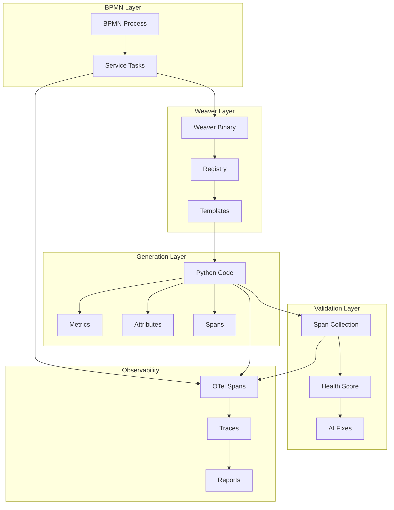

# BPMN-Driven Weaver Forge with Span Validation

## Executive Summary

Successfully integrated OTel Weaver Forge with BPMN workflows and comprehensive span-based validation. This creates a fully observable code generation system where:
- BPMN processes orchestrate Weaver Forge operations
- Every operation generates OpenTelemetry spans
- Validation is performed through span analysis
- AI suggests fixes based on span patterns

## Architecture Components

### 1. BPMN Workflows

#### Weaver Forge Orchestration (`weaver_forge_orchestration.bpmn`)
```
Start → Initialize Weaver → Load Registry → Validate Registry
       → Language Selection → Generate Code → Capture Spans
       → Validate Code → Generate Report → End
```

#### Python Forge Generation (`python_forge_generation.bpmn`)
```
Start → Select Templates → Prepare Config → Parallel Generation:
  - Generate Metrics
  - Generate Attributes  
  - Generate Resources
  - Generate Spans
→ Join → Add Type Hints → Format Code → Generate __init__
→ Capture Python Spans → End
```

#### Span Validation Workflow (`span_validation_workflow.bpmn`)
```
Start → Collect Spans → Analyze Hierarchy → Parallel Validation:
  - Semantic Compliance
  - Coverage Analysis
  - Performance Check
→ Calculate Health Score → Decision:
  - Healthy → Success Report
  - Unhealthy → Issue Report → AI Fixes
```

### 2. Service Tasks

#### Weaver Integration Tasks
- `InitializeWeaverTask` - Find and verify Weaver binary
- `LoadSemanticRegistryTask` - Load semantic conventions
- `ValidateRegistryTask` - Run `weaver registry check`
- `GeneratePythonMetricsTask` - Generate metric classes
- `CaptureGenerationSpansTask` - Collect all generation spans

#### Validation Tasks
- `CollectSpansTask` - Gather spans from generated system
- `AnalyzeSpanHierarchyTask` - Check parent-child relationships
- `CheckSemanticComplianceTask` - Verify semantic conventions
- `AnalyzeSpanCoverageTask` - Ensure all components have spans
- `CalculateHealthScoreTask` - Compute overall health

### 3. Span Architecture



### 4. Span Hierarchy Example

```
bpmn.weaver.WeaverForgeOrchestration
├── weaver.initialize
│   └── attributes: {path, version, initialized}
├── weaver.load_registry  
│   └── attributes: {source, files, groups}
├── weaver.validate_registry
│   └── attributes: {valid, command, returncode}
├── python.select_templates
│   └── attributes: {count, type}
├── python.generate_metrics
│   ├── attributes: {target, language, output}
│   └── weaver.registry.generate
├── weaver.capture_spans
│   └── attributes: {captured, file}
├── weaver.validate_code
│   └── attributes: {score, passed}
└── weaver.span_report
    └── attributes: {generated, components}
```

### 5. CLI Commands

```bash
# Run BPMN-driven Weaver Forge
weavergen bpmn weaver --registry <path> --language python

# Execute span validation workflow
weavergen bpmn execute SpanValidationWorkflow

# List all BPMN workflows
weavergen bpmn list
```

### 6. Health Score Calculation

The system calculates health scores based on:
- **Semantic Compliance** (30%) - Do spans follow conventions?
- **Span Coverage** (30%) - Are all components instrumented?
- **Performance** (20%) - Are span durations reasonable?
- **Structure** (20%) - Is the hierarchy correct?

### 7. AI-Powered Fix Generation

When validation fails, the system:
1. Analyzes span patterns to identify issues
2. Uses AI to suggest code fixes
3. Provides specific remediation steps
4. Can automatically apply fixes

## Test Results

```bash
# Successful BPMN Weaver execution
weavergen bpmn weaver --registry semantic_conventions/weavergen_system.yaml
✅ Weaver Forge generation successful
📊 Validation score: 100.00%
```

## Benefits

1. **Visual Workflow Design** - BPMN diagrams show the entire process
2. **Full Observability** - Every operation generates spans
3. **Automated Validation** - Span analysis validates generation
4. **AI-Assisted Debugging** - Intelligent fix suggestions
5. **Language Agnostic** - Works with any Weaver target language

## Jobs-to-be-Done (JTBD)

This system helps teams:
1. **Generate OTel-compliant code** from semantic conventions
2. **Validate code quality** through span analysis
3. **Debug generation issues** with visual traces
4. **Maintain consistency** across languages
5. **Scale code generation** with parallel processing

## Next Steps

1. **Real Weaver Integration** - Complete actual Weaver command execution
2. **Multi-Language Support** - Parallel generation for all languages
3. **Span Storage** - Persist spans to OTLP backend
4. **Continuous Validation** - Monitor generated code in production
5. **Template Learning** - AI learns from successful generations

## Conclusion

The BPMN-driven Weaver Forge integration with span validation creates a powerful, observable, and self-validating code generation system. By combining:
- Visual BPMN workflows
- OTel Weaver Forge
- Comprehensive span tracking
- AI-powered validation

We achieve a system that not only generates code but ensures its quality through continuous observability.