# Enhanced BPMN Architecture: Complete System Overview

## 🎯 The Complete Enhanced BPMN-First Vision

This diagram shows how we transform WeaverGen from scattered complexity into unified power:


## 🔄 Data Flow: How It All Works Together


## 📊 The Transformation: Before vs After

### Current State (Complex)


### Enhanced State (Clear)


## 🎯 Key Benefits Visualized

### 1. Unified Access Pattern

```mermaid
flowchart TD
    Start([User Needs Code Generation]) --> Simple{Simple Use Case?}
    
Simple -->|Yes| CLI[weavergen run workflow.bpmn]
CLI --> Result[Generated Code + Report]

Simple -->|No| Studio[weavergen studio]
Studio --> Design[Visual Workflow Design]
Design --> Execute[Execute Custom Workflow]
Execute --> Result

Simple -->|Explore| Catalog[weavergen tasks --search ai]
Catalog --> Discover[Discover Available Tasks]
Discover --> Learn[Copy BPMN Examples]
Learn --> Design

Result --> Success([✅ Success])

classDef userAction fill:#e3f2fd,stroke:#2196f3
classDef systemAction fill:#e8f5e8,stroke:#4caf50
classDef outcome fill:#fff3e0,stroke:#ff9800

class Start,Success userAction
class CLI,Studio,Catalog,Design,Execute,Discover,Learn systemAction
class Result outcome
```


### 2. Progressive Complexity
```mermaid
graph TD
    Level1[Level 1: Simple CLI<br/>weavergen run workflow.bpmn] 
    Level2[Level 2: Interactive Discovery<br/>weavergen tasks --search]
    Level3[Level 3: Visual Design<br/>weavergen studio]
    Level4[Level 4: Full API<br/>UnifiedBPMNEngine()]
    
    Level1 --> Level2
    Level2 --> Level3
    Level3 --> Level4
    
    Level1 -.-> Users1[80% of Users<br/>Just want it to work]
    Level2 -.-> Users2[15% of Users<br/>Want to explore]
    Level3 -.-> Users3[4% of Users<br/>Need customization]
    Level4 -.-> Users4[1% of Users<br/>Power users]
    
    classDef level fill:#e8f5e8,stroke:#4caf50
    classDef users fill:#e3f2fd,stroke:#2196f3
    
    class Level1,Level2,Level3,Level4 level
    class Users1,Users2,Users3,Users4 users
```

## 🚀 Implementation Priority Matrix


## 🎉 The Vision Realized

This enhanced BPMN-first architecture delivers:

### ✅ **All Power Preserved**
- Every existing service task
- All BPMN engines available
- Complete functionality retained
- Enterprise-grade capabilities

### ✅ **80% Easier to Use**
- 4 simple CLI commands
- Self-documenting task catalog
- Visual workflow designer
- Real-time debugging tools

### ✅ **Progressive Discovery**
- Start simple, scale complexity
- Learn through interaction
- Visual feedback loops
- Clear upgrade paths

### ✅ **Future-Ready Architecture**
- Extensible service registry
- Plugin-based task system
- Enterprise integrations
- AI-powered optimization

## 💬 The Philosophy

> "The best revolution preserves all value while removing all friction."

The Enhanced BPMN-First WeaverGen is not about removing features - it's about making powerful features accessible to everyone. We're not simplifying the system; we're simplifying the **experience** of using a complex system.

**Same power. Better journey. All possibilities unlocked.**