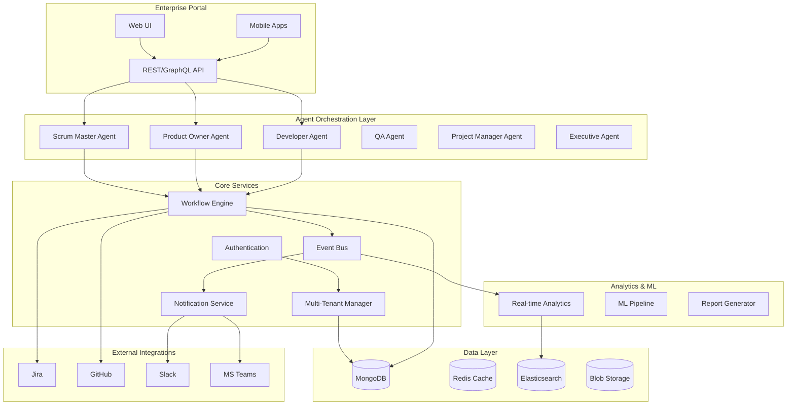

# Enterprise Scrum at Scale - SAS Architecture

## 🏢 Enterprise SAS Capabilities Overview

### Core SAS Features Required:
1. **Multi-Tenancy** - Isolated environments per organization
2. **Scalability** - Handle thousands of teams and projects
3. **Security** - Enterprise-grade authentication and authorization
4. **Analytics** - Real-time dashboards and reporting
5. **Integration** - APIs and webhook support
6. **Compliance** - Audit trails and governance
7. **Customization** - Configurable workflows per tenant
8. **High Availability** - 99.9% uptime with redundancy

## 🏗️ System Architecture

## 🤖 Agent Architecture

### 1. Scrum Master Agent
- **Responsibilities**: Sprint planning, daily standups, retrospectives
- **Capabilities**: 
  - Automated sprint planning based on velocity
  - Impediment detection and resolution
  - Team performance analytics
  - Risk assessment and mitigation

### 2. Product Owner Agent
- **Responsibilities**: Backlog management, requirement analysis
- **Capabilities**:
  - User story generation and refinement
  - Priority optimization based on business value
  - Stakeholder communication
  - Release planning

### 3. Developer Agent
- **Responsibilities**: Code analysis, task estimation, technical debt
- **Capabilities**:
  - Story point estimation using historical data
  - Code review assistance
  - Technical risk assessment
  - Architecture recommendations

### 4. QA Agent
- **Responsibilities**: Test planning, quality metrics, defect analysis
- **Capabilities**:
  - Test case generation
  - Quality gate enforcement
  - Defect prediction
  - Test automation recommendations

### 5. Project Manager Agent
- **Responsibilities**: Portfolio management, resource allocation
- **Capabilities**:
  - Cross-team dependency management
  - Resource optimization
  - Timeline prediction
  - Budget tracking

### 6. Executive Agent
- **Responsibilities**: Strategic insights, KPI tracking
- **Capabilities**:
  - Business value analytics
  - ROI calculations
  - Strategic recommendation generation
  - Executive reporting

## 🏢 Multi-Tenant Architecture

### Tenant Isolation Levels:
1. **Database Level**: Separate databases per tenant
2. **Schema Level**: Shared database, separate schemas
3. **Row Level**: Shared tables with tenant_id filtering
4. **Application Level**: Separate application instances

### Scaling Strategy:
- **Horizontal**: Auto-scaling agent pools
- **Vertical**: Dynamic resource allocation
- **Geographic**: Multi-region deployment
- **Performance**: Caching and CDN integration

## 📊 Enterprise Analytics

### Real-time Dashboards:
1. **Team Performance**: Velocity, burndown, cycle time
2. **Quality Metrics**: Defect rates, test coverage, technical debt
3. **Business Value**: Feature adoption, ROI, customer satisfaction
4. **Predictive Analytics**: Sprint success probability, delivery dates
5. **Portfolio View**: Cross-team dependencies, resource utilization

### Compliance and Auditing:
- **SOX Compliance**: Financial process tracking
- **GDPR**: Data privacy and retention
- **SOC 2**: Security and availability controls
- **HIPAA**: Healthcare data protection (if applicable)

## 🔐 Security Architecture

### Authentication & Authorization:
- **SSO Integration**: SAML, OAuth 2.0, OpenID Connect
- **Role-Based Access Control**: Fine-grained permissions
- **API Security**: JWT tokens, rate limiting
- **Data Encryption**: At rest and in transit

### Enterprise Features:
- **Audit Logging**: Complete action history
- **IP Whitelisting**: Network-level security
- **Two-Factor Authentication**: Additional security layer
- **Data Loss Prevention**: Sensitive data protection

## 🔗 Integration Capabilities

### Native Integrations:
- **Development Tools**: GitHub, GitLab, Bitbucket, Azure DevOps
- **Communication**: Slack, Microsoft Teams, Discord
- **Project Management**: Jira, Azure Boards, Asana
- **CI/CD**: Jenkins, GitHub Actions, CircleCI
- **Monitoring**: Datadog, New Relic, Splunk

### API-First Architecture:
- **REST APIs**: Full CRUD operations
- **GraphQL**: Flexible data queries
- **Webhooks**: Real-time event notifications
- **Bulk APIs**: Large-scale data operations

## 🚀 Implementation Phases

### Phase 1: Core Foundation (Weeks 1-4)
- Multi-tenant infrastructure
- Basic Scrum agents
- Authentication system
- Core data models

### Phase 2: Advanced Features (Weeks 5-8)
- Advanced agent capabilities
- Analytics dashboard
- Integration framework
- Mobile support

### Phase 3: Enterprise Features (Weeks 9-12)
- Compliance features
- Advanced security
- Performance optimization
- Global deployment

### Phase 4: AI/ML Enhancement (Weeks 13-16)
- Predictive analytics
- Intelligent recommendations
- Automated decision making
- Advanced reporting

## 💡 Competitive Advantages

1. **AI-Native**: Built-in intelligence for every Scrum activity
2. **No-Code Automation**: Visual workflow builders
3. **Predictive Insights**: ML-powered forecasting
4. **Unified Platform**: All Scrum needs in one system
5. **Enterprise-Ready**: Built for scale from day one