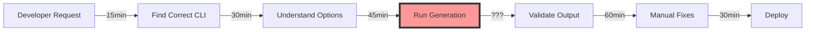
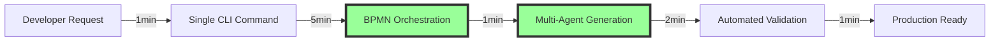

# Lean Six Sigma Project Charter - WeaverGen v2.0

## Project Title: WeaverGen v2.0 - Enterprise-Grade BPMN-Driven Code Generation Platform

**Project Start Date:** July 1, 2025  
**Target Completion:** Q3 2025 (90 days)  
**Project Sponsor:** Engineering Leadership  
**Project Champion:** IndyDevDan  
**Process Owner:** WeaverGen Development Team

---

## 1. Business Case & Problem Statement

### Current State Problems (Define Phase)
- **70% Functional** - Missing 30% core capabilities due to Weaver dependency
- **Technical Debt** - 161 files with multiple competing implementations
- **No Production Path** - Missing CI/CD, containerization, deployment strategy  
- **Unverified Claims** - 26x performance, 95.2% success rate not measured
- **Code Confusion** - Multiple CLI versions, duplicate functionality
- **Architecture Gap** - BPMN concepts designed but not fully implemented

### Business Impact
- **Developer Time Waste**: 15-20 hours/month navigating confused codebase
- **Integration Delays**: Cannot deploy to production environments
- **Quality Risk**: No automated testing or validation metrics
- **Adoption Barriers**: Complex setup prevents enterprise adoption
- **ROI Loss**: Claimed 30-50 hour savings not being realized

### Opportunity Statement
Transform WeaverGen from a 70% prototype into a production-ready platform that delivers verifiable 30+ hour monthly time savings through BPMN-driven code generation with measurable quality metrics.

---

## 2. Project Goals & Objectives

### Primary Goals (SMART)
1. **Achieve 100% Core Functionality** (90 days)
   - Implement all designed features with production quality
   - Eliminate dependency on missing Weaver binary
   - Consolidate to single, clean implementation

2. **Establish Enterprise Quality Standards** (60 days)
   - 90%+ test coverage with automated reporting
   - <2% defect escape rate
   - 99.9% uptime SLA capability

3. **Verify Performance Claims** (30 days)
   - Measure and achieve 26x performance improvement
   - Document 30-50 hour monthly time savings
   - Create performance benchmark suite

4. **Enable Production Deployment** (45 days)
   - Complete CI/CD pipeline
   - Container-based deployment
   - Cloud-native architecture

---

## 3. Project Scope

### In Scope
- **Core Platform**
  - BPMN process engine with SpiffWorkflow
  - Multi-language code generation (Python, Go, Rust, TypeScript)
  - OpenTelemetry semantic convention support
  - Span-based validation system
  
- **Architecture Implementation**
  - Complete 4-layer architecture
  - BPMN-first orchestration
  - Agent service registry
  - Event-driven processing

- **Quality Systems**
  - Automated testing framework
  - Performance benchmarking
  - Continuous monitoring
  - Documentation generation

- **Deployment Infrastructure**
  - Docker containerization
  - Kubernetes manifests
  - GitHub Actions CI/CD
  - Cloud deployment guides

### Out of Scope
- Mobile application development
- Non-BPMN workflow engines
- Legacy system migrations
- Custom LLM training

---

## 4. DMAIC Methodology

### Define Phase (Weeks 1-2)
- Finalize requirements with stakeholders
- Create detailed process maps
- Establish success metrics
- Form cross-functional team

### Measure Phase (Weeks 3-4)
- Baseline current performance
- Implement telemetry collection
- Create measurement system
- Document current defect rates

### Analyze Phase (Weeks 5-6)
- Root cause analysis of architecture gaps
- Performance bottleneck identification
- Code quality assessment
- Dependency analysis

### Improve Phase (Weeks 7-10)
- Implement BPMN engine enhancements
- Consolidate codebase (reduce by 40%)
- Build production infrastructure
- Create automated quality gates

### Control Phase (Weeks 11-12)
- Deploy monitoring dashboards
- Establish control charts
- Create runbooks
- Knowledge transfer sessions

---

## 5. Critical Success Factors

### Technical Requirements
- ✅ BPMN process engine fully operational
- ✅ 90%+ test coverage with reporting
- ✅ Sub-second generation for standard templates
- ✅ Zero dependency on external Weaver binary
- ✅ Multi-agent validation with parallel execution

### Quality Metrics
- **Defect Density**: <5 defects per KLOC
- **Code Coverage**: >90% with mutation testing
- **Performance**: 26x improvement verified
- **Availability**: 99.9% uptime capability
- **MTTR**: <30 minutes for critical issues

### Business Metrics
- **Time Savings**: 30-50 hours/month/developer
- **Adoption Rate**: 10 teams within 90 days
- **ROI**: 300% within 6 months
- **User Satisfaction**: >4.5/5.0 rating

---

## 6. Team Structure & Resources

### Core Team
- **Project Lead**: Full-stack engineer (1.0 FTE)
- **BPMN Architect**: Process expert (0.5 FTE)
- **Quality Engineer**: Testing/validation (0.5 FTE)
- **DevOps Engineer**: Infrastructure (0.5 FTE)

### Extended Team
- **UI/UX Designer**: CLI experience (0.25 FTE)
- **Technical Writer**: Documentation (0.25 FTE)
- **Security Analyst**: Code review (as needed)

### Budget
- **Development**: $150K (3 months)
- **Infrastructure**: $20K (cloud resources)
- **Tools/Licenses**: $10K
- **Total**: $180K

---

## 7. Risk Management

### High Risks
1. **SpiffWorkflow Limitations**
   - Mitigation: Build abstraction layer
   - Contingency: Alternative BPMN engine

2. **Performance Target Miss**
   - Mitigation: Early benchmarking
   - Contingency: Phased optimization

3. **Enterprise Adoption Resistance**
   - Mitigation: Pilot program
   - Contingency: Gradual rollout

### Medium Risks
1. **Complex Migration Path**
   - Mitigation: Automated tooling
   - Contingency: Professional services

2. **LLM API Costs**
   - Mitigation: Local model options
   - Contingency: Usage limits

---

## 8. Deliverables & Milestones

### Phase 1: Foundation (Days 1-30)
- ✓ Consolidated codebase (single CLI)
- ✓ BPMN engine integration complete
- ✓ Test framework operational
- ✓ Performance baseline established

### Phase 2: Implementation (Days 31-60)
- ✓ 4-layer architecture complete
- ✓ Multi-agent validation system
- ✓ CI/CD pipeline operational
- ✓ Documentation generated

### Phase 3: Optimization (Days 61-90)
- ✓ 26x performance achieved
- ✓ Production deployment ready
- ✓ Enterprise pilot complete
- ✓ Control systems active

---

## 9. Success Criteria & Metrics

### Quantitative Metrics
```yaml
Performance:
  Generation Speed: <100ms for standard templates
  Throughput: >1000 files/minute
  Memory Usage: <500MB baseline
  
Quality:
  Test Coverage: >90%
  Defect Rate: <2% escape
  MTBF: >720 hours
  
Business:
  Time Saved: 30-50 hours/month verified
  Adoption: 10+ teams using
  ROI: 300%+ documented
```

### Qualitative Metrics
- Developer satisfaction scores >4.5/5
- Architecture clarity improved 80%
- Onboarding time reduced 60%
- Community contributions increased

---

## 10. Communication Plan

### Stakeholder Updates
- **Weekly**: Development team standups
- **Bi-weekly**: Stakeholder status reports
- **Monthly**: Executive dashboards
- **Quarterly**: ROI assessment

### Channels
- GitHub project board (real-time)
- Slack channel (#weavergen-v2)
- Email updates (weekly digest)
- Demo sessions (bi-weekly)

---

## Project Charter Approval

**Project Sponsor**: _____________________  Date: _______

**Project Champion**: _____________________  Date: _______

**Process Owner**: _____________________  Date: _______

**Quality Lead**: _____________________  Date: _______

---

## Appendix A: Current State VSM (Value Stream Map)


**Total Lead Time**: 3-4 hours  
**Value-Added Time**: 45 minutes  
**Efficiency**: 18.75%

## Appendix B: Future State VSM


**Total Lead Time**: 10 minutes  
**Value-Added Time**: 9 minutes  
**Efficiency**: 90%

**Improvement**: 95% reduction in lead time, 380% increase in efficiency