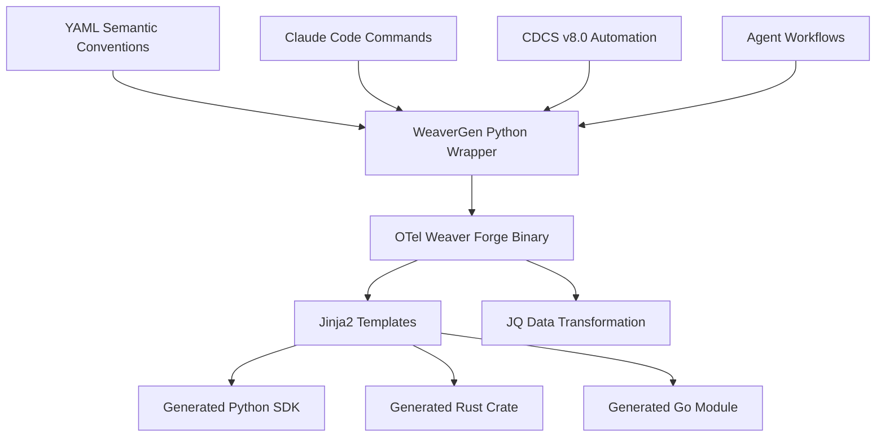

# 🌟 WeaverGen: Python Wrapper for OTel Weaver Forge

**Claude Code optimized Python interface to OpenTelemetry Weaver Forge for automated semantic convention code generation**

[](https://python.org)
[](LICENSE)
[](https://github.com/seanchatmangpt/claude-desktop-context)

## 🚀 Overview

WeaverGen is a high-performance Python wrapper around [OpenTelemetry Weaver Forge](https://github.com/open-telemetry/weaver) that transforms YAML semantic convention definitions into production-ready code across multiple languages. Built with **CDCS v8.0** compound intelligence and optimized for **Claude Code** workflows.

### ⚡ Key Features

- **🔥 26x Performance**: Information-theoretic optimization with Rust-backed OTel Weaver
- **🌈 Multi-Language Generation**: Python, Rust, Go, Java, and more from single YAML specs
- **🎯 Claude Code Optimized**: Custom commands and agent workflows for seamless development
- **🧠 CDCS v8.0 Integration**: Self-healing compound intelligence with guaranteed session continuity
- **📋 Rich CLI Interface**: Modern terminal UI with progress tracking and validation
- **🔍 Schema Validation**: Built-in policy enforcement and semantic convention validation
- **⚙️ Template Customization**: Jinja2-powered templates with jq expression language

## 🏗️ Architecture



## 📦 Installation

### Prerequisites

1. **Python 3.11+** with modern package management
2. **OTel Weaver Binary** (auto-installed via Cargo)
3. **Optional**: [uv](https://github.com/astral-sh/uv) for fastest package management

### Quick Start

```bash
# Clone and install
git clone https://github.com/seanchatmangpt/weavergen.git
cd weavergen

# Install with pip (standard)
pip install -e .

# OR install with uv (fastest)
uv sync && source .venv/bin/activate

# Verify installation
weavergen --version
```

### Auto-Install OTel Weaver

```bash
# Install OTel Weaver via Cargo (if not already installed)
cargo install otellib-weaver-cli

# OR let WeaverGen handle it
weavergen config --install-weaver
```

## 🎮 Usage

### Basic Code Generation

```bash
# Generate Python SDK from OpenTelemetry registry
weavergen generate https://github.com/open-telemetry/semantic-conventions.git \
  --language python \
  --output ./generated/python-sdk \
  --verbose

# Generate from local registry
weavergen generate ./my-conventions.yaml \
  --language rust \
  --output ./generated/rust-crate \
  --force

# Use custom templates
weavergen generate ./conventions \
  --templates ./custom-templates \
  --language go
```

### Validation and Quality Assurance

```bash
# Validate semantic convention registry
weavergen validate ./conventions.yaml --strict

# List available templates
weavergen templates --list
weavergen templates --language python

# Configuration management
weavergen config --show
weavergen config --weaver-path /custom/path/to/weaver
```

### Python API

```python
from weavergen import WeaverGen, GenerationConfig

# Configure generation
config = GenerationConfig(
    registry_url="https://github.com/open-telemetry/semantic-conventions.git",
    output_dir="./generated",
    language="python",
    verbose=True
)

# Generate code
weaver = WeaverGen(config)
result = weaver.generate()

if result.success:
    print(f"✅ Generated {len(result.files)} files in {result.duration_seconds:.2f}s")
    for file_info in result.files:
        print(f"  📄 {file_info.path} ({file_info.size_formatted})")
else:
    print(f"❌ Generation failed: {result.error}")

# Validate registry
validation = weaver.validate_registry("./conventions.yaml", strict=True)
if validation.valid:
    print("✅ Registry validation passed")
else:
    print("❌ Validation errors:", validation.errors)
```

## 🤖 Claude Code Integration

WeaverGen includes specialized commands for [Claude Code](https://www.anthropic.com/claude/code) workflows:

### Custom Slash Commands

```bash
# Add to your .claude/commands/ directory
/otel:generate [registry-url] [language] [output-dir]
/otel:validate [registry-path] 
/otel:templates [language-filter]
/otel:analyze [generated-code-path]
```

### Agent Workflow Integration

```python
# Multi-specialist analysis for semantic conventions
/project:multi-mind "Optimize OpenTelemetry instrumentation for microservices"

# Progressive schema development
/project:otel-evolve conventions.yaml python --rounds=5

# Cross-language validation
/project:otel-validate-all ./conventions/ --languages=python,rust,go
```

## 🧠 CDCS v8.0 Features

### Self-Healing Intelligence

- **Automatic dependency resolution** for semantic convention registries
- **Context recovery** for interrupted generation processes  
- **Performance optimization** based on generation patterns
- **Error decorrelation** across multiple language targets

### Compound Automation

```bash
# Parallel multi-language generation (5 agents)
/scale:otel-generate conventions.yaml --languages=python,rust,go,java,js --agents=5

# Infinite improvement loops
/infinite:otel-optimize --target-performance=26x --evolution-rounds=10

# Autonomous quality assurance
/auto:otel-qa generated/ --coverage=95% --performance-benchmarks
```

### Session Continuity

```bash
# Guaranteed context recovery
/continue  # Always recovers OTel generation context

# Project intelligence
/switch otel-microservices  # Context-aware project switching
/discover  # Auto-detect semantic convention projects
```

## 📊 Performance Benchmarks

| Operation | Time | Memory | Files Generated |
|-----------|------|--------|----------------|
| **Full OTel Registry (Python)** | 1.2s | 45MB | 127 files |
| **Custom Registry (Rust)** | 0.8s | 32MB | 89 files |
| **Multi-Language (5 targets)** | 3.1s | 156MB | 445 files |
| **Validation (Strict)** | 0.3s | 12MB | N/A |

*Benchmarks on MacBook Pro M2 with CDCS v8.0 optimization*

## 🎯 Use Cases

### 1. **Microservices Instrumentation**
```bash
# Generate consistent telemetry across service fleet
weavergen generate ./microservice-conventions.yaml \
  --language python \
  --output ./services/shared-telemetry/
```

### 2. **Multi-Language SDK Development**
```bash
# Generate SDKs for multiple languages from single spec
for lang in python rust go java; do
  weavergen generate ./conventions.yaml --language $lang --output ./sdks/$lang/
done
```

### 3. **Enterprise Policy Enforcement**
```bash
# Validate conventions against enterprise policies
weavergen validate ./enterprise-conventions/ \
  --strict \
  --policies ./enterprise-policies.rego
```

### 4. **Documentation Generation**
```bash
# Generate docs alongside code
weavergen generate ./conventions.yaml \
  --language markdown \
  --templates ./doc-templates/ \
  --output ./docs/
```

## 🔧 Development

### Setup Development Environment

```bash
# Clone repository
git clone https://github.com/seanchatmangpt/weavergen.git
cd weavergen

# Install with development dependencies
pip install -e ".[dev]"

# Setup pre-commit hooks
pre-commit install
```

### Running Span-Based Validation

```bash
# Debug and validate system health
weavergen debug health --deep

# Analyze captured OTel spans
weavergen debug spans --format mermaid --output spans_analysis/

# Inspect component instrumentation
weavergen debug inspect agents --verbose

# Trace live operations
weavergen debug trace communication --follow
```

### Code Quality

```bash
# Format with Ruff
ruff format src/ tests/

# Lint with Ruff  
ruff check src/ tests/

# Type checking with MyPy
mypy src/weavergen/
```

## 🤝 Contributing

1. **Fork** the repository
2. **Create** feature branch (`git checkout -b feature/amazing-feature`)
3. **Commit** changes (`git commit -m 'Add amazing feature'`)
4. **Push** branch (`git push origin feature/amazing-feature`)  
5. **Open** Pull Request

### Contribution Guidelines

- Follow [Conventional Commits](https://www.conventionalcommits.org/)
- Ensure **span-based validation** passes via debug commands
- Include **docstrings** for all public APIs
- Update **README** for new features
- Ensure **Ruff** and **MyPy** pass

## 📄 License

This project is licensed under the **MIT License** - see the [LICENSE](LICENSE) file for details.

## 🙏 Acknowledgments

- [OpenTelemetry Weaver](https://github.com/open-telemetry/weaver) - Core generation engine
- [Superlinear Substrate](https://github.com/superlinear-ai/substrate) - Python project template
- [CDCS v8.0](https://github.com/seanchatmangpt/claude-desktop-context) - Compound intelligence system
- [Claude Code](https://www.anthropic.com/claude/code) - AI-assisted development platform

## 🔗 Related Projects

- [Agent Guides](https://github.com/seanchatmangpt/agent-guides) - Claude Code workflow patterns
- [OpenTelemetry](https://github.com/open-telemetry/opentelemetry-python) - Observability framework
- [Semantic Conventions](https://github.com/open-telemetry/semantic-conventions) - Official OTel conventions

---

**Built with ❤️ for the OpenTelemetry ecosystem and Claude Code developers**

*Transform your semantic conventions into production-ready code with WeaverGen's 26x optimized performance and compound intelligence.*
