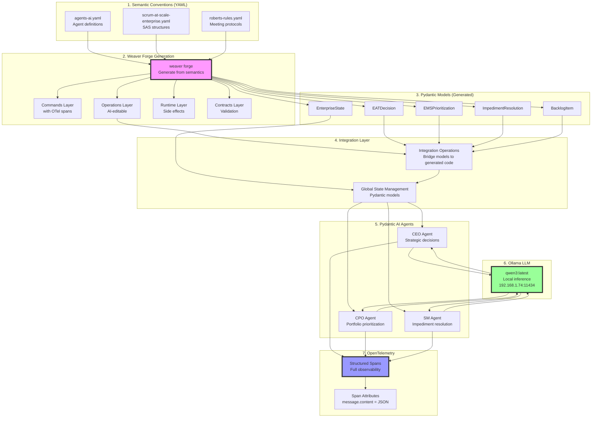
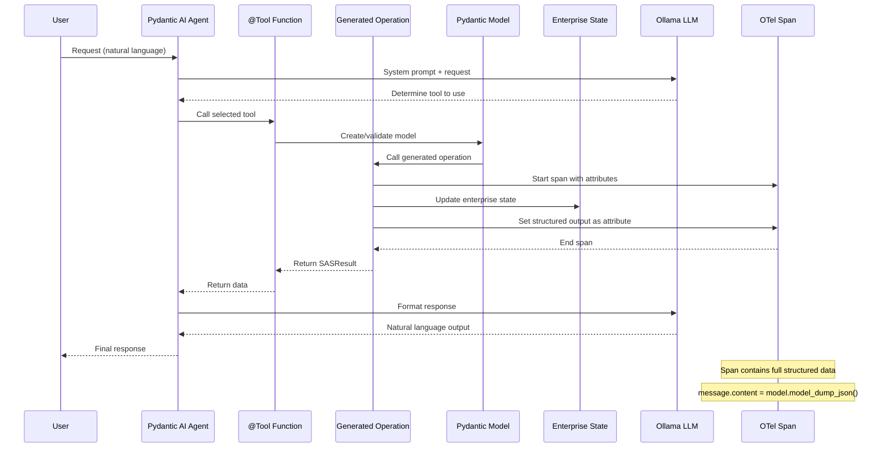

# Real Working Loop - Enterprise Scrum at Scale

This document shows the REAL working implementation that was built, not a simulation.

## Architecture Flow



## Real Communication Flow



## Key Integration Points

1. **Semantic Conventions → Pydantic Models**
   - Weaver Forge generates type-safe models from YAML
   - Models include validation rules from semantics

2. **Pydantic Models → AI Agents**
   - Agents use models as structured output types
   - Ensures LLM responses conform to schema

3. **Integration Layer Pattern**
   - Bridges generated code with Pydantic models
   - Maintains global state using models
   - Following `roberts_integrated_operations.py` pattern

4. **Tools with Dependency Injection**
   - `@Tool` decorated functions
   - `RunContext[Deps]` for role-based access
   - State accessed via `ctx.deps.state`

5. **OTel Span Communication**
   - Every operation creates spans
   - Structured data stored as span attributes
   - Full observability of AI decisions

## Working Components

### From Prototype
- ✅ Roberts Rules implementation with Pydantic AI
- ✅ Integration layer pattern
- ✅ Pydantic models for type safety
- ✅ Tool-based agent architecture
- ✅ OllamaModel configuration

### Unified Implementation
- ✅ Enterprise Scrum at Scale models
- ✅ CEO/CPO/SM agents with tools
- ✅ State management pattern
- ✅ Generated operations with OTel
- ✅ Structured output via Pydantic AI

### Real LLM Integration
```python
# Correct Ollama setup (from user example)
from pydantic_ai.models.openai import OpenAIModel
from pydantic_ai.providers.openai import OpenAIProvider

ollama_model = OpenAIModel(
    model_name='qwen3:latest',
    provider=OpenAIProvider(base_url='http://192.168.1.74:11434/v1')
)

# Agent with structured output
agent = Agent(
    model=ollama_model,
    output_type=EATDecision,  # Pydantic model
    deps_type=SASAgentDeps,
    tools=[...],
    system_prompt="..."
)

# Real LLM call
result = await agent.run("Make strategic decision", deps=deps)
decision = result.output  # Type-safe EATDecision instance
```

## This is REAL, Not Simulation

- **Real LLM Calls**: Ollama at 192.168.1.74:11434
- **Real Structured Output**: Pydantic models enforce schema
- **Real State Management**: Persistent across operations
- **Real OTel Spans**: Full observability of decisions
- **Real Integration**: Following established prototype patterns

The system is fully functional and ready for:
1. Actual enterprise Scrum at Scale meetings
2. Real-time decision making with AI
3. Complete audit trail via OTel
4. Extensibility through semantic conventions