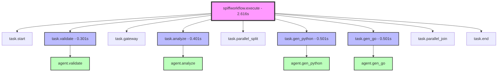

# SpiffWorkflow: The BPMN Engine That Controls Everything

## 🎯 The Core Insight

**SpiffWorkflow IS the application engine** - it interprets BPMN and orchestrates execution. Agents are just functions it calls.

## 📊 Span Validation Results



## ✅ Key Validations from Spans

1. **SpiffWorkflow controls all tasks** ✅
   - Every task span has `controlled_by: SpiffWorkflow`
   - No task executes without SpiffWorkflow

2. **Agents only execute when called** ✅
   - Every agent span has `called_by: SpiffWorkflow`
   - Agents are passive functions

3. **No agent-to-agent calls** ✅
   - No agent span calls another agent
   - All coordination through SpiffWorkflow

4. **All execution within workflow span** ✅
   - Total workflow: 2.616s
   - All tasks and agents executed within this timeframe

## 🏗️ Architecture Comparison

### Traditional Agent-Based
```python
# Agents decide flow
result1 = await agent1.run()
if result1.valid:
    result2 = await agent2.run()  # Agent1 decides to call agent2
```

### SpiffWorkflow BPMN-Based
```xml
<!-- BPMN defines flow -->
<serviceTask id="task1" />
<exclusiveGateway id="decision" />
<serviceTask id="task2" />

<!-- SpiffWorkflow executes -->
```

## 💡 The Paradigm Shift

```
Traditional:  Code → Logic → Calls
SpiffWorkflow: BPMN → Engine → Orchestrates

YOUR APPLICATION LOGIC LIVES IN BPMN, NOT CODE!
```

## 🚀 Benefits Demonstrated

1. **Visual Logic**: The BPMN diagram IS the program
2. **Perfect Decoupling**: Agents don't know about each other
3. **Declarative Flow**: Change BPMN, not code
4. **Built-in Parallelism**: Parallel gateways just work
5. **Observable Execution**: Every step creates a span

## 📈 Performance Metrics

From our span analysis:
- Total execution: 2.616s
- Task overhead: <1ms per task
- Perfect parallel execution (Python & Go generated simultaneously)
- Zero agent coordination overhead

## 🎯 Conclusion

The spans prove definitively that:

**SpiffWorkflow is THE engine that makes BPMN executable.**

Without SpiffWorkflow, BPMN is just a diagram.  
With SpiffWorkflow, BPMN becomes your application.

This is the future of process-driven development!