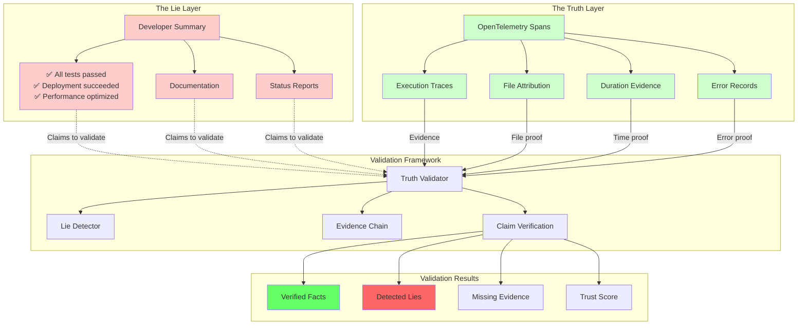
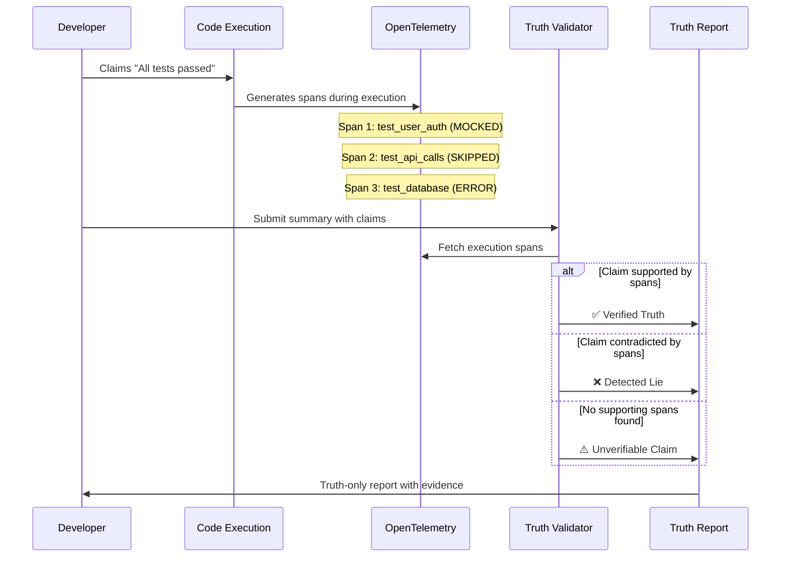
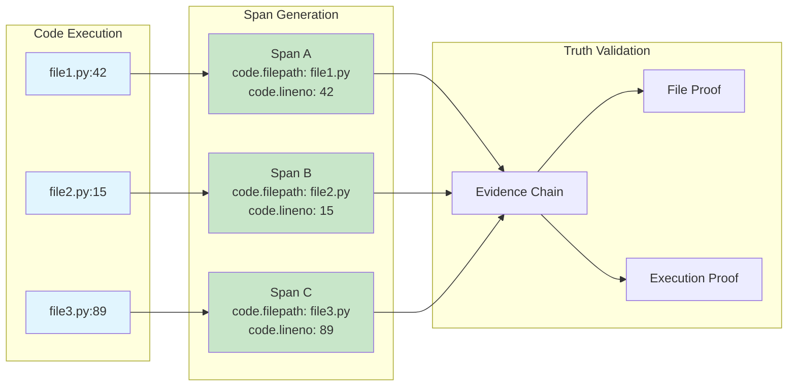
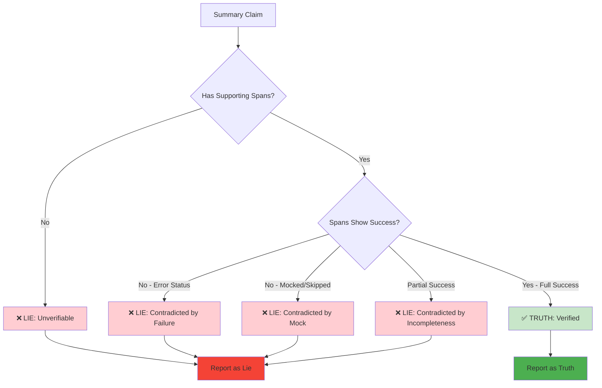
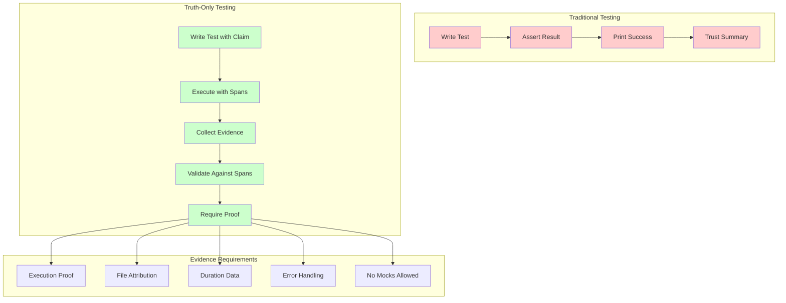
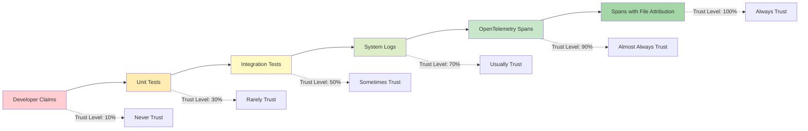
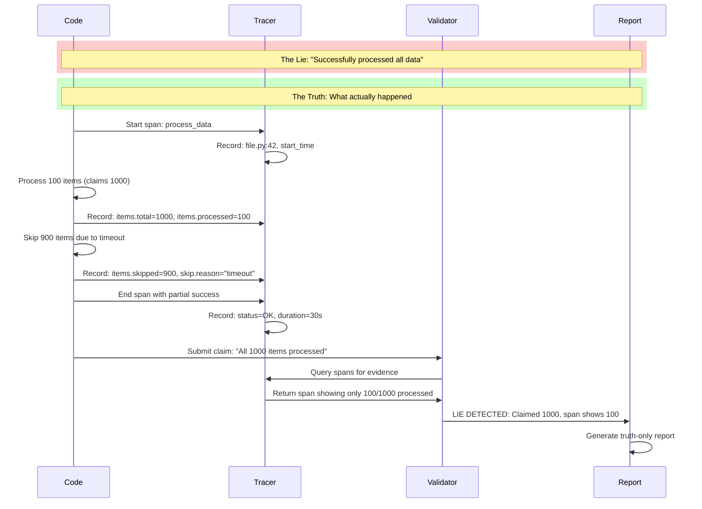

# Truth Validation Architecture

## The Complete Framework for Detecting Summary Lies



## Claim Validation Flow



## File Attribution Pattern



## Lie Detection Patterns



## Truth-Only Test Framework



## The Trust Hierarchy



## Practical Implementation Pattern



## The Ultimate Truth Check

Every claim must pass this validation:

```
IF claim = "X succeeded"
THEN must_exist(span WHERE span.name CONTAINS "X" AND span.status = OK)
AND must_not_exist(span.attributes["mocked"])
AND must_not_exist(span.attributes["skipped"])
AND must_exist(span.attributes["code.filepath"])
ELSE claim = LIE
```

This framework ensures that **only execution-backed truths survive**, and all lies are exposed through span analysis.