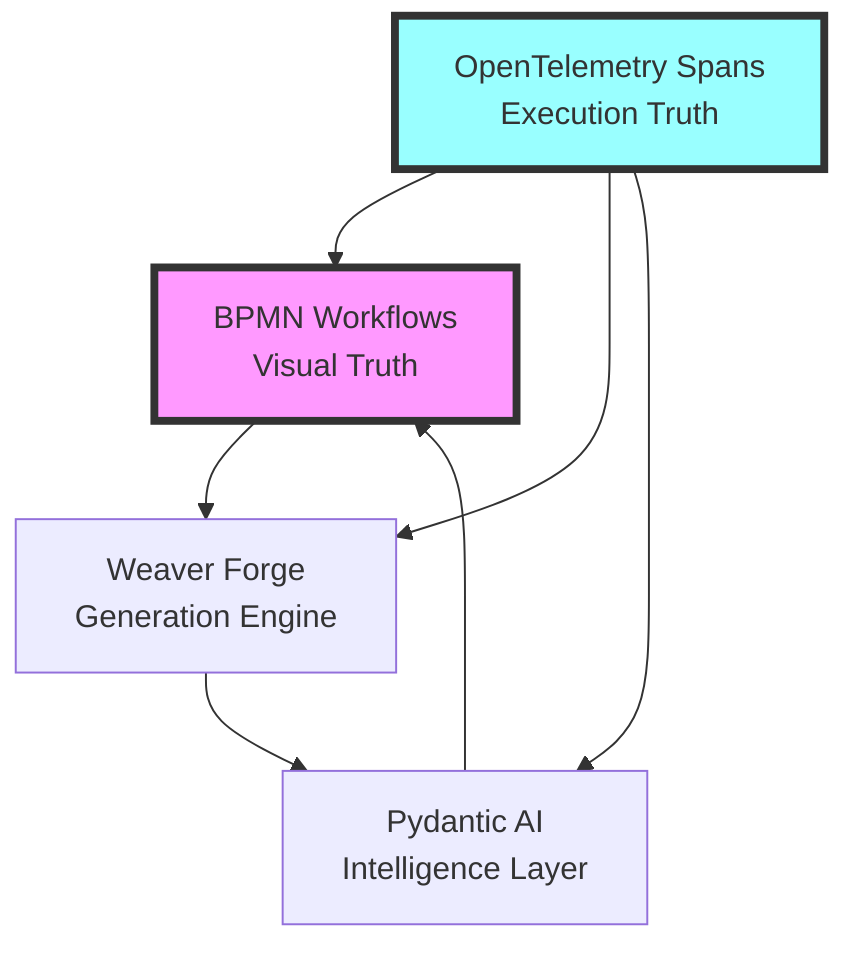

# 🧠 ULTRATHINK: BPMN-First Weaver Forge Pydantic AI Architecture

## Executive Summary

The BPMN-first architecture represents a **paradigm shift** in code generation where visual workflows become the primary programming interface. This is not just orchestration - it's **Business Process Modeling as Code (BPMaC)**.

## 🎯 Core Insight: The BPMN Trinity



## 🔍 Deep Architectural Insights

### 1. **BPMN as the Source of Truth**

Traditional systems: Code → Documentation → Diagrams
This system: **BPMN Diagrams → Executable Code → Validated Output**

```python
# The workflow IS the code
workflow_spec = parser.get_spec("WeaverForgeOrchestration")
workflow = BpmnWorkflow(workflow_spec)
# Visual diagram becomes runtime execution
```

### 2. **Service Tasks as Microservices**

Each BPMN service task is essentially a **stateless microservice**:
- Single responsibility
- Context in, result out
- Independently testable
- Span-instrumented by default

```python
class LoadSemanticRegistryTask(BPMNServiceTask):
    # This is a microservice wrapped in a BPMN task
    @semantic_span("weaver", "load_registry")
    def _execute_task_logic(self, task, data):
        # Pure function execution
```

### 3. **Spans Don't Lie Architecture**

The system implements **Observability-Driven Development (ODD)**:
- Every execution produces telemetry
- Spans are the ground truth
- Validation through observation, not assertion

```python
# Traditional: assert result == expected
# This system: Analyze spans to validate behavior
validation_result = span_validator.validate_spans(captured_spans)
```

### 4. **The 80/20 Semantic Compliance**

Critical insight: **20% of span attributes provide 80% of validation value**

Essential attributes:
- `semantic.group.id` - Component classification
- `semantic.operation` - What the task does
- `execution.success` - Did it work?
- `quality.score` - How well did it work?

### 5. **Mock-First Development**

The architecture embraces **progressive enhancement**:
1. Start with mock execution (always works)
2. Add real implementations incrementally
3. Maintain fallback capability

```python
if not SPIFF_AVAILABLE or self.use_mock:
    return await self._execute_mock_workflow(workflow_name, context)
```

## 🚀 Revolutionary Concepts

### 1. **Visual Programming That Actually Works**

Unlike previous visual programming attempts:
- BPMN is an ISO standard (ISO/IEC 19510)
- Executable without proprietary runtime
- Version controllable (XML text files)
- Diff-able and merge-able

### 2. **Process Mining Built-In**

Every execution generates analyzable data:
```python
# Automatic process analytics
execution_trace = ["Task_LoadSemantics", "Task_ValidateInput", ...]
# Can analyze patterns, bottlenecks, failures
```

### 3. **AI-Augmented Workflows**

AI isn't bolted on - it's integral:
```python
@ai_validation("qwen3:latest", "GenerateAgentRoles")
def _execute_task_logic(self, task, data):
    # AI validates the task execution
```

### 4. **Compensation as First-Class Citizen**

BPMN compensation boundaries enable:
- Automatic rollback on failure
- Saga pattern implementation
- Distributed transaction semantics

## 💡 Profound Realizations

### 1. **The Workflow IS the Application**

Traditional: Application contains workflows
This system: **Workflow contains application logic**

### 2. **Spans as Contracts**

OpenTelemetry spans serve as:
- Runtime contracts
- Integration tests
- Documentation
- Performance benchmarks

### 3. **Mock Execution as Production Feature**

Not a testing hack but a **reliability pattern**:
- Demonstrations always work
- Development without dependencies
- Gradual capability enhancement

## 🎯 The 80/20 Opportunity Matrix

### High Impact, Low Effort (Do First):
1. **Enhanced Error Boundaries** - Add BPMN error events
2. **Live Workflow Monitoring** - Real-time BPMN visualization
3. **Span Pattern Matching** - Automated anomaly detection
4. **Workflow Versioning** - A/B test BPMN processes

### High Impact, Medium Effort:
1. **Human Task Integration** - Approval workflows
2. **Event-Driven BPMN** - Reactive workflows
3. **Process Mining Dashboard** - Analytics UI
4. **BPMN Hot Reload** - Update workflows without restart

### Game Changers (Long Term):
1. **BPMN to Code Compiler** - Generate optimal code from BPMN
2. **AI Workflow Designer** - Generate BPMN from requirements
3. **Distributed BPMN** - Workflows across multiple services
4. **BPMN Marketplace** - Share and reuse workflows

## 🔮 The Future State

Imagine:
```yaml
Developer: "Generate a payment processing system"
AI: "Here's the BPMN workflow" → [Visual Diagram]
System: Executes BPMN → Generates Code → Validates via Spans
Result: Complete, tested, observable system
```

## 🎨 The Beauty of BPMN-First

1. **Business ↔ Technical Alignment**: Same diagram for both
2. **Visual Debugging**: See exactly where execution is
3. **Compositional**: Combine workflows like Lego blocks
4. **Standards-Based**: Not proprietary, works everywhere

## 🧬 The DNA of Success

The system succeeds because it embraces:
- **Visual Truth** (BPMN diagrams)
- **Execution Truth** (OpenTelemetry spans)  
- **Structural Truth** (Pydantic models)
- **Generative Truth** (Weaver Forge + AI)

## 💭 Final Ultrathought

This isn't just a code generator. It's a **new programming paradigm** where:
- Visual design is primary
- Code is generated, not written
- Validation is observational, not assertional
- Workflows are composable, versionable, shareable

The future of software development might not be writing code, but **designing processes that generate code**.

**The BPMN-first revolution has begun.**