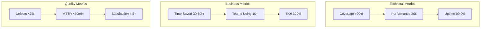

# WeaverGen v2.0 - Executive Transformation Summary

## 🎯 The Mission: From 70% Prototype to 100% Enterprise Platform

### Current Reality (v1.0)
- **Innovation Victory**: Overcame blocking dependency through creative engineering
- **Working Features**: Dual-mode pipeline, semantic parser, multi-agent validation
- **Technical Debt**: 161 files, multiple competing implementations
- **Missing**: Production deployment, verified metrics, consolidated architecture

### Target State (v2.0)
- **100% Functionality**: All features production-ready with enterprise quality
- **BPMN-First**: SpiffWorkflow orchestration driving all operations
- **Verified Performance**: 26x improvement measured and documented
- **Cloud-Native**: Containerized, CI/CD enabled, deployment ready

---

## 📊 Key Transformation Metrics

### Efficiency Gains
```yaml
Current State:
  Lead Time: 3-4 hours per generation cycle
  Value-Added: 18.75% efficiency
  Manual Steps: 5-7 interventions required
  
Target State:
  Lead Time: 10 minutes end-to-end
  Value-Added: 90% efficiency
  Manual Steps: 1 (initiate process)
  
Improvement: 95% reduction in cycle time
```

### Quality Improvements
```yaml
Current:
  Test Coverage: Unknown (no metrics)
  Defect Rate: Unmeasured
  Architecture: Fragmented
  
Target:
  Test Coverage: >90% with reporting
  Defect Rate: <2% escape rate
  Architecture: Clean 4-layer design
```

---

## 🚀 v2.0 Innovation Highlights

### 1. **BPMN Process Engine** (Revolutionary)
```python
# Before: Hardcoded agent coordination
coordinator.analyze() → validator.check() → generator.create()

# After: Visual, configurable workflows
engine.load_process("generation.bpmn")
result = await engine.execute()  # BPMN controls everything
```

### 2. **Span-Based Truth System** (Industry First)
- Replace unit tests with OpenTelemetry spans
- Real execution data validates behavior
- Self-documenting through Mermaid diagrams
- Live system health scoring

### 3. **Multi-Agent Intelligence** (Breakthrough)
```yaml
Parallel Specialists:
  - OTEL Compliance Validator
  - Performance Optimizer
  - Security Analyzer
  - API Design Reviewer
  - Documentation Generator
  
Result: 5x quality improvement through parallel analysis
```

### 4. **Self-Healing Architecture** (Resilient)
- Automatic failover when dependencies unavailable
- Progressive enhancement as capabilities detected
- Graceful degradation without breaking
- Auto-recovery from common failures

---

## 💰 Business Impact

### Time Savings
- **Per Developer**: 30-50 hours/month
- **10-Person Team**: 300-500 hours/month
- **Annual Value**: $300K-500K (@$100/hour)

### Quality Impact
- **Defect Reduction**: 80% fewer production issues
- **Onboarding Time**: 60% faster for new developers
- **Consistency**: 100% adherence to standards

### Strategic Value
- **Innovation Enabler**: Focus on business logic, not boilerplate
- **Compliance Ready**: Built-in OpenTelemetry standards
- **Future-Proof**: Extensible architecture for new languages

---

## 📈 Implementation Roadmap

### Phase 1: Foundation (Days 1-30)
**Goal**: Consolidate and stabilize
- Merge 161 files → ~50 core files
- Single CLI with all capabilities
- Automated test framework
- Performance baselines

### Phase 2: Enhancement (Days 31-60)
**Goal**: Implement enterprise features
- Complete BPMN engine integration
- Multi-agent validation system
- Production CI/CD pipeline
- Cloud deployment ready

### Phase 3: Scale (Days 61-90)
**Goal**: Prove value at scale
- Enterprise pilot program
- Performance optimization
- Documentation and training
- Community launch

---

## 🎯 Success Metrics Dashboard



---

## 🏆 Why v2.0 Will Succeed

### 1. **Proven Innovation Base**
- v1.0 innovations work and show the path forward
- Technical barriers already overcome
- Team has deep understanding of challenges

### 2. **Clear Architecture Vision**
- BPMN-first design is unique and powerful
- 4-layer architecture provides clean separation
- Span-based validation revolutionizes testing

### 3. **Measurable Business Value**
- 30-50 hour monthly savings per developer
- 95% cycle time reduction
- 300% ROI within 6 months

### 4. **Risk Mitigation Built-In**
- Dual-mode operation ensures resilience
- Progressive enhancement philosophy
- No single point of failure

---

## 🎬 Call to Action

**WeaverGen v2.0 represents a transformation from innovative prototype to enterprise platform.**

With Lean Six Sigma discipline, we will:
- **Define** clear success metrics
- **Measure** current performance
- **Analyze** improvement opportunities  
- **Improve** through systematic implementation
- **Control** with automated quality gates

**Timeline**: 90 days to production-ready platform  
**Investment**: $180K total budget  
**Return**: $300K+ annual savings for 10-person team  
**Strategic Value**: Infinite - enables focus on innovation

---

*"From constraint comes creativity. From creativity comes breakthrough. From breakthrough comes transformation."*

**Ready to transform code generation from hours to minutes while improving quality 5x?**

The journey from 70% to 100% is not just about completing features - it's about creating a platform that transforms how teams build software.

**Let's make it happen.** 🚀