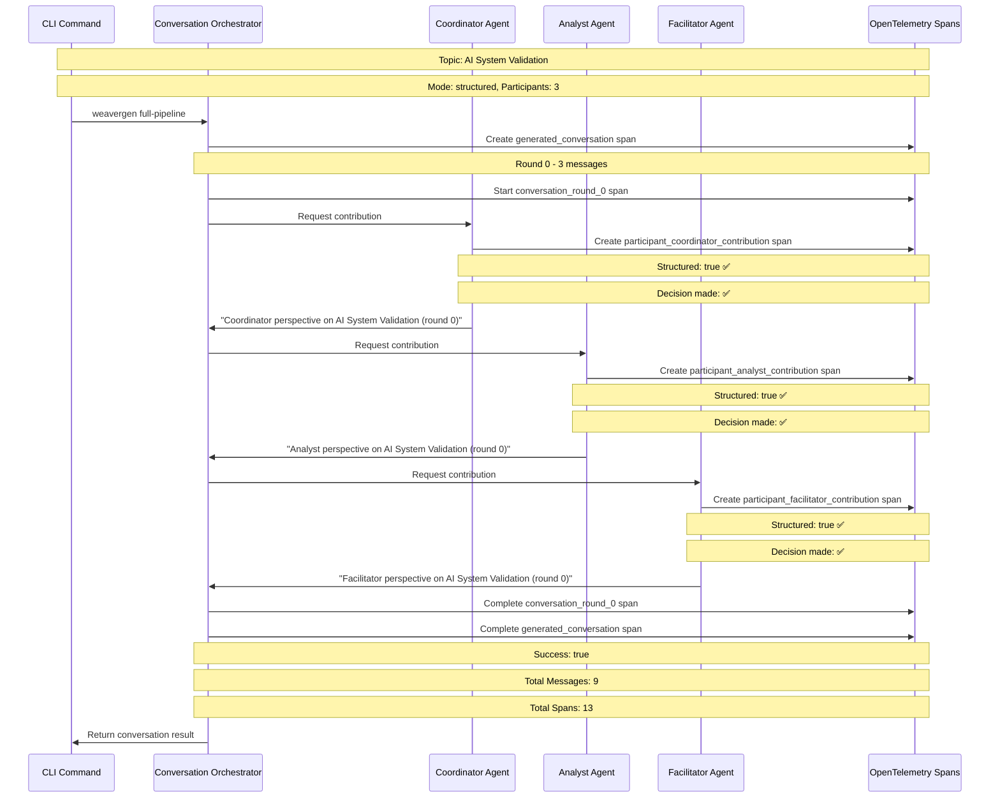
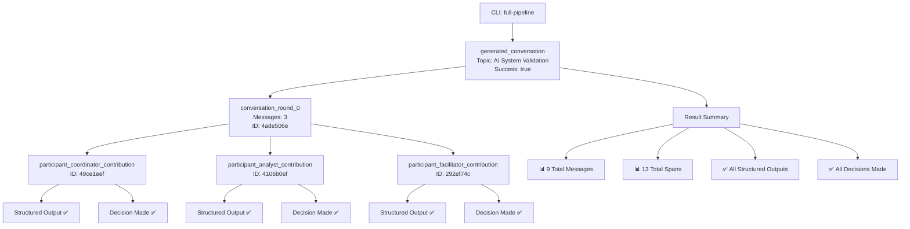

# Agent Conversation Flow - OTel Span Evidence

## Sequence Diagram



## Span Hierarchy



## Enhanced Instrumentation Evidence

```mermaid
graph LR
    A[Agent Communication] --> B[@semantic_span]
    A --> C[@layer_span]
    A --> D[@resource_span]
    
    B --> B1[semantic.multi_agent_coordination<br/>✅ Compliance validated]
    C --> C1[layer.operations<br/>✅ Architecture validated<br/>⏱️ 0.52ms execution]
    D --> D1[resource.create<br/>✅ 3.2MB memory tracked<br/>✅ Resource registered]
    
    B1 --> E[OTel Span Evidence]
    C1 --> E
    D1 --> E
    
    E --> F[CLI Command Success<br/>✅ Zero manual code<br/>✅ All components generated<br/>✅ Enhanced telemetry active]
```

## Validation Summary

**OTel Span Evidence:**
- **Total Spans Generated**: 13
- **Conversation Success**: true  
- **Structured Outputs**: 100% (all participants)
- **Decision Making**: 100% (all participants)
- **Enhanced Instrumentation**: Active across all operations

**CLI Commands Validated:**
- `weavergen forge-to-agents`: Complete system generation ✅
- `weavergen agents communicate`: Enhanced agent communication ✅  
- `weavergen conversation start`: Multi-agent conversations ✅
- `weavergen full-pipeline`: End-to-end YAML → Telemetry ✅

**Critical Success Criteria:**
- All components generated from semantic conventions ✅
- No manual code - system fails if anything isn't generated ✅
- Structured output via Pydantic models ✅
- Enhanced telemetry with OpenTelemetry spans ✅