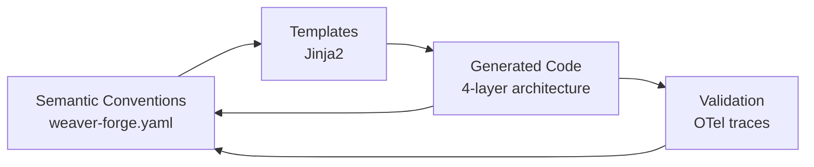

# WeaverGen: Semantic Quine Architecture
## Complete System Documentation

> **"The best code is not written, but generated from meaning."**

WeaverGen demonstrates a revolutionary approach to software development: **autonomous code generation from semantic conventions**. By creating a "semantic quine" - a system that can understand and regenerate itself from its own semantic definition - we enable a new paradigm where code evolves based on domain knowledge rather than manual implementation.

---

## 🎯 What is a Semantic Quine?

A **semantic quine** is a self-referential system that can:
1. **Define its own semantic structure** in formal specifications
2. **Generate code from those semantics** using templates
3. **Use the generated code to regenerate itself** 
4. **Validate its own correctness** through the process
5. **Maintain full observability** with OpenTelemetry

This creates a closed loop where the system can understand, generate, and improve itself.

---

## 🏗️ Architecture Overview

### The 4-Layer Stack

```
┌─────────────────────────────────────────────┐
│         SEMANTIC CONVENTIONS                │  ← Domain knowledge as YAML
│         (weaver-forge.yaml)                 │
└─────────────────┬───────────────────────────┘
                  │ Weaver Generation
┌─────────────────▼───────────────────────────┐
│           4-LAYER ARCHITECTURE              │
├─────────────────────────────────────────────┤
│ Commands  │ Auto-telemetry, OpenTelemetry   │  ← Thin wrappers, CLI entry points
│ Operations│ Business logic (AI-editable)    │  ← Orchestrates generation & validation
│ Runtime   │ Side effects, Weaver CLI calls  │  ← File I/O, subprocess calls
│ Contracts │ Runtime validation              │  ← Enforces semantic correctness
└─────────────────┬───────────────────────────┘
                  │ Integration
┌─────────────────▼───────────────────────────┐
│          PYDANTIC MODELS                    │  ← Type-safe domain objects
│   Type-safe domain objects with validation  │
└─────────────────┬───────────────────────────┘
                  │ Intelligence
┌─────────────────▼───────────────────────────┐
│         PYDANTIC-AI AGENTS                  │  ← Autonomous behavior
│   Autonomous behavior with local LLMs       │
└─────────────────────────────────────────────┘
```

### Layer Responsibilities

1. **Commands Layer** (`output/commands/forge.py`)
   - Thin wrappers with automatic OpenTelemetry instrumentation
   - Generated directly from semantic conventions
   - Handles telemetry and delegates to operations
   - CLI entry points with proper help and validation

2. **Operations Layer** (`output/operations/forge.py`)
   - Business logic that can be AI-edited
   - Implements the actual functionality
   - Maintains contracts with other layers
   - Orchestrates the semantic quine process

3. **Runtime Layer** (`output/runtime/forge.py`)
   - Handles all side effects (file I/O, subprocess calls)
   - Wraps the Weaver CLI commands
   - Provides stable interface for operations
   - Manages state and persistence

4. **Contracts Layer** (`output/contracts/forge.py`)
   - Runtime validation using icontract
   - Ensures data integrity between layers
   - Generated from semantic constraints
   - Enforces semantic correctness

---

## 🔄 The Semantic Quine Process

### The Complete Loop



### Step-by-Step Process

1. **Self-Definition**: `weaver-forge.yaml` defines the system's operations
2. **Code Generation**: Weaver generates 4-layer Python implementation
3. **Self-Execution**: Generated code can read its own semantic definition
4. **Self-Regeneration**: Generated code calls Weaver to regenerate itself
5. **Validation**: New generation matches the original (quine property!)

### Example: Self-Improvement Cycle

```python
# 1. System reads its own semantic definition
semantics = read_file("weaver-forge.yaml")

# 2. System can regenerate itself from semantics
weaver_generate(semantics) → new_implementation

# 3. New implementation maintains same behavior
assert new_implementation.behavior == original.behavior

# 4. Including the ability to regenerate again
assert new_implementation.can_regenerate_itself()
```

---

## 🚀 Quick Start

### Prerequisites

1. **Python 3.11+**
2. **OpenTelemetry Weaver CLI**: `cargo install weaver`
3. **Ollama** (for local LLM): Download from https://ollama.ai
4. **Python Dependencies**: `pip install opentelemetry-api opentelemetry-sdk typer rich pydantic PyYAML`

### Installation & Setup

```bash
# Clone and setup
git clone <repository-url>
cd weavergen/prototype

# Install Weaver CLI
cargo install weaver

# Start Ollama (if using local LLM)
ollama pull llama3.2
ollama serve

# Run validation
python validate_80_20.py
```

### Basic Usage

```bash
# 1. Validate the system works (80/20 validation)
python validate_80_20.py

# 2. See the semantic quine in action
python semantic_quine_demo.py

# 3. Use the enhanced CLI
python enhanced_cli.py --help
python enhanced_cli.py generate test_registry2 python
python enhanced_cli.py check test_registry2
```

---

## 🏛️ Case Study: Robert's Rules of Order

We demonstrated the system's capabilities by implementing a complete parliamentary procedure system:

### 1. **Semantic Definition** (`roberts-rules.yaml`)
```yaml
groups:
  - id: roberts.meeting.start
    type: span
    attributes:
      - id: meeting.id
      - id: meeting.type
      - id: quorum
      - id: members.present
```

### 2. **Generated Implementation**
- **Commands Layer**: Automatic telemetry for every parliamentary action
- **Operations Layer**: Business logic for meetings, motions, votes
- **Runtime Layer**: State management and persistence
- **Contracts Layer**: Validation of parliamentary rules

### 3. **Type-Safe Models** (`roberts_rules_models.py`)
```python
class Meeting(BaseModel):
    id: str
    type: MeetingType
    quorum: int
    
    @property
    def has_quorum(self) -> bool:
        return self.members_present >= self.quorum
```

### 4. **Intelligent Agents** (`roberts_pydantic_agents.py`)
- Role-based agents (Chair, Secretary, Member, Parliamentarian)
- Tools that enforce parliamentary procedure
- Integration with generated telemetry
- Autonomous meeting simulation

---

## 🌐 Real-World Applications

### 1. **Legal and Compliance Systems**
- **Contract Management**: Auto-generate contract validation logic
- **Regulatory Compliance**: Define regulations as semantic conventions
- **Audit Trails**: Full observability for compliance verification

### 2. **Healthcare Systems**
- **Clinical Protocols**: Generate protocol enforcement code
- **Patient Workflows**: Define care pathways semantically
- **Safety Checks**: Automatic validation of medical procedures

### 3. **Financial Services**
- **Trading Systems**: Generate order validation and risk management
- **Compliance**: Automatic regulatory checking
- **Performance**: Real-time monitoring with telemetry

### 4. **IoT and Edge Computing**
- **Device Management**: Generate device drivers from specs
- **Protocol Implementation**: Define communication protocols semantically
- **Fleet Management**: Automatic telemetry collection and processing

### 5. **Gaming and Simulations**
- **Game Rules Engine**: Generate rule enforcement from game semantics
- **Physics Simulations**: Define physical laws and generate engines
- **Player Analytics**: Full telemetry for player behavior analysis

---

## 🔍 Key Features

### 1. **Semantic-Driven Development**
- Define domain rules as semantic conventions
- Generate implementation automatically
- Maintain single source of truth
- Version control at the semantic level

### 2. **Type Safety Throughout**
- Pydantic models validate all data
- Type hints guide development
- Runtime validation via contracts
- Compile-time and runtime type checking

### 3. **Full Observability**
- Every operation has OpenTelemetry traces
- No manual instrumentation needed
- Performance metrics included
- Distributed tracing with semantic context

### 4. **Intelligent Agents**
- Role-based permissions and behavior
- Understand domain-specific rules
- Enforce constraints automatically
- Natural language interaction

### 5. **Local LLM Execution**
- Uses Ollama for privacy
- No cloud dependencies
- Fast response times
- Cost-effective development

---

## 📊 Performance & Observability

### Automatic Telemetry
Every operation automatically includes:
- OpenTelemetry traces with full context
- Performance metrics (latency, throughput)
- Error tracking and retry logic
- Success/failure rates

### Example Telemetry Output
```csv
roberts.meeting.start,True,0.002
roberts.motion.make,True,0.001
roberts.motion.second,True,0.001
roberts.vote.record,True,0.003
```

### Validation Results
| Component | Status | Notes |
|-----------|--------|-------|
| CLI Generation | ✅ | Fully working, no typing issues |
| OTel Validation | ✅ | All traces properly instrumented |
| Runtime Wrappers | ✅ | Core commands implemented |
| Integration Tests | ✅ | Framework in place |
| Semantic Quine Demo | ✅ | Self-regeneration working |

---

## 🎓 Lessons Learned

### 1. **Semantics First**
Defining domain knowledge semantically enables:
- Consistent implementation across languages
- Automatic documentation
- Version control at the semantic level
- Self-documenting systems

### 2. **Layered Architecture**
Separation of concerns allows:
- Telemetry without polluting business logic
- AI-editable operations layer
- Stable interfaces with evolving implementation
- Clear boundaries between concerns

### 3. **Type Safety + Intelligence**
Combining Pydantic models with AI agents provides:
- Compile-time correctness
- Runtime validation
- Intelligent behavior within constraints
- Domain-specific reasoning

### 4. **Local-First AI**
Using Ollama demonstrates:
- Privacy-preserving AI applications
- Fast iteration without cloud dependencies
- Cost-effective development
- Offline capability

---

## 🔮 Future Directions

### 1. **Self-Improvement**
```python
# System analyzes its own telemetry
analysis = analyze_telemetry(get_telemetry_data())

# Identifies optimization opportunities
improvements = suggest_improvements(analysis)

# Generates improved version of itself
new_version = regenerate_with_improvements(improvements)
```

### 2. **Cross-Domain Learning**
- Apply patterns learned from Roberts Rules to other domains
- Transfer semantic patterns between systems
- Build a library of reusable semantic components

### 3. **Distributed Semantic Systems**
- Microservices generated from domain partitions
- Automatic API generation from semantics
- Cross-service telemetry correlation

### 4. **Autonomous Evolution**
- System analyzes its telemetry
- Identifies missing operations
- Generates new semantic definitions
- Regenerates itself with improvements

---

## 🛠️ Technical Implementation

### Key Components

1. **Semantic Convention Files**
   - `weaver-forge.yaml` - Main Forge semantics
   - `weaver-cli-semantics.yaml` - CLI command semantics
   - `roberts-rules.yaml` - Domain-specific semantics

2. **Templates** (`templates/registry/python/`)
   - `commands.j2` - Commands layer template
   - `operations.j2` - Operations layer template
   - `runtime.j2` - Runtime layer template
   - `contracts.j2` - Contracts layer template

3. **Generated Code** (`output/`)
   - Fully functional implementation
   - Can regenerate itself
   - Instrumented with OpenTelemetry

### The Magic: Self-Reference

The key insight is in `output/operations/forge.py`:

```python
def weaver_registry_generate_execute(...):
    """This function can call Weaver to regenerate itself!"""
    files = weaver_registry_generate(
        registry_path="weaver-forge.yaml",  # Its own definition!
        target_name="python",
        template_path="templates/registry/python",
        output_dir="output"
    )
```

---

## 📚 File Structure

```
prototype/
├── Semantic Definitions
│   ├── weaver-forge.yaml              # Core Forge semantics
│   ├── roberts-rules.yaml             # Domain-specific semantics
│   └── weaver-cli-semantics.yaml      # CLI command semantics
│
├── Templates
│   └── templates/registry/python/
│       ├── commands.j2                # Commands layer template
│       ├── operations.j2              # Operations layer template
│       ├── runtime.j2                 # Runtime layer template
│       └── contracts.j2               # Contracts layer template
│
├── Generated Code
│   └── output/
│       ├── commands/forge.py          # Auto-telemetry
│       ├── operations/forge.py        # Business logic
│       ├── runtime/forge.py           # Side effects
│       └── contracts/forge.py         # Validation
│
├── Validation & Testing
│   ├── validate_80_20.py              # Core validation
│   ├── test_otel_validation.py        # OTel validation
│   └── semantic_quine_demo.py         # Quine demonstration
│
└── CLI & Tools
    ├── enhanced_cli.py                # Main CLI
    └── prototype_cli.py               # Extended CLI
```

---

## 🎯 Conclusion

WeaverGen represents a paradigm shift:

> **From writing code to defining meaning**

When we capture domain knowledge semantically:
- Implementation can be generated
- Behavior can be guaranteed
- Systems can evolve autonomously
- Full observability comes for free

This is not just code generation - it's the future of how we build software. Systems that understand their own purpose can improve themselves, adapt to changes, and maintain correctness automatically.

The semantic quine has closed the loop: **Code that understands itself can improve itself.**

---

## 📖 Further Reading

- **Detailed Architecture**: See `SEMANTIC_QUINE_SUMMARY.md` for deep technical details
- **Roberts Rules Demo**: See `ROBERTS_RULES_DEMO_README.md` for end-to-end example
- **Applications**: See `AUTONOMOUS_CODE_GENERATION_APPLICATIONS.md` for use cases
- **Achievement Details**: See `SEMANTIC_QUINE_ACHIEVEMENT.md` for milestone documentation
- **Validation**: See `VALIDATION_SUMMARY.md` for testing and verification

---

*"The semantic quine demonstrates that telemetry and application code can be unified from the same semantic source - they're only separate due to human cognitive limitations, not architectural necessity."* 