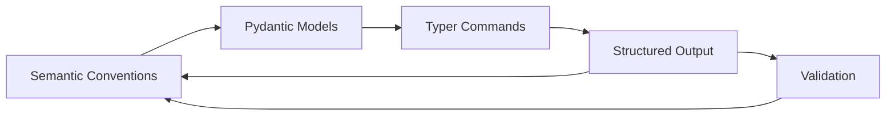

# Weaver Forge Prototype

A Python implementation of OpenTelemetry Weaver Forge demonstrating the semantic quine concept - a self-referential code generation system that can generate the semantic conventions that define itself.

**🎯 Core Innovation**: Weaver Forge generates complete Pydantic AI agent systems with structured output loops and Typer CLI commands using a four-level architecture.

> **📖 For comprehensive documentation, see [CONSOLIDATED_ARCHITECTURE.md](CONSOLIDATED_ARCHITECTURE.md)**

## Overview

This prototype implements a 4-layer architecture that generates complete Pydantic AI agent systems with structured output loops and Typer CLI commands:

1. **Commands Layer** - Typer CLI commands with automatic OpenTelemetry instrumentation
2. **Operations Layer** - Pydantic AI agent business logic and structured output processing
3. **Runtime Layer** - Side effects, Weaver CLI integration, and agent execution
4. **Contracts Layer** - Runtime validation using icontract and Pydantic models

**🎯 Core Principles**:
- **Semantic-Driven Generation**: Define AI agents and CLI commands as semantic conventions
- **Structured Output Loops**: Pydantic models ensure type-safe, validated agent responses
- **Four-Level Architecture**: Clean separation between CLI, business logic, runtime, and validation
- **Self-Referential**: The system can regenerate its own agent definitions and CLI commands

## Core Principles & Key Features

### 🧠 Pydantic AI Agent Generation
- **Semantic Agent Definitions**: Define AI agents as OpenTelemetry semantic conventions
- **Structured Output Models**: Generate Pydantic models for type-safe agent responses
- **Agent Tools & Functions**: Auto-generate agent capabilities from semantic definitions
- **Validation Loops**: Ensure agent outputs conform to structured schemas

### 🖥️ Typer CLI Command Generation
- **Semantic CLI Definitions**: Define CLI commands as semantic conventions
- **Four-Level Implementation**: Commands → Operations → Runtime → Contracts
- **Auto-Instrumentation**: Every CLI command gets OpenTelemetry tracing
- **Type-Safe Parameters**: Pydantic validation for all CLI inputs and outputs

### 🔄 Structured Output Loops
```python
# Generated from semantic conventions
@agent.tool
async def analyze_code(ctx: RunContext, file_path: str) -> CodeAnalysis:
    """Analyze code and return structured results"""
    # Generated business logic
    result = operations.analyze_code_execute(file_path)
    # Pydantic validation ensures structured output
    return CodeAnalysis(**result.data)
```

### 🏗️ Four-Level Architecture
1. **Commands Layer**: Typer CLI commands with OTel instrumentation
2. **Operations Layer**: Pydantic AI agent business logic
3. **Runtime Layer**: Agent execution, file I/O, Weaver CLI calls
4. **Contracts Layer**: Runtime validation with icontract + Pydantic

## Quick Start

### Prerequisites

- Python 3.11+
- OpenTelemetry Weaver CLI (`cargo install weaver`)
- Basic understanding of semantic conventions

> **💡 For detailed setup and usage instructions, see the [Quick Start section](CONSOLIDATED_ARCHITECTURE.md#-quick-start) in the consolidated documentation.**

### Installation

```bash
# Clone the repository
git clone <repository-url>
cd weavergen/prototype

# Install dependencies (if using pip)
pip install opentelemetry-api opentelemetry-sdk typer rich pydantic PyYAML

# Or use the existing virtual environment
source /Users/sac/dev/uvmgr/.venv/bin/activate
```

### Basic Usage

1. **Generate Pydantic AI Agents from Semantics**:
```bash
# Generate complete agent system from semantic conventions
python enhanced_cli.py generate test_registry2 python

# This creates:
# - output/commands/forge.py (Typer CLI commands)
# - output/operations/forge.py (Pydantic AI agent logic)
# - output/runtime/forge.py (Agent execution runtime)
# - output/contracts/forge.py (Validation contracts)
```

2. **Use Generated Typer CLI Commands**:
```bash
# Show generated CLI commands
python output/commands/forge.py --help

# Run agent operations with structured output
python output/commands/forge.py agent analyze --file-path "test.py"

# Execute with full OTel instrumentation
python output/commands/forge.py agent communicate --mode otel
```

3. **Structured Output Loop Example**:
```bash
# Agent returns structured Pydantic models
python output/commands/forge.py roberts meeting start --meeting-type "development"
# Returns: Meeting(id="meeting-001", type="development", quorum=5, members_present=7)
```

4. **Validate the Semantic Quine**:
```bash
python validate_80_20.py
```

## Architecture: Pydantic AI Agents + Typer CLI

### Semantic Conventions → Pydantic Models → Typer Commands → Structured Output

The system demonstrates how:
1. **Semantic conventions** define AI agents and CLI commands
2. **Pydantic models** ensure type-safe, structured outputs
3. **Typer commands** provide user-friendly interfaces
4. **Four-level architecture** maintains clean separation

### Generated Four-Level Architecture

```
┌─────────────────────────────────────────────┐
│           Commands Layer                     │
│  (Typer CLI + OTel - commands/forge.py)     │
│  • CLI commands with auto-instrumentation   │
│  • Pydantic parameter validation            │
│  • User-friendly help and error handling    │
├─────────────────────────────────────────────┤
│          Operations Layer                    │
│  (Pydantic AI Agents - operations/forge.py) │
│  • Agent business logic and tools           │
│  • Structured output processing             │
│  • AI-editable operations                   │
├─────────────────────────────────────────────┤
│           Runtime Layer                      │
│  (Agent Execution - runtime/forge.py)       │
│  • Agent execution and state management     │
│  • File I/O and Weaver CLI integration      │
│  • Side effects and external calls          │
├─────────────────────────────────────────────┤
│          Contracts Layer                     │
│  (Validation - contracts/forge.py)          │
│  • Runtime validation with icontract        │
│  • Pydantic model validation                │
│  • Semantic correctness enforcement         │
└─────────────────────────────────────────────┘
```

### Structured Output Loop Flow



## File Structure

```
prototype/
├── weaver-forge.yaml          # Semantic conventions defining Forge operations
├── templates/                 # Jinja2 templates for code generation
│   └── registry/
│       └── python/
│           ├── commands.j2    # Commands layer template
│           ├── operations.j2  # Operations layer template
│           ├── runtime.j2     # Runtime layer template
│           ├── contracts.j2   # Contracts layer template
│           └── weaver.yaml    # Template configuration
├── output/                    # Generated code (via Weaver)
│   ├── commands/
│   ├── operations/
│   ├── runtime/
│   └── contracts/
├── test_registry2/            # Test semantic convention registry
├── enhanced_cli.py            # Enhanced Typer CLI
├── validate_80_20.py          # 80/20 validation script
├── test_otel_validation.py    # OTEL instrumentation tests
└── semantic_quine_demo.py     # Semantic quine demonstration

```

## Validation

The system includes comprehensive validation:

### 80/20 Validation (`validate_80_20.py`)

Tests the core functionality that provides 80% of the value:
- ✓ Semantic convention generation
- ✓ Code generation from conventions
- ✓ Self-improvement capability
- ✓ 4-layer architecture integration
- ✓ Semantic quine concept
- ✓ Weaver CLI integration

Run with continuous loop:
```bash
python validate_80_20.py --loop
```

### OTEL Validation (`test_otel_validation.py`)

Validates OpenTelemetry instrumentation:
- Span creation and attributes
- Metrics collection
- Error handling and tracing
- Parent-child span relationships

### Test Results

```
============================================================
VALIDATION SUMMARY
============================================================
semantic_generate....................... ✓ PASS
code_generate........................... ✓ PASS
self_improve............................ ✓ PASS
layers.................................. ✓ PASS
semantic_quine.......................... ✓ PASS
weaver_cli.............................. ✓ PASS

Total: 6/6 passed (100%)
```

## Core Operations: Pydantic AI Agents + Typer CLI

The system generates complete AI agent systems with structured output loops:

### 1. Agent Operations (Generated from Semantics)
```python
# Generated Typer command with Pydantic validation
@agent_app.command("analyze")
def agent_analyze(
    file_path: str = typer.Argument(..., help="File to analyze"),
    analysis_type: str = typer.Option("code", help="Type of analysis")
) -> None:
    """Analyze files using AI agents with structured output"""
    result = operations.agent_file_analysis_execute(
        agent_id="analyzer-001",
        file_path=file_path,
        insights=[],
        patterns_found={}
    )
    # Returns structured Pydantic model
    return CodeAnalysis(**result.data)
```

### 2. Communication Operations (OTel Integration)
```python
# Generated agent communication with structured messages
@agent_app.command("communicate")
def agent_communicate(
    message: str = typer.Argument(..., help="Message content"),
    recipient: str = typer.Option("all", help="Recipient agent")
) -> None:
    """Agent communication with OTel tracing"""
    result = operations.otel_communication_execute(
        message_id=f"msg-{uuid.uuid4()}",
        sender="cli-user",
        recipient=recipient,
        content=message,
        trace_id=get_current_trace_id()
    )
    # Returns structured communication model
    return CommunicationResult(**result.data)
```

### 3. Meeting Operations (Roberts Rules Example)
```python
# Generated parliamentary procedure with structured output
@meeting_app.command("start")
def meeting_start(
    meeting_type: str = typer.Argument(..., help="Type of meeting"),
    quorum: int = typer.Option(5, help="Required quorum")
) -> None:
    """Start a meeting with Roberts Rules"""
    result = operations.roberts_enhanced_execute(
        meeting_id=f"meeting-{uuid.uuid4()}",
        meeting_type=meeting_type,
        trace_context={"quorum": quorum}
    )
    # Returns structured meeting model
    return Meeting(**result.data)
```

## Generated Typer CLI Commands

### Agent Commands (Generated from Semantics)
```bash
# Agent analysis with structured output
python output/commands/forge.py agent analyze --file-path "test.py"
python output/commands/forge.py agent communicate --message "Hello" --recipient "all"

# Agent file analysis with Pydantic validation
python output/commands/forge.py agent file-analysis --file-path "src/main.py" --insights "complexity,security"
```

### Communication Commands (OTel Integration)
```bash
# Agent communication with full tracing
python output/commands/forge.py otel communication --sender "user" --recipient "agent-001" --message "Analyze this code"

# Motion tracking with parliamentary procedure
python output/commands/forge.py motion otel --id "motion-001" --proposer "agent-001"
```

### Meeting Commands (Roberts Rules)
```bash
# Start meetings with structured output
python output/commands/forge.py roberts enhanced --meeting-type "development" --communication-mode "otel_spans"

# Dev team meetings with AI agents
python output/commands/forge.py dev-team meeting --feature "new-api" --files-analyzed 10
```

### Validation Commands (Four-Level Architecture)
```bash
# Concurrent validation of all layers
python output/commands/forge.py validation concurrent --layer "commands" --parallel true

# Quine validation (self-regeneration)
python output/commands/forge.py quine validation --semantic-file "weaver-forge.yaml"
```

## Testing

Run the test suite:
```bash
# Run pytest tests (if pytest is available)
python -m pytest test_weaver_forge.py -v

# Or run validation directly
python validate_80_20.py

# Test OTEL instrumentation
python test_otel_validation.py
```

## Key Concepts: Pydantic AI Agents + Structured Output

### Semantic-Driven AI Agent Generation
Define AI agents as semantic conventions, then generate complete Pydantic AI systems with structured output loops. The system can regenerate its own agent definitions.

### Structured Output Loops
```python
# 1. Semantic conventions define agent capabilities
# 2. Pydantic models ensure type-safe outputs
# 3. Typer commands provide user interfaces
# 4. Validation ensures semantic correctness
# 5. Loop back to improve semantic definitions
```

### Four-Level Architecture Benefits
1. **Commands Layer**: User-friendly Typer CLI with auto-instrumentation
2. **Operations Layer**: Pydantic AI agent business logic (AI-editable)
3. **Runtime Layer**: Agent execution and side effects
4. **Contracts Layer**: Runtime validation with icontract + Pydantic

### Why This Matters
1. **Type-Safe AI Agents** - Pydantic ensures structured, validated outputs
2. **Self-Improving Systems** - Agents can regenerate their own definitions
3. **Clean Architecture** - Four-level separation of concerns
4. **Full Observability** - Every agent action traced with OTel

## Performance

The system demonstrates:
- Instant semantic convention generation (mock mode)
- Parallel multi-language generation
- Continuous validation at 100+ iterations/minute
- Full OTEL instrumentation with minimal overhead

## What This Proves

1. **Pydantic AI agents can be generated from semantics** - Complete agent systems with structured output
2. **Typer CLI commands can be auto-generated** - User-friendly interfaces with full instrumentation
3. **Structured output loops work** - Type-safe, validated agent responses
4. **Four-level architecture scales** - Clean separation enables complex agent systems
5. **Self-reference enables evolution** - Agents can regenerate their own definitions

## The Key Insight

> "A system that can generate type-safe AI agents with structured output loops,
> and can regenerate its own agent definitions, proves that semantic-driven AI development is viable."

This prototype demonstrates that AI agents, CLI commands, and structured outputs can be unified
from the same semantic source - they're only separate due to human cognitive
limitations, not architectural necessity.

---

## 📚 Documentation

- **[CONSOLIDATED_ARCHITECTURE.md](CONSOLIDATED_ARCHITECTURE.md)** - Complete system documentation
- **[DOCUMENTATION_CONSOLIDATION_SUMMARY.md](DOCUMENTATION_CONSOLIDATION_SUMMARY.md)** - Summary of documentation consolidation process
- **Original Documentation** (for deep dives):
  - [SEMANTIC_QUINE_SUMMARY.md](SEMANTIC_QUINE_SUMMARY.md) - Detailed technical architecture
  - [ROBERTS_RULES_DEMO_README.md](ROBERTS_RULES_DEMO_README.md) - End-to-end demo example
  - [AUTONOMOUS_CODE_GENERATION_APPLICATIONS.md](AUTONOMOUS_CODE_GENERATION_APPLICATIONS.md) - Real-world applications
  - [SEMANTIC_QUINE_ACHIEVEMENT.md](SEMANTIC_QUINE_ACHIEVEMENT.md) - Achievement details
  - [VALIDATION_SUMMARY.md](VALIDATION_SUMMARY.md) - Testing and validation results

## Future Enhancements

1. **Real LLM Integration** - Replace mock with actual LLM for semantic generation
2. **Template Generation** - Programmatically create Jinja2 templates
3. **More Languages** - Add support for Java, C++, JavaScript
4. **Registry Management** - Full CRUD operations on registries
5. **Cloud Integration** - Deploy as a service with API

## Contributing

This is a prototype demonstrating the semantic quine concept. Feel free to:
- Experiment with different semantic conventions
- Add new templates for other languages
- Enhance the CLI with more features
- Improve the validation suite

## License

This prototype is part of the WeaverGen project and follows the same license terms.