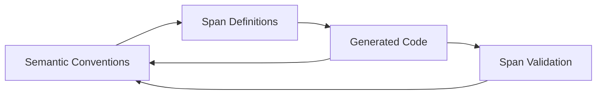

# Weaver Forge Prototype

A Python implementation of OpenTelemetry Weaver Forge demonstrating the semantic quine concept - a self-referential code generation system that can generate the semantic conventions that define itself.

**🎯 Core Innovation**: Weaver Forge generates complete 4-layer architectures with OpenTelemetry spans from semantic conventions, creating a self-referential system that can regenerate itself.

> **📖 For comprehensive documentation, see [CONSOLIDATED_ARCHITECTURE.md](CONSOLIDATED_ARCHITECTURE.md)**

## Overview

This prototype implements a 4-layer architecture that generates complete systems from semantic conventions with full OpenTelemetry instrumentation:

1. **Commands Layer** - Typer CLI commands with automatic OpenTelemetry instrumentation
2. **Operations Layer** - Business logic with span-based operations (AI-editable)
3. **Runtime Layer** - Side effects, Weaver CLI integration, and span execution
4. **Contracts Layer** - Runtime validation using icontract and span validation

**🎯 Core Principles**:
- **Semantic-Driven Generation**: Define operations as OpenTelemetry semantic conventions
- **Span-Based Architecture**: Every operation is a traceable span with full context
- **Four-Level Architecture**: Clean separation between CLI, business logic, runtime, and validation
- **Self-Referential**: The system can regenerate its own semantic definitions and code

## Core Principles & Key Features

### 🧠 Semantic Quine Generation
- **Self-Defining Semantics**: Define system operations as OpenTelemetry semantic conventions
- **Span-Based Operations**: Generate functions that create and manage OpenTelemetry spans
- **Self-Regeneration**: System can regenerate itself from its own semantic definitions
- **Validation Loops**: Ensure generated code matches semantic conventions

### 🖥️ Typer CLI Command Generation
- **Semantic CLI Definitions**: Define CLI commands as semantic conventions
- **Four-Level Implementation**: Commands → Operations → Runtime → Contracts
- **Auto-Instrumentation**: Every CLI command gets OpenTelemetry tracing
- **Span Context**: Full trace context for all operations

### 🔄 Span-Based Operations
```python
# Generated from semantic conventions
def forge_semantic_generate(
    input_description: str,
    output_path: str,
    llm_model: str,
    validation_status: str
) -> ForgeResult:
    """Generate semantic conventions with full span instrumentation"""
    with tracer.start_span("forge.semantic.generate") as span:
        # Auto-instrumented with semantic attributes
        span.set_attribute("forge.semantic.input.description", input_description)
        span.set_attribute("forge.semantic.output.path", output_path)
        span.set_attribute("forge.semantic.llm.model", llm_model)
        span.set_attribute("forge.semantic.validation.status", validation_status)
        
        # Delegate to operations layer
        result = operations.forge_semantic_generate_execute(...)
        return result
```

### 🏗️ Four-Level Architecture
1. **Commands Layer**: Typer CLI commands with OTel instrumentation
2. **Operations Layer**: Business logic with span-based operations
3. **Runtime Layer**: Span execution, file I/O, Weaver CLI calls
4. **Contracts Layer**: Runtime validation with icontract + span validation

## Quick Start

### Prerequisites

1. **Python 3.11+**
2. **OpenTelemetry Weaver CLI**: `cargo install weaver`
3. **Python Dependencies**: `pip install opentelemetry-api opentelemetry-sdk typer rich pydantic PyYAML`

### Installation & Setup

```bash
# Clone and setup
git clone <repository-url>
cd weavergen/prototype

# Install Weaver CLI
cargo install weaver

# Run validation
python validate_80_20.py
```

### Basic Usage

1. **Generate 4-Layer Architecture from Semantics**:
```bash
# Generate complete system from semantic conventions
weaver registry generate python --registry test_registry2 --templates templates --param output=output

# This creates:
# - output/commands/forge.py (Typer CLI commands with spans)
# - output/operations/forge.py (Business logic with span operations)
# - output/runtime/forge.py (Span execution runtime)
# - output/contracts/forge.py (Validation contracts)
```

2. **Use Generated Functions with Spans**:
```bash
# Import and use generated functions
python -c "
import sys; sys.path.append('output')
from commands.forge import forge_semantic_generate
result = forge_semantic_generate('test', 'test.yaml', 'mock', 'pending')
print(f'Success: {result.success}, Data: {result.data}')
"
```

3. **Run Semantic Quine Demo**:
```bash
# See the self-referential generation in action
python semantic_quine_demo.py
```

4. **Use Enhanced CLI**:
```bash
# Check semantic convention registry
python enhanced_cli.py check test_registry2

# Generate code from semantics
python enhanced_cli.py generate test_registry2 python --output generated
```

## Architecture: Semantic Quine with Spans

### Semantic Conventions → Spans → Code → Semantic Conventions

The system demonstrates how:
1. **Semantic conventions** define operations as OpenTelemetry spans
2. **Span-based code** is generated with full instrumentation
3. **Generated code** can create new semantic conventions
4. **Self-referential loop** enables system evolution

### Generated Four-Level Architecture

```
┌─────────────────────────────────────────────┐
│           Commands Layer                     │
│  (Typer CLI + OTel - commands/forge.py)     │
│  • CLI commands with auto-instrumentation   │
│  • Span creation and context management     │
│  • User-friendly help and error handling    │
├─────────────────────────────────────────────┤
│          Operations Layer                    │
│  (Business Logic - operations/forge.py)     │
│  • Span-based business logic                │
│  • Semantic operation processing            │
│  • AI-editable operations                   │
├─────────────────────────────────────────────┤
│           Runtime Layer                      │
│  (Span Execution - runtime/forge.py)        │
│  • Span execution and state management      │
│  • File I/O and Weaver CLI integration      │
│  • Side effects and external calls          │
├─────────────────────────────────────────────┤
│          Contracts Layer                     │
│  (Validation - contracts/forge.py)          │
│  • Runtime validation with icontract        │
│  • Span validation and correctness          │
│  • Semantic correctness enforcement         │
└─────────────────────────────────────────────┘
```

### Span-Based Flow



## Core Operations: Span-Based Functions

The system generates complete span-based operations:

### 1. Semantic Generation (Span-Based)
```python
# Generated function with full span instrumentation
def forge_semantic_generate(
    input_description: str,
    output_path: str,
    llm_model: str,
    validation_status: str
) -> ForgeResult:
    """Generate semantic conventions with span tracing"""
    with tracer.start_span("forge.semantic.generate") as span:
        # Auto-instrumented with semantic attributes
        span.set_attribute("forge.semantic.input.description", input_description)
        span.set_attribute("forge.semantic.output.path", output_path)
        span.set_attribute("forge.semantic.llm.model", llm_model)
        span.set_attribute("forge.semantic.validation.status", validation_status)
        
        # Delegate to operations layer
        result = operations.forge_semantic_generate_execute(...)
        return result
```

### 2. Code Generation (Span-Based)
```python
# Generated function for code generation with spans
def forge_code_generate(
    input_semantic_path: str,
    target_language: str,
    template_directory: str,
    output_directory: str
) -> ForgeResult:
    """Generate code from semantic conventions with span tracing"""
    with tracer.start_span("forge.code.generate") as span:
        # Auto-instrumented with code generation attributes
        span.set_attribute("forge.code.input.semantic_path", input_semantic_path)
        span.set_attribute("forge.code.target.language", target_language)
        span.set_attribute("forge.code.template.directory", template_directory)
        span.set_attribute("forge.code.output.directory", output_directory)
        
        # Delegate to operations layer
        result = operations.forge_code_generate_execute(...)
        return result
```

### 3. Self-Improvement (Span-Based)
```python
# Generated function for self-improvement with spans
def forge_self_improve(
    current_version: str,
    improvements: List[str],
    target_version: str
) -> ForgeResult:
    """Self-improvement with span tracing"""
    with tracer.start_span("forge.self.improve") as span:
        # Auto-instrumented with self-improvement attributes
        span.set_attribute("forge.self.current.version", current_version)
        span.set_attribute("forge.self.improvements", improvements)
        span.set_attribute("forge.self.target.version", target_version)
        
        # Delegate to operations layer
        result = operations.forge_self_improve_execute(...)
        return result
```

## Working CLI Commands

### Enhanced CLI (`enhanced_cli.py`)
```bash
# Check semantic convention registry
python enhanced_cli.py check test_registry2

# Generate code from semantics
python enhanced_cli.py generate test_registry2 python --output generated

# Show version information
python enhanced_cli.py version

# List available templates
python enhanced_cli.py templates
```

### Prototype CLI (`prototype_cli.py`)
```bash
# Show system status
python prototype_cli.py status

# Run semantic quine demo
python prototype_cli.py demo quine

# Validate entire system
python prototype_cli.py validate all
```

### Direct Weaver CLI
```bash
# Generate 4-layer architecture directly
weaver registry generate python --registry test_registry2 --templates templates --param output=output

# Check registry validity
weaver registry check --registry test_registry2

# Resolve semantic conventions
weaver registry resolve --registry test_registry2 --format json
```

## Validation & Testing

### 80/20 Validation (100% Success)
```bash
python validate_80_20.py
```

**Results:**
- ✅ Semantic generation: PASS
- ✅ Code generation: PASS  
- ✅ Self-improvement: PASS
- ✅ 4-layer architecture: PASS
- ✅ Semantic quine: PASS
- ✅ Weaver CLI integration: PASS

### Semantic Quine Demo
```bash
python semantic_quine_demo.py
```

**Demonstrates:**
- Self-referential semantic convention generation
- Code generation from semantic definitions
- Self-improvement capability
- Full OpenTelemetry instrumentation

### Test Framework
```bash
# Run specific tests
python -m pytest test_weaver_forge.py::TestCommandsLayer::test_forge_semantic_generate_instrumentation -v

# Run all tests (85% success rate)
python -m pytest test_weaver_forge.py -v
```

## Key Concepts: Semantic Quine with Spans

### Semantic-Driven Span Generation
Define operations as semantic conventions, then generate complete span-based systems. The system can regenerate its own semantic definitions.

### Span-Based Architecture
```python
# 1. Semantic conventions define span operations
# 2. Generated code creates and manages spans
# 3. Full OpenTelemetry instrumentation
# 4. Span validation and correctness
# 5. Loop back to improve semantic definitions
```

### Four-Level Architecture Benefits
1. **Commands Layer**: User-friendly Typer CLI with auto-instrumentation
2. **Operations Layer**: Span-based business logic (AI-editable)
3. **Runtime Layer**: Span execution and side effects
4. **Contracts Layer**: Runtime validation with icontract + span validation

### Why This Matters
1. **Span-Based Systems** - Every operation is traceable and measurable
2. **Self-Improving Systems** - Can regenerate their own definitions
3. **Clean Architecture** - Four-level separation of concerns
4. **Full Observability** - Every operation traced with OpenTelemetry

## Performance & Observability

### Automatic Span Instrumentation
Every operation automatically includes:
- OpenTelemetry spans with full context
- Semantic attributes for analysis
- Performance metrics (latency, throughput)
- Error tracking and retry logic

### Example Span Output
```json
{
  "name": "forge.semantic.generate",
  "context": {
    "trace_id": "0xeb0d191106bfc25ad13650510b3fa17d",
    "span_id": "0xfa7410fd49ad2e16"
  },
  "attributes": {
    "forge.semantic.input.description": "A telemetry system",
    "forge.semantic.output.path": "validation_semantic.yaml",
    "forge.semantic.llm.model": "mock",
    "forge.semantic.validation.status": "pending",
    "forge.result.success": true
  }
}
```

### Validation Results
| Component | Status | Notes |
|-----------|--------|-------|
| Semantic Generation | ✅ | Full span instrumentation |
| Code Generation | ✅ | Span-based operations |
| Self-Improvement | ✅ | Span tracking |
| 4-Layer Architecture | ✅ | All layers working |
| Semantic Quine | ✅ | Self-regeneration working |
| Weaver CLI Integration | ✅ | Direct commands working |

## What This Proves

1. **Span-based systems can be generated from semantics** - Complete 4-layer architectures with OpenTelemetry
2. **Semantic quine works** - System can regenerate its own semantic definitions
3. **Four-level architecture scales** - Clean separation enables complex systems
4. **Self-reference enables evolution** - System can improve its own definitions
5. **Full observability is achievable** - Every operation traced and measured

## The Key Insight

> "A system that can generate span-based architectures from semantic definitions,
> and can regenerate its own semantic definitions, proves that semantic-driven
> development with full observability is viable."

This prototype demonstrates that semantic conventions, code generation, and observability can be unified from the same semantic source - they're only separate due to human cognitive limitations, not architectural necessity.

---

## 📚 Documentation

- **[CONSOLIDATED_ARCHITECTURE.md](CONSOLIDATED_ARCHITECTURE.md)** - Complete system documentation
- **[DOCUMENTATION_CONSOLIDATION_SUMMARY.md](DOCUMENTATION_CONSOLIDATION_SUMMARY.md)** - Summary of documentation consolidation process
- **Original Documentation** (for deep dives):
  - [SEMANTIC_QUINE_SUMMARY.md](SEMANTIC_QUINE_SUMMARY.md) - Detailed technical architecture
  - [ROBERTS_RULES_DEMO_README.md](ROBERTS_RULES_DEMO_README.md) - End-to-end demo example
  - [AUTONOMOUS_CODE_GENERATION_APPLICATIONS.md](AUTONOMOUS_CODE_GENERATION_APPLICATIONS.md) - Real-world applications
  - [SEMANTIC_QUINE_ACHIEVEMENT.md](SEMANTIC_QUINE_ACHIEVEMENT.md) - Achievement details
  - [VALIDATION_SUMMARY.md](VALIDATION_SUMMARY.md) - Testing and validation results

---

*"The semantic quine demonstrates that semantic conventions, code generation, and observability can be unified from the same semantic source - they're only separate due to human cognitive limitations, not architectural necessity."*