# The Lean Semantic Framework: From Ad Hoc to Proven Principles

## Executive Summary

We've transformed semantic-driven development from philosophical ideals into a **quantifiable, measurable framework** based on three proven methodologies:

1. **80/20 (Pareto Principle)** - Focus on the vital few
2. **Jobs-to-be-Done (JTBD)** - Build what customers hire you for
3. **Design for Lean Six Sigma (DFLSS)** - Statistical quality where it counts

## The Integrated Framework

### 🎯 Core Formula

```
Semantic Success = (Critical Coverage × Job Completion × Process Capability) / Complexity
```

Where:
- **Critical Coverage** = 100% of the 20% that matters (Pareto)
- **Job Completion** = 80% of customer jobs achievable (JTBD)
- **Process Capability** = Cpk > 1.33 on critical path (Six Sigma)
- **Complexity** = Semantic model size (Lean principle)

## How The Three Documents Work Together

### 1. Definition of Done (What to Build)
**Grounded in 80/20 + JTBD**

- ✓ Identifies critical 20% through JTBD analysis
- ✓ Measures completion by jobs done, not features built
- ✓ Applies Six Sigma only where customers need it

### 2. Manifesto (How to Think)
**Philosophy meets Six Sigma methodology**

- ✓ Values stream mapping over feature lists
- ✓ Embraces statistical thinking over opinions
- ✓ Pursues perfection through waste elimination

### 3. Shipping Criteria (When to Ship)
**DMAIC process with economic analysis**

- ✓ Define shipping via customer value
- ✓ Measure with control charts
- ✓ Analyze cost of delay vs. incompleteness
- ✓ Ship at statistical confidence

## The Practical Integration

### Phase 1: JTBD Discovery (Define)
```yaml
# Not features, but jobs
customer_jobs:
  - job: "Authenticate users"
    importance: 10
    current_satisfaction: 0
    target_outcome: "Access granted in <200ms"
```

### Phase 2: 80/20 Semantic Modeling (Measure)
```yaml
# Model the vital few
critical_semantics:  # 20% of operations
  - auth.validate   # 35% of requests
  - auth.session    # 25% of requests
  - auth.refresh    # 20% of requests
  total: 80% of system load
```

### Phase 3: Six Sigma Generation (Analyze/Improve)
```python
@critical_path
@six_sigma_quality(cpk_target=2.0)
@measure_ctq(["response_time", "success_rate"])
def auth_validate():
    # Generated with quality built in
```

### Phase 4: Statistical Shipping Decision (Control)
```python
shipping_decision = {
    "pareto_coverage": 1.0,      # 100% of critical 20%
    "jtbd_completion": 0.82,     # 82% of jobs doable
    "process_capability": 1.41,   # Exceeds 1.33 threshold
    "decision": "SHIP"
}
```

## Why This Framework Succeeds

### 1. Quantifiable Over Philosophical
- **Old**: "Ship when it feels ready"
- **New**: "Ship when Cpk > 1.33 and JTBD ≥ 80%"

### 2. Customer-Centric Over Feature-Centric
- **Old**: "Implement all user stories"
- **New**: "Complete 80% of hired jobs"

### 3. Statistical Over Anecdotal
- **Old**: "Seems stable in testing"
- **New**: "Process in statistical control"

### 4. Economic Over Perfectionist
- **Old**: "Ship when complete"
- **New**: "Ship when CoD > CoS"

## The Unified Workflow

```mermaid
graph TD
    A[JTBD Analysis] -->|Identify Critical Jobs| B[80/20 Semantic Modeling]
    B -->|Model Vital Few| C[Six Sigma Generation]
    C -->|Generate with Quality| D[Statistical Validation]
    D -->|Measure Performance| E{Shipping Decision}
    E -->|Cpk > 1.33 & JTBD ≥ 80%| F[SHIP]
    E -->|Below Thresholds| G[Targeted Improvement]
    G -->|Pareto Focus| B
    F -->|Monitor & Control| H[Evolution Triggers]
    H -->|Statistical Limits| G
```



## Key Metrics Dashboard

| Principle | Metric | Target | Measurement |
|-----------|--------|--------|-------------|
| **80/20** | Critical Coverage | 100% | Count(implemented) / Count(critical) |
| **JTBD** | Job Completion | ≥80% | Σ(JobsSatisfied) / Σ(JobsIdentified) |
| **Six Sigma** | Process Capability | Cpk>1.33 | (USL-μ) / 3σ |
| **Lean** | Value Ratio | >50% | ValueTime / TotalTime |

## The Bottom Line

This framework transforms semantic-driven development from:
- **Art → Science** (measurable outcomes)
- **Opinion → Data** (statistical decisions)
- **Features → Jobs** (customer focus)
- **Perfection → Optimization** (80/20 reality)

## Implementation Checklist

### Week 1: JTBD Analysis
- [ ] Interview customers about jobs
- [ ] Rank jobs by importance
- [ ] Map jobs to semantic operations

### Week 2: 80/20 Modeling
- [ ] Identify critical 20% of operations
- [ ] Create semantic definitions
- [ ] Validate with telemetry estimates

### Week 3: Six Sigma Implementation
- [ ] Generate with quality constraints
- [ ] Implement measurement
- [ ] Calculate baseline Cpk

### Week 4: Shipping Decision
- [ ] Measure JTBD completion
- [ ] Verify statistical control
- [ ] Calculate CoD vs CoS
- [ ] Make data-driven decision

## Success Stories Pattern

```yaml
before:
  approach: "Build everything, ship when done"
  timeline: "6-12 months"
  satisfaction: "Unknown until launch"
  quality: "Hope for the best"

after:
  approach: "Build critical 20%, ship at 80% jobs"
  timeline: "4-6 weeks"
  satisfaction: "82% measured before ship"
  quality: "Cpk = 1.41 on critical path"
```

## Remember

**This isn't about lowering standards—it's about applying the highest standards where they matter most.**

The framework ensures you:
1. Build what customers actually hire you for (JTBD)
2. Focus on the vital few operations (80/20)
3. Achieve statistical quality where needed (Six Sigma)
4. Ship based on data, not opinions (Lean)

---

*"The best framework is one that turns philosophy into measurement, ideals into metrics, and decisions into data."*