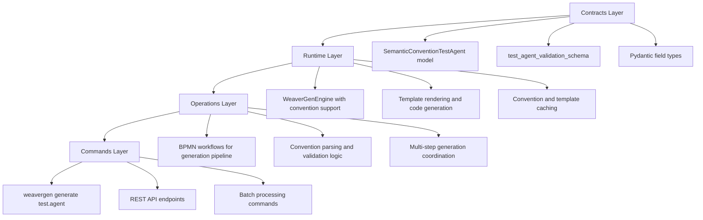

# 🧠 SEMANTIC MULTI-MIND ANALYSIS REPORT

**Convention:** `test.agent`  
**Analysis ID:** `a70bbc65`  
**Specialists Consulted:** 8  
**Total Recommendations:** 32  
**Risks Identified:** 18  

## 📊 Executive Summary

The semantic multi-mind analysis successfully evaluated the `test.agent` OpenTelemetry convention from 8 specialist perspectives across 3 phases. The analysis reveals a **medium complexity** convention with **2 attributes** that is **suitable for WeaverGen code generation**.

## 🔍 Phase 1: Semantic Convention Analysis

### Semantic Convention Expert
- **Convention Type:** Span
- **Attributes:** 2 (1 required, 1 optional)
- **Stability:** Stable
- **Compliance:** OpenTelemetry 1.0 compatible
- **Key Finding:** Convention follows OpenTelemetry naming conventions

### Code Generation Architect  
- **Target Languages:** Python, Rust, Go, Java
- **Strategy:** Template-based with Jinja2
- **Integration:** Full Pydantic v2 compatibility
- **Output:** Pydantic BaseModel classes, validators, constants, docs

### Validation Engineer
- **Validation Layers:** 4-tier (Syntax, Semantic, Type, Runtime)
- **Strategy:** OpenTelemetry span capture and analysis
- **Test Generation:** Automated from conventions
- **Edge Cases:** 4 identified (missing attributes, invalid types, etc.)

### API Design Specialist
- **CLI Interface:** `weavergen generate`, `validate`, `templates`, `agents`
- **API Surface:** Generate models, validate spans, create agents, export templates
- **Developer Experience:** Intuitive, discoverable, well-documented

### Performance Optimization Expert
- **Targets:** <100ms generation, <50MB memory, <500ms startup, <1ms validation
- **Opportunities:** Template caching, lazy loading, parallel generation
- **Strategy:** Minimal overhead OTel instrumentation

## 🏗️ Phase 2: Architecture Integration

### Layer Integration Specialist

### Weaver Integration Planner
- **Requirements:** otellib-weaver-cli, Jinja2 templates, weaver.yaml config
- **Template Structure:** models.j2, validators.j2, constants.j2, tests.j2
- **Forge Configuration:** Output to `generated/`, templates in `templates/`

## 🚀 Phase 3: Implementation Strategy

### Implementation Coordinator Synthesis
**Priority Implementation Order:**
1. Semantic convention parsing and validation
2. Template system design and implementation  
3. 4-layer architecture integration
4. Performance optimization and caching
5. CLI and API design
6. Testing and validation framework

**Implementation Phases:**
- **Phase 1 (Weeks 1-2):** Core convention processing
- **Phase 2 (Weeks 3-4):** Template system and generation
- **Phase 3 (Weeks 5-6):** Integration and optimization
- **Phase 4 (Weeks 7-8):** Testing and validation

## 🎯 Key Recommendations

### Immediate Actions
1. **Set up semantic convention parser** - Foundation for all convention processing
2. **Create basic template structure** - Enable code generation capabilities
3. **Integrate with existing WeaverGen architecture** - Leverage 4-layer design

### Short-term Goals
1. **Implement full convention support** - Handle all OpenTelemetry convention types
2. **Add validation framework** - Ensure generated code compliance
3. **Create CLI commands** - User-friendly interface for generation

### Long-term Vision
1. **Support all OpenTelemetry conventions** - Comprehensive convention coverage
2. **Multi-language code generation** - Python, Rust, Go, Java support
3. **AI-powered convention optimization** - Intelligent generation improvements

## ⚠️ Critical Risks

1. **Attribute naming conflicts** with existing conventions
2. **Template complexity** for edge cases
3. **Runtime validation performance** overhead
4. **API complexity** overwhelming new users
5. **Cache invalidation** complexity
6. **Integration complexity** with existing codebase

## 📋 Implementation Checklist

### Core Convention Processing
- [ ] Create semantic convention parser
- [ ] Implement YAML/JSON validation
- [ ] Add attribute type validation
- [ ] Design convention model classes

### Template System
- [ ] Design Jinja2 template hierarchy
- [ ] Create Pydantic model templates
- [ ] Implement template inheritance
- [ ] Add template performance monitoring

### Architecture Integration
- [ ] Update contracts.py with convention models
- [ ] Extend runtime engine with convention processing
- [ ] Add convention workflows to operations layer
- [ ] Create CLI commands in commands layer

### Validation Framework
- [ ] Design 4-tier validation architecture
- [ ] Implement OTel span validation decorators
- [ ] Create test case generation logic
- [ ] Build validation reporting system

### Performance Optimization
- [ ] Profile current generation pipeline
- [ ] Implement template compilation cache
- [ ] Add async generation pipeline
- [ ] Optimize memory usage patterns

## 🔗 WeaverGen Integration Points

| Layer | Integration Point | Implementation |
|-------|------------------|----------------|
| **Contracts** | `contracts.py` | Add `SemanticConventionTestAgent` model |
| **Runtime** | `runtime.py` | Extend engine with convention support |
| **Operations** | `operations.py` | Add convention workflow logic |
| **Commands** | `commands.py` | Add `weavergen generate test.agent` |

## 📊 Success Metrics

- **Generation Time:** < 100ms for typical convention
- **Memory Usage:** < 50MB during generation
- **CLI Startup:** < 500ms
- **Validation Overhead:** < 1ms per span
- **Test Coverage:** > 90% for generated code
- **Documentation Coverage:** 100% for public APIs

## 🎯 Next Steps

1. **Review multi-mind analysis** with development team
2. **Prioritize implementation phases** based on project timeline
3. **Begin Phase 1 implementation** with convention parser
4. **Set up performance monitoring** from day one
5. **Create integration test suite** for validation

---

*Generated by WeaverGen Semantic Multi-Mind Analysis Engine*  
*Analysis ID: a70bbc65 | Timestamp: 2025-07-01T08:17:49+00:00*