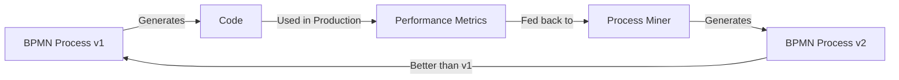

# Radical Implications of BPMN-First Code Generation

## The Paradigm Inversion

### From Text to Visual
Traditional: Developers write text → Compiler generates machine code
BPMN-First: Developers draw processes → Process engine generates source code

This isn't just a UI change—it's a fundamental inversion of how we think about programming.

## Most Radical Departures

### 1. **Code as Emergent Behavior**
In a BPMN-first world, code isn't written—it emerges from process execution. The Python class, Rust struct, or Go interface you need doesn't exist as a template or generator function. It exists as the OUTPUT of executing a business process.

```
Process Definition → Process Execution → Code Emerges
```

### 2. **Compilation as Process Mining**
Instead of compilers that parse syntax trees, we have process miners that discover optimal code patterns:

- Traditional: Parse → AST → Optimize → Generate
- BPMN-First: Execute → Mine → Discover → Evolve

The "compiler" becomes a learning system that gets better at generating code over time.

### 3. **Version Control for Processes, Not Code**
```bash
git diff my_generator.bpmn
# Shows visual diff of process changes
# Code changes are DERIVED, not primary
```

Developers stop versioning generated code entirely. They version the processes that generate the code.

### 4. **Debugging by Time Travel**
Since BPMN processes record execution history:
- Step backward through generation
- Replay with different inputs
- Fork execution at any decision point
- Visualize all possible code outputs simultaneously

### 5. **AI as Process Designer**
LLMs don't generate code—they generate BPMN processes:

```
User: "I need a REST API client for the GitHub API"
AI: *Generates BPMN process that, when executed, produces the client in multiple languages*
```

## Thought Experiments

### Experiment 1: The Self-Improving Generator


The system continuously evolves better ways to generate code.

### Experiment 2: Cross-Language Process Fusion
What if processes from different domains could merge?

```xml
<bpmn:collaboration>
  <participant name="PythonGenerator" />
  <participant name="RustGenerator" />
  <participant name="TypeSystemMediator" />
  
  <!-- They negotiate the best type representation -->
  <messageFlow from="PythonGenerator" to="TypeSystemMediator" />
  <messageFlow from="RustGenerator" to="TypeSystemMediator" />
  <messageFlow from="TypeSystemMediator" to="Both">
    <message>Agreed Type Definition</message>
  </messageFlow>
</bpmn:collaboration>
```

### Experiment 3: Quantum Superposition of Code
Since BPMN can model parallel universes (via event-based gateways), could we generate code that exists in superposition until observed?

```xml
<bpmn:eventBasedGateway id="QuantumChoice">
  <outgoing>Functional</outgoing>
  <outgoing>ObjectOriented</outgoing>
  <outgoing>Reactive</outgoing>
</bpmn:eventBasedGateway>

<!-- All three paradigms generated simultaneously -->
<!-- Collapsed to one based on usage patterns -->
```

## Philosophical Implications

### 1. **What Is Code?**
If code is just the output of process execution, is it still "code" in the traditional sense? Or is it more like a build artifact?

### 2. **Who Is the Programmer?**
- The person drawing BPMN diagrams?
- The process engine executing them?
- The AI optimizing the processes?
- All of the above?

### 3. **Determinism vs. Emergence**
Traditional code generation is deterministic. BPMN-first generation could be emergent—the same process might generate different (but functionally equivalent) code based on:
- Execution environment
- Historical patterns
- Current system load
- Even time of day

## Ultimate Vision: The Process Ecosystem

### Living Processes
BPMN processes that:
- Reproduce (generate variations of themselves)
- Compete (based on performance metrics)
- Evolve (through process mining)
- Die (when superseded by better processes)

### Process Markets
```yaml
marketplace:
  - process: OptimizedPythonGenerator
    rating: 4.8/5
    metrics:
      speed: 26x faster than manual
      accuracy: 99.7%
    price: 0.001 tokens per generation
    
  - process: RustSafetyGenerator
    rating: 4.9/5
    specialization: memory-safe code
    verified-by: formal-methods
```

### Meta-Processes
Processes that generate processes that generate code:

```
Level 0: Manual BPMN creation
Level 1: BPMN that generates code
Level 2: BPMN that generates BPMN that generates code
Level 3: BPMN that generates BPMN that generates BPMN...
Level ∞: The process singularity
```

## The Most Radical Idea

What if BPMN-first isn't about code generation at all?

What if it's about **making programming disappear entirely**?

In this world:
- Business analysts draw what they want
- Processes execute and create what's needed
- Code becomes an implementation detail
- Programming languages become invisible
- Software development becomes process design

The ultimate abstraction: **Process-Oriented Programming** where the process IS the program, execution IS compilation, and code is just a side effect.

## Conclusion: Beyond Code

BPMN-first WeaverGen isn't just a new way to generate code—it's a glimpse into a post-code future where:

1. **Visual thinking** replaces textual thinking
2. **Processes** replace programs
3. **Execution** replaces compilation
4. **Evolution** replaces versioning
5. **Emergence** replaces engineering

The question isn't whether this is practical today, but whether this is where software development is inevitably heading. When we look back in 20 years, will we wonder why we ever wrote code by hand, just as we now wonder why anyone programmed in assembly?

The BPMN-first approach suggests that code generation isn't the end goal—it's just a stepping stone to a world where the distinction between designing software and having software no longer exists.

**The most radical departure**: In a BPMN-first world, WeaverGen doesn't generate code. It generates realities.