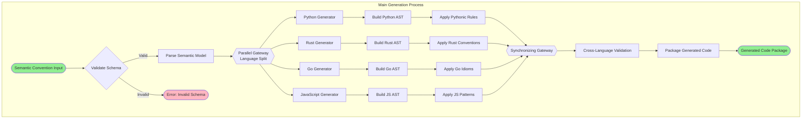
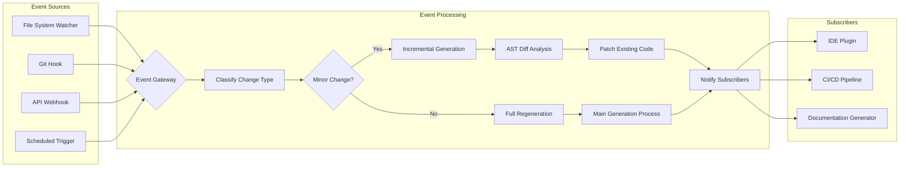
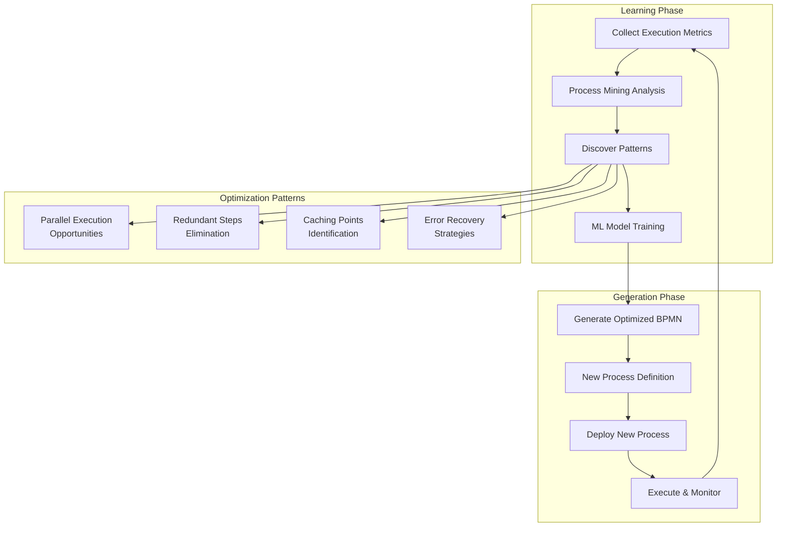
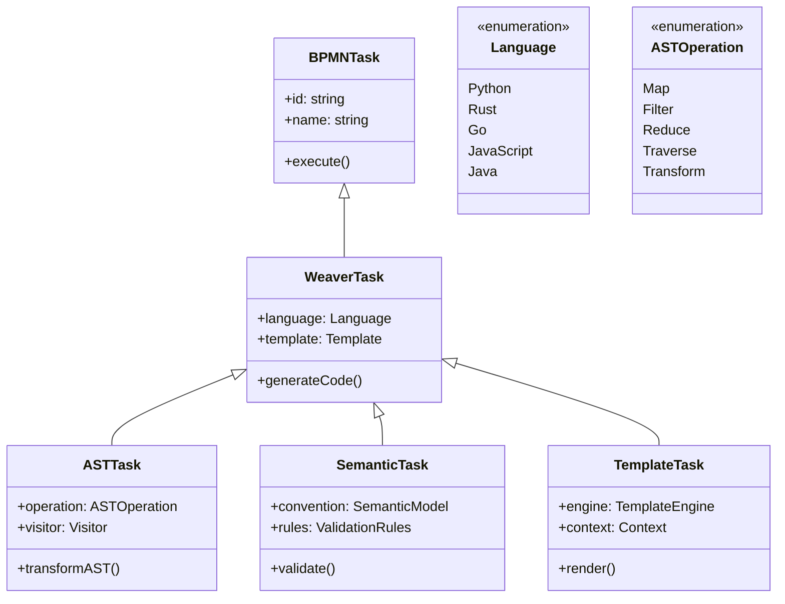
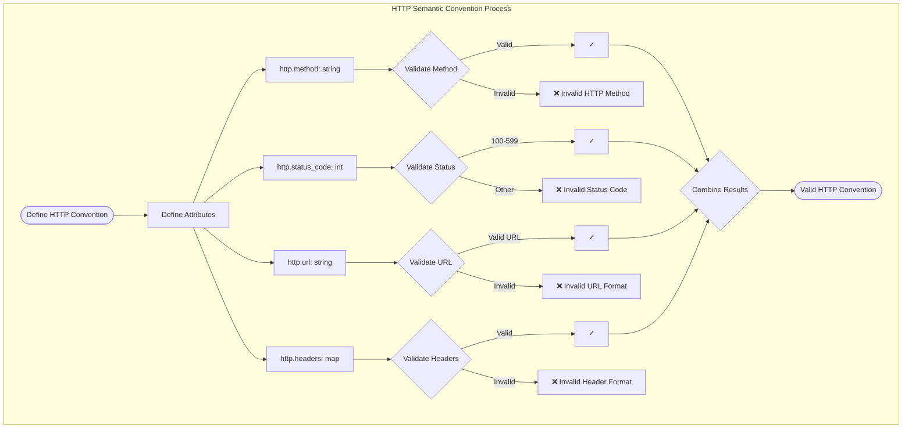
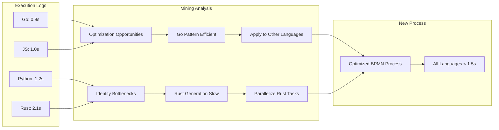
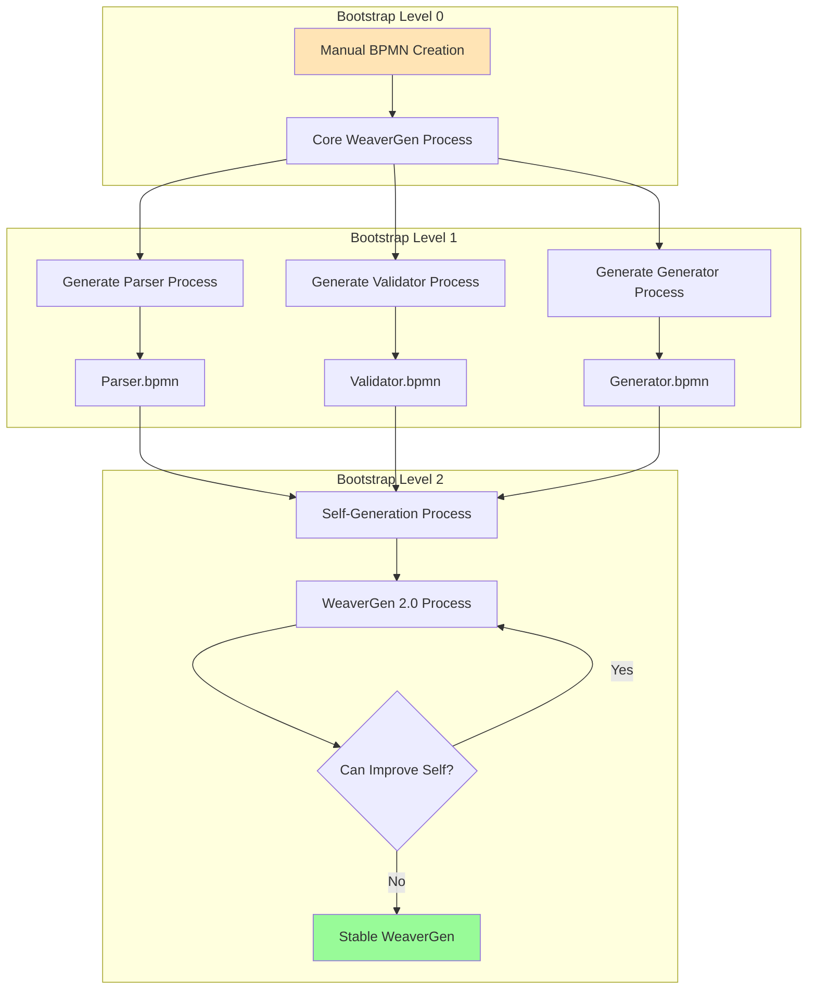
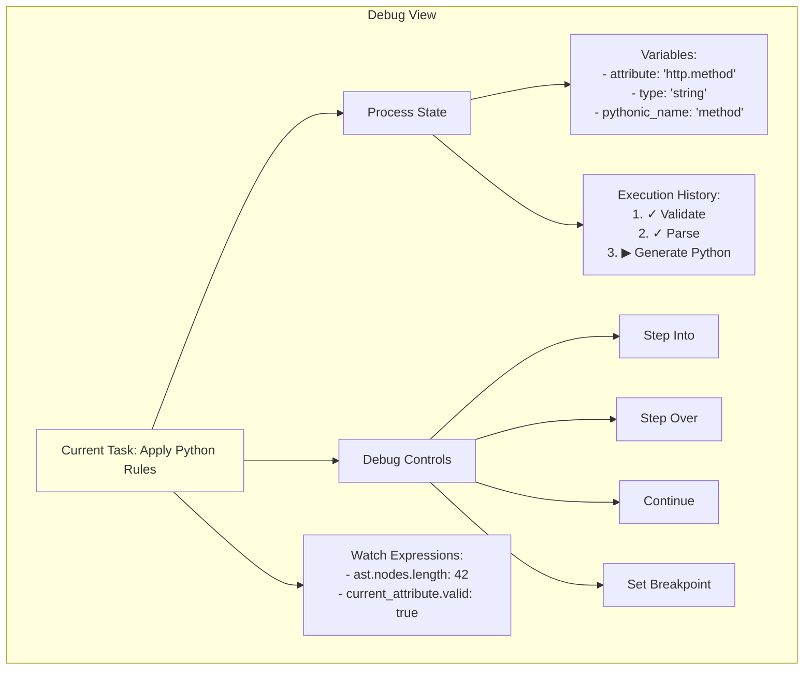

# BPMN-First WeaverGen: Visual Examples

## Core Code Generation Process



## Event-Driven Regeneration



## Self-Modifying Workflow Example



## BPMN Extensions for Code Generation



## Semantic Convention as BPMN Process



## Process Mining Visualization



## Meta-Level Bootstrap Process



## Visual Debugging Interface



## Language-Specific Subprocess Example

```mermaid
graph TD
    subgraph "Python Generation Subprocess"
        PyStart([Semantic Model]) --> ClassGen[Generate Class Structure]
        
        ClassGen --> InitMethod[Generate __init__]
        ClassGen --> Properties[Generate Properties]
        ClassGen --> Methods[Generate Methods]
        
        InitMethod --> TypeHints{Add Type Hints?}
        TypeHints -->|Yes| Typed[Add typing imports]
        TypeHints -->|No| Untyped[Basic Python]
        
        Properties --> PropLoop[For Each Attribute]
        PropLoop --> Getter[@property getter]
        PropLoop --> Setter[@setter if mutable]
        
        Methods --> Validation[Add validation methods]
        Methods --> Serialization[Add to_dict/from_dict]
        
        Typed --> Combine[Combine Code Parts]
        Untyped --> Combine
        Getter --> Combine
        Setter --> Combine
        Validation --> Combine
        Serialization --> Combine
        
        Combine --> Format[Apply Black Formatter]
        Format --> PyEnd([Python Code])
    end
```

These visual examples demonstrate how BPMN-first code generation would work in practice, showing the flow-based nature of the generation logic and how different aspects of the system interconnect.