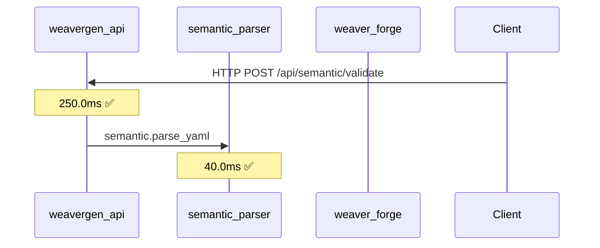
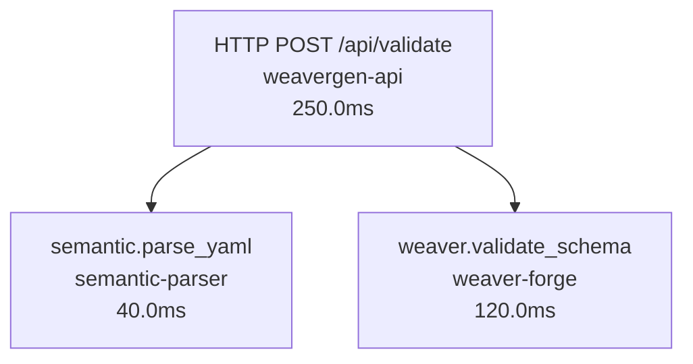
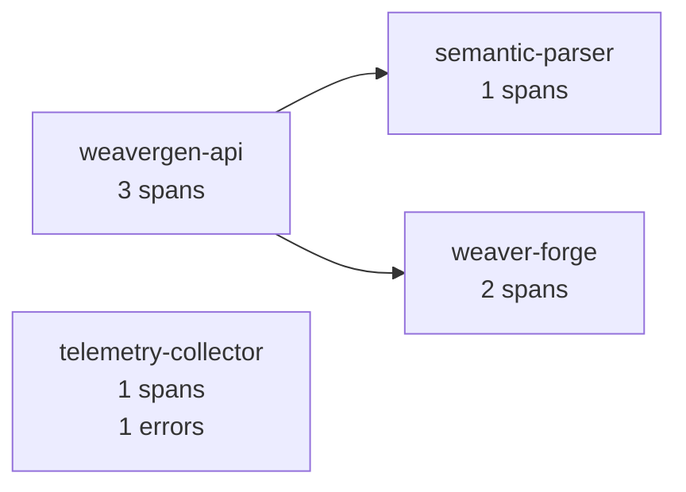

# Span File to Mermaid Conversion

## Overview

The `weavergen mermaid spans` command converts OpenTelemetry span files into rich mermaid diagrams for visualization and analysis.

## Command Usage

```bash
weavergen mermaid spans <span_file> [OPTIONS]
```

### Arguments
- `span_file`: Path to OpenTelemetry span file (JSON, JSONL, CSV, or log format)

### Options
- `--type, -t`: Diagram type (sequence, trace, service, timeline) [default: sequence]
- `--max, -m`: Maximum number of spans to visualize [default: 50]
- `--trace-id`: Specific trace ID to visualize (for trace diagrams)
- `--timing/--no-timing`: Include/exclude timing information [default: timing]
- `--output, -o`: Save diagram to file

## Supported Input Formats

### 1. JSON Format
Standard JSON array of span objects:
```json
[
  {
    "spanId": "span-001",
    "traceId": "trace-abc123",
    "operationName": "HTTP POST /api/validate",
    "serviceName": "weavergen-api",
    "startTime": "2025-07-02T16:00:00.000Z",
    "endTime": "2025-07-02T16:00:00.250Z",
    "status": "OK",
    "attributes": {...}
  }
]
```

### 2. JSONL Format
One JSON span object per line:
```
{"spanId": "span-001", "traceId": "trace-abc123", ...}
{"spanId": "span-002", "traceId": "trace-abc123", ...}
```

### 3. CSV Format
Comma-separated values with headers:
```csv
span_id,trace_id,operation_name,service_name,start_time,end_time,duration_ms,status
span-001,trace-abc123,HTTP POST,weavergen-api,2025-07-02T16:00:00.000Z,2025-07-02T16:00:00.250Z,250,OK
```

### 4. Log Format
Log files containing JSON span objects (extracted automatically)

### 5. OTLP Format
OpenTelemetry Protocol format with resourceSpans structure

## Diagram Types

### Sequence Diagram (`--type sequence`)
Shows service interactions over time:


### Trace Flow Diagram (`--type trace`)
Shows span hierarchy and relationships:


### Service Map (`--type service`)
Shows service dependencies and health:


### Timeline Diagram (`--type timeline`)
Shows execution timeline as Gantt chart:

```mermaid
gantt
    title Span Timeline
    dateFormat X
    axisFormat %H:%M:%S
    section weavergen-api
    HTTP POST /api/validate :done, 0, 0
    section semantic-parser
    semantic.parse_yaml :done, 0, 0
```


## Examples

### Basic Usage
```bash
# Generate sequence diagram
weavergen mermaid spans traces.json

# Generate service dependency map
weavergen mermaid spans traces.json --type service

# Generate trace flow for specific trace
weavergen mermaid spans traces.json --type trace --trace-id abc123

# Generate timeline with limited spans
weavergen mermaid spans traces.json --type timeline --max 20
```

### Advanced Usage
```bash
# Save service map to file
weavergen mermaid spans production_traces.json --type service --output service_map.md

# Analyze specific trace without timing
weavergen mermaid spans debug_trace.jsonl --type trace --trace-id xyz789 --no-timing

# Generate comprehensive timeline
weavergen mermaid spans full_system_trace.json --type timeline --max 100 --output timeline.md
```

## Features

### Automatic Format Detection
The parser automatically detects input format based on file extension and content.

### Rich Statistics
Shows comprehensive statistics about parsed spans:
- Total span count
- Number of services
- Number of traces  
- Error span count
- Duration ranges

### Error Visualization
Errors are highlighted in diagrams:
- ❌ Red nodes for error spans
- ✅ Green nodes for successful spans
- ⏳ Yellow nodes for pending/unknown status

### Flexible Parsing
Handles various field name conventions:
- `spanId`, `span_id`, `id`, `spanID`
- `traceId`, `trace_id`, `traceID`
- `operationName`, `operation_name`, `name`, `spanName`
- `serviceName`, `service_name`, `service`

### Performance
- Processes large span files efficiently
- Configurable limits to prevent diagram overload
- Memory-efficient streaming for JSONL files

## Real-World Use Cases

### Development Debugging
```bash
# Visualize API request flow
weavergen mermaid spans api_debug.json --type sequence --max 20

# Check service dependencies
weavergen mermaid spans system_trace.json --type service
```

### Production Monitoring  
```bash
# Analyze system timeline
weavergen mermaid spans prod_traces.jsonl --type timeline --max 50

# Focus on specific failing trace
weavergen mermaid spans error_traces.json --type trace --trace-id failed-xyz
```

### Architecture Documentation
```bash
# Generate service map for documentation
weavergen mermaid spans comprehensive_trace.json --type service --output docs/service_map.md
```

## Output

The command outputs:
1. **Rich console display** with syntax highlighting
2. **Statistics table** showing span metrics
3. **Mermaid diagram** ready for copy/paste
4. **Optional file export** in markdown format

All diagrams are generated as standard mermaid syntax that works with:
- GitHub markdown
- GitLab markdown  
- Mermaid Live Editor
- Documentation tools (Sphinx, MkDocs, etc.)
- VS Code mermaid extensions

## Integration

This command integrates seamlessly with:
- **WeaverGen v2 workflows** - Analyze BPMN execution traces
- **Agent communication** - Visualize multi-agent interactions
- **Development debugging** - Trace semantic convention processing
- **Production monitoring** - Analyze system performance