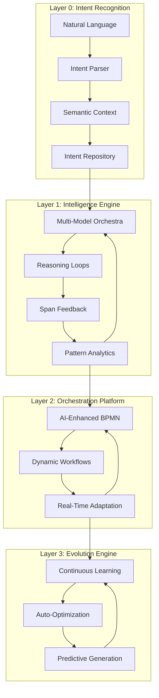

# WeaverGen v2: Technical Architecture
*Based on v1 80/20 SUCCESS - Building on proven span-based validation*

## Architecture Overview

### Core Paradigm: **Intelligence-First Architecture**



## Component Architecture

### 1. Intent Recognition Layer

#### **Natural Language Processor**
```python
class IntentRecognizer:
    """Converts natural language to actionable semantic intents"""
    
    def __init__(self):
        self.models = MultiModelOrchestra([
            "qwen3:latest",
            "claude-3-sonnet", 
            "gpt-4-turbo"
        ])
        self.context_memory = SemanticMemory()
    
    async def parse_intent(self, natural_language: str) -> Intent:
        """Parse natural language into structured intent"""
        # Multi-model consensus on intent extraction
        # Context-aware parsing based on project history
        # Intent validation against semantic conventions
```

#### **Semantic Context Engine**
```python
class SemanticContextEngine:
    """Maintains context across generation sessions"""
    
    def __init__(self):
        self.project_context = ProjectContextDB()
        self.pattern_memory = PatternMemoryGraph()
        self.relationship_engine = SemanticRelationshipEngine()
    
    async def enhance_context(self, intent: Intent) -> EnhancedContext:
        """Add relevant context from project history and patterns"""
```

### 2. Intelligence Engine Layer

#### **Multi-Model Orchestra**
```python
class MultiModelOrchestra:
    """Orchestrates multiple AI models for optimal results"""
    
    def __init__(self):
        self.models = {
            "code_generation": ["qwen3:latest", "deepseek-coder"],
            "reasoning": ["claude-3-sonnet", "gpt-4-turbo"],
            "validation": ["specialized-validator-model"],
            "optimization": ["performance-optimizer-model"]
        }
        self.consensus_engine = ConsensusEngine()
        self.quality_predictor = QualityPredictor()
    
    async def generate_with_consensus(self, context: EnhancedContext) -> GenerationResult:
        """Generate code using multiple models and consensus"""
```

#### **Reasoning Loop Engine**
```python
class ReasoningLoopEngine:
    """Implements complex reasoning for semantic generation"""
    
    def __init__(self):
        self.reasoning_chain = ReasoningChain()
        self.validation_engine = IntelligentValidation()
        self.improvement_engine = ContinuousImprovement()
    
    async def reason_and_generate(self, context: EnhancedContext) -> ReasonedResult:
        """Execute reasoning loops until optimal solution"""
        while not self.is_optimal(current_solution):
            current_solution = await self.refine_solution(current_solution)
            validation_result = await self.validate_solution(current_solution)
            if validation_result.quality_score > threshold:
                break
        return current_solution
```

#### **Span-Based Learning Engine**
```python
class SpanBasedLearning:
    """Learns from execution spans to improve future generations"""
    
    def __init__(self):
        self.span_analyzer = AdvancedSpanAnalyzer()
        self.pattern_extractor = PatternExtractor()
        self.quality_correlator = QualityCorrelator()
    
    async def learn_from_spans(self, spans: List[Span]) -> LearningInsights:
        """Extract patterns and insights from execution spans"""
        patterns = await self.pattern_extractor.extract(spans)
        correlations = await self.quality_correlator.analyze(patterns)
        return LearningInsights(patterns, correlations)
```

### 3. Orchestration Platform Layer

#### **AI-Enhanced BPMN Engine**
```python
class AIEnhancedBPMNEngine:
    """BPMN workflows with AI decision points"""
    
    def __init__(self):
        self.workflow_engine = SpiffWorkflow()
        self.ai_decision_engine = AIDecisionEngine()
        self.dynamic_workflow_generator = DynamicWorkflowGenerator()
    
    async def execute_intelligent_workflow(self, workflow_id: str, context: Dict) -> WorkflowResult:
        """Execute BPMN with AI-driven decision points"""
        workflow = await self.load_or_generate_workflow(workflow_id, context)
        
        for task in workflow.tasks:
            if task.type == "ai_decision":
                decision = await self.ai_decision_engine.make_decision(task, context)
                workflow.set_decision(task.id, decision)
            elif task.type == "generation":
                result = await self.intelligence_engine.generate(task.context)
                workflow.set_result(task.id, result)
```

#### **Real-Time Collaboration Engine**
```python
class RealTimeCollaboration:
    """Enables real-time collaborative code generation"""
    
    def __init__(self):
        self.websocket_manager = WebSocketManager()
        self.conflict_resolver = IntelligentConflictResolver()
        self.shared_context = SharedContextManager()
    
    async def handle_collaborative_generation(self, session_id: str, participants: List[User]) -> CollaborationResult:
        """Handle multiple users generating code simultaneously"""
```

### 4. Evolution Engine Layer

#### **Continuous Learning System**
```python
class ContinuousLearningSystem:
    """Continuously improves based on usage patterns"""
    
    def __init__(self):
        self.usage_analyzer = UsagePatternAnalyzer()
        self.model_updater = ModelUpdater()
        self.template_evolver = TemplateEvolver()
    
    async def evolve_system(self) -> EvolutionReport:
        """Continuously evolve templates, models, and workflows"""
        usage_patterns = await self.usage_analyzer.analyze()
        template_improvements = await self.template_evolver.evolve(usage_patterns)
        model_improvements = await self.model_updater.update(usage_patterns)
        return EvolutionReport(template_improvements, model_improvements)
```

#### **Predictive Generation Engine**
```python
class PredictiveGenerationEngine:
    """Predicts and pre-generates commonly needed code"""
    
    def __init__(self):
        self.prediction_model = PredictionModel()
        self.cache_manager = IntelligentCacheManager()
        self.pregeneration_scheduler = PregenerationScheduler()
    
    async def predict_and_pregenerate(self, context: ProjectContext) -> PredictionResult:
        """Predict future needs and pre-generate code"""
```

## Data Architecture

### Semantic Knowledge Graph
```python
class SemanticKnowledgeGraph:
    """Graph database for semantic relationships"""
    
    nodes = {
        "conventions": SemanticConvention,
        "patterns": CodePattern,
        "relationships": SemanticRelationship,
        "projects": Project,
        "templates": Template,
        "spans": ExecutionSpan
    }
    
    relationships = {
        "derives_from": ConventionDerivation,
        "used_in": Usage,
        "optimizes": Optimization,
        "conflicts_with": Conflict,
        "enhances": Enhancement
    }
```

### Span Analytics Database
```python
class SpanAnalyticsDB:
    """Time-series database for span analytics"""
    
    def __init__(self):
        self.timeseries_db = InfluxDB()
        self.analytics_engine = AnalyticsEngine()
        self.visualization_engine = VisualizationEngine()
    
    async def analyze_execution_patterns(self) -> AnalyticsReport:
        """Analyze execution patterns across all spans"""
```

## Deployment Architecture

### Kubernetes-Native Deployment
```yaml
# v2-deployment.yaml
apiVersion: apps/v1
kind: Deployment
metadata:
  name: weavergen-v2-intelligence-engine
spec:
  replicas: 3
  selector:
    matchLabels:
      app: weavergen-v2
      component: intelligence-engine
  template:
    spec:
      containers:
      - name: intelligence-engine
        image: weavergen/v2-intelligence:latest
        resources:
          requests:
            memory: "4Gi"
            cpu: "2"
            nvidia.com/gpu: "1"
          limits:
            memory: "8Gi"
            cpu: "4"
            nvidia.com/gpu: "2"
```

### Microservices Architecture
```
┌─────────────────┐    ┌─────────────────┐    ┌─────────────────┐
│  Intent Service │    │ Intelligence    │    │ Orchestration   │
│                 │    │ Service         │    │ Service         │
│ - NLP Processing│    │ - Multi-Model   │    │ - BPMN Engine   │
│ - Context Mgmt  │    │ - Reasoning     │    │ - Workflow Mgmt │
│ - Intent Store  │    │ - Learning      │    │ - Real-time Sync│
└─────────────────┘    └─────────────────┘    └─────────────────┘
         │                       │                       │
         └───────────────────────┼───────────────────────┘
                                 │
                    ┌─────────────────┐
                    │ Evolution       │
                    │ Service         │
                    │                 │
                    │ - Learning      │
                    │ - Optimization  │
                    │ - Prediction    │
                    └─────────────────┘
```

## Security Architecture

### Zero-Trust Intelligence
```python
class ZeroTrustIntelligence:
    """Security-first AI system"""
    
    def __init__(self):
        self.auth_engine = AuthenticationEngine()
        self.authorization_engine = AuthorizationEngine()
        self.audit_engine = AuditEngine()
        self.encryption_engine = EncryptionEngine()
    
    async def secure_generation(self, request: GenerationRequest) -> SecureResult:
        """Secure AI-driven code generation"""
        # Authenticate user and validate permissions
        # Encrypt all data in transit and at rest
        # Audit all AI decisions
        # Validate generated code for security vulnerabilities
```

## Monitoring & Observability

### Advanced Telemetry
```python
class AdvancedTelemetry:
    """Enhanced observability for AI systems"""
    
    def __init__(self):
        self.otel_collector = OpenTelemetryCollector()
        self.ai_metrics = AIMetricsCollector()
        self.span_enhancer = SpanEnhancer()
        self.alerting_engine = AlertingEngine()
    
    async def monitor_ai_execution(self, context: ExecutionContext) -> MonitoringResult:
        """Monitor AI model performance and decisions"""
```

## Migration Strategy: v1 → v2

### Backward Compatibility
- v1 CLI commands continue to work
- v1 spans are automatically imported into v2 analytics
- v1 templates are auto-migrated to v2 intelligent templates

### Progressive Enhancement
- v2 features can be enabled incrementally
- Hybrid mode: v1 execution with v2 intelligence layer
- Gradual migration of existing projects

## Success Metrics

### Technical KPIs
- **Generation Quality**: 95%+ first-time success rate
- **Performance**: 10x faster than v1
- **Scalability**: Support 10,000+ concurrent generations
- **Availability**: 99.9% uptime
- **Cost Efficiency**: 50% reduction in compute costs per generation

### Intelligence KPIs  
- **Learning Rate**: Measurable improvement every 1,000 generations
- **Prediction Accuracy**: 80%+ accuracy for pre-generation
- **Pattern Discovery**: Automatic discovery of 100+ reusable patterns per week
- **Optimization Impact**: 25% improvement in generated code quality month-over-month

This architecture transforms WeaverGen from a code generation tool into an **intelligent development partner** that continuously evolves and improves.