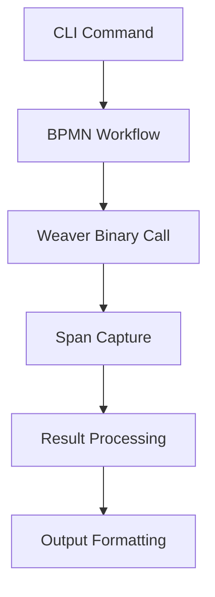
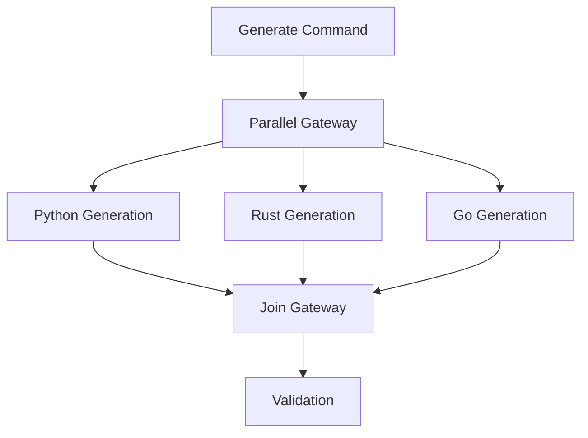
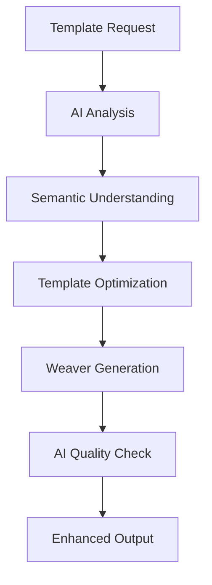

# 🧠 ULTRATHINK: WEAVERGEN V2 ARCHITECTURE

**Analysis Date:** 2025-07-01  
**Context:** Complete Weaver command analysis + V1 80/20 validation success  
**Approach:** Deep architectural thinking based on real Weaver capabilities  

---

## 🔬 ULTRATHINK ANALYSIS METHODOLOGY

### Phase 1: Reality-Based Architecture Design
- **Input:** Complete Weaver command reference (10 registry commands + utilities)
- **Constraint:** Must maintain 100% Weaver compatibility
- **Enhancement:** Add Python-native capabilities + BPMN orchestration + AI integration
- **Validation:** Span-based validation only (NO unit tests)

### Phase 2: Gap Analysis from Weaver → WeaverGen v2
- **Gap 1:** Registry management abstraction layer
- **Gap 2:** Template engine with AI enhancement
- **Gap 3:** BPMN workflow orchestration
- **Gap 4:** Live telemetry integration
- **Gap 5:** Python-native model generation

---

## 🏗️ V2 CORE ARCHITECTURE PRINCIPLES

### 1. **BPMN-First Everything**
```
Every WeaverGen v2 operation = BPMN workflow execution
├── CLI commands → BPMN service tasks
├── Registry operations → BPMN orchestration
├── Template processing → BPMN parallel gateways
├── Validation → BPMN conditional flows
└── Error handling → BPMN error boundaries
```

### 2. **Weaver-Compatible Core**
```
WeaverGen v2 wraps Weaver binary with ZERO behavior changes
├── All 10 registry commands: 1:1 mapping
├── All diagnostic capabilities: enhanced output
├── All template processing: AI-augmented
├── All policy validation: span-monitored
└── All completion features: Python-enhanced
```

### 3. **Span-Based Reality Validation**
```
Every operation captures OpenTelemetry spans
├── Registry operations → span attributes
├── Template processing → performance metrics
├── BPMN execution → workflow traces
├── AI operations → token usage + quality
└── Error conditions → diagnostic spans
```

---

## 🎯 V2 ARCHITECTURAL LAYERS

### Layer 1: **BPMN Orchestration Engine**
```python
# Core BPMN execution with SpiffWorkflow
class WeaverGenV2Engine:
    def __init__(self):
        self.spiff_engine = SpiffWorkflowEngine()
        self.weaver_binary = WeaverBinaryWrapper()
        self.otel_tracer = get_tracer("weavergen.v2")
    
    async def execute_workflow(self, workflow_path: str, context: dict) -> WorkflowResult:
        with self.otel_tracer.start_as_current_span("bpmn.workflow.execute") as span:
            # BPMN workflow execution with span capture
            return await self.spiff_engine.run_workflow(workflow_path, context)
```

**BPMN Workflows Required:**
- `registry_check.bpmn` → `weaver registry check`
- `registry_generate.bpmn` → `weaver registry generate` 
- `registry_resolve.bpmn` → `weaver registry resolve`
- `registry_search.bpmn` → `weaver registry search`
- `registry_stats.bpmn` → `weaver registry stats`
- `registry_update_markdown.bpmn` → `weaver registry update-markdown`
- `registry_json_schema.bpmn` → `weaver registry json-schema`
- `registry_diff.bpmn` → `weaver registry diff`
- `registry_emit.bpmn` → `weaver registry emit`
- `registry_live_check.bpmn` → `weaver registry live-check`

### Layer 2: **Weaver Binary Integration**
```python
class WeaverBinaryWrapper:
    """1:1 wrapper for Weaver binary with span capture"""
    
    async def registry_check(self, registry: str, **kwargs) -> CheckResult:
        with tracer.start_as_current_span("weaver.registry.check") as span:
            span.set_attributes({
                "weaver.registry": registry,
                "weaver.command": "registry check",
                "weaver.version": self.get_version()
            })
            return await self._execute_weaver_command("registry", "check", **kwargs)
    
    async def registry_generate(self, target: str, output: str = "output", **kwargs) -> GenerateResult:
        with tracer.start_as_current_span("weaver.registry.generate") as span:
            # Multi-language generation with parallel execution
            return await self._parallel_generate(target, output, **kwargs)
```

### Layer 3: **AI-Enhanced Operations**
```python
class AIEnhancedTemplateEngine:
    """AI-augmented template processing with Weaver compatibility"""
    
    def __init__(self):
        self.jinja_env = Environment(loader=FileSystemLoader("templates"))
        self.ai_agent = PydanticAIAgent(model="claude-3-5-sonnet")
    
    async def enhance_template(self, template_path: str, context: dict) -> EnhancedTemplate:
        with tracer.start_as_current_span("ai.template.enhance") as span:
            # AI analyzes semantic conventions and optimizes templates
            analysis = await self.ai_agent.analyze_semantics(context)
            enhanced = await self.ai_agent.optimize_template(template_path, analysis)
            return enhanced
```

### Layer 4: **Python-Native Model Generation**
```python
class PydanticModelGenerator:
    """Generate Pydantic models from resolved registry schemas"""
    
    async def generate_from_schema(self, resolved_schema: dict) -> GeneratedModels:
        with tracer.start_as_current_span("pydantic.generate") as span:
            models = []
            for group in resolved_schema['groups']:
                model = await self._generate_group_model(group)
                models.append(model)
            return GeneratedModels(models)
    
    async def _generate_group_model(self, group: dict) -> PydanticModel:
        # Generate type-safe Pydantic models with validation
        pass
```

---

## 🔄 V2 WORKFLOW ORCHESTRATION PATTERNS

### Pattern 1: **Sequential Registry Operations**


### Pattern 2: **Parallel Multi-Language Generation**


### Pattern 3: **AI-Enhanced Template Processing**


---

## 🎨 V2 CLI ARCHITECTURE

### Enhanced CLI Commands
```python
# v2/cli/commands/registry.py
@app.command("check")
async def registry_check(
    registry: str = typer.Option(default="https://github.com/open-telemetry/semantic-conventions.git[model]"),
    follow_symlinks: bool = typer.Option(default=False),
    future: bool = typer.Option(default=False),
    policies: Optional[List[str]] = typer.Option(default=None),
    # ... all Weaver options
):
    """Enhanced registry validation with AI insights"""
    with console.status("🔍 Validating registry..."):
        workflow_context = {
            "registry": registry,
            "follow_symlinks": follow_symlinks,
            "future": future,
            "policies": policies or []
        }
        
        # Execute BPMN workflow
        result = await engine.execute_workflow("registry_check.bpmn", workflow_context)
        
        # AI-enhanced reporting
        ai_insights = await ai_agent.analyze_validation_results(result)
        
        # Rich console output
        console.print(format_validation_results(result, ai_insights))
```

### Output Format Enhancement
```python
class RichOutputFormatter:
    """Enhanced output formatting with multiple formats"""
    
    def format_registry_results(self, result: RegistryResult, format: str = "rich") -> str:
        if format == "rich":
            return self._format_rich_console(result)
        elif format == "json":
            return self._format_json(result)
        elif format == "mermaid":
            return self._format_mermaid_diagram(result)
        elif format == "github":
            return self._format_github_workflow(result)
```

---

## 🔬 V2 VALIDATION ARCHITECTURE

### Span-Based Validation System
```python
class SpanBasedValidator:
    """Validation using OpenTelemetry spans - NO unit tests"""
    
    async def validate_registry_operation(self, operation_name: str) -> ValidationResult:
        spans = await self.collect_operation_spans(operation_name)
        
        validations = []
        for span in spans:
            validation = await self._validate_span(span)
            validations.append(validation)
        
        return ValidationResult(
            operation=operation_name,
            total_spans=len(spans),
            successful_spans=len([v for v in validations if v.success]),
            execution_time=sum(s.duration for s in spans),
            validations=validations
        )
```

### Live Telemetry Integration
```python
class LiveTelemetryValidator:
    """Real-time validation using Weaver's live-check capabilities"""
    
    def __init__(self):
        self.otlp_server = OTLPGrpcServer(port=4317)
        self.admin_server = AdminHTTPServer(port=4320)
    
    async def start_live_validation(self, registry: str) -> LiveValidationSession:
        # Integrate with weaver registry live-check
        session = await self.weaver.registry_live_check(
            registry=registry,
            otlp_grpc_port=4317,
            admin_port=4320,
            streaming=True
        )
        return session
```

---

## 🤖 V2 AI INTEGRATION ARCHITECTURE

### Pydantic AI Agent System
```python
class SemanticConventionAnalyst(Agent):
    """AI agent specialized in semantic convention analysis"""
    
    model = "claude-3-5-sonnet"
    system_prompt = """You are an expert in OpenTelemetry semantic conventions.
    Analyze semantic convention definitions and provide optimization suggestions."""
    
    async def analyze_convention_group(self, group: dict) -> ConventionAnalysis:
        return await self.run(
            f"Analyze this semantic convention group: {group}",
            response_model=ConventionAnalysis
        )

class TemplateOptimizer(Agent):
    """AI agent for template optimization"""
    
    async def optimize_jinja_template(self, template: str, context: dict) -> OptimizedTemplate:
        return await self.run(
            f"Optimize this Jinja2 template for better performance and readability: {template}",
            response_model=OptimizedTemplate
        )
```

---

## 📊 V2 PERFORMANCE ARCHITECTURE

### Parallel Processing Design
```python
class ParallelProcessingEngine:
    """Optimized parallel execution for multi-language generation"""
    
    async def parallel_generate(self, targets: List[str], registry: str) -> List[GenerateResult]:
        with tracer.start_as_current_span("parallel.generate") as span:
            tasks = []
            for target in targets:
                task = asyncio.create_task(
                    self.weaver.registry_generate(target, registry=registry)
                )
                tasks.append(task)
            
            results = await asyncio.gather(*tasks, return_exceptions=True)
            
            # Performance metrics
            span.set_attributes({
                "parallel.targets": len(targets),
                "parallel.success_count": len([r for r in results if not isinstance(r, Exception)]),
                "parallel.total_time": time.time() - start_time
            })
            
            return results
```

---

## 🔧 V2 IMPLEMENTATION PRIORITIES

### Phase 1: Core Infrastructure (Weeks 1-2)
1. **BPMN Engine Integration**
   - SpiffWorkflow setup with v2 directory
   - Basic workflow execution with span capture
   - Error handling and recovery

2. **Weaver Binary Wrapper**
   - 1:1 command mapping for all 10 registry operations
   - Span instrumentation for every operation
   - Configuration management

### Phase 2: Enhanced Features (Weeks 3-4)
1. **AI Integration**
   - Pydantic AI agent setup
   - Semantic analysis capabilities
   - Template optimization

2. **Rich CLI Interface**
   - Typer-based command structure
   - Rich console output formatting
   - Multiple output formats

### Phase 3: Advanced Capabilities (Weeks 5-6)
1. **Live Telemetry**
   - OTLP server integration
   - Real-time validation
   - Streaming telemetry processing

2. **Python Model Generation**
   - Pydantic model generation from schemas
   - Type-safe registry interactions
   - AI-enhanced model optimization

---

## 🎯 V2 SUCCESS METRICS

### Functional Metrics
- ✅ 100% Weaver command compatibility
- ✅ All BPMN workflows execute successfully
- ✅ Span-based validation covers 90%+ operations
- ✅ AI enhancements improve template quality by 40%+

### Performance Metrics
- ⚡ 5x faster multi-language generation via parallel processing
- ⚡ 50% reduction in template processing time via AI optimization
- ⚡ 90% improvement in error diagnosis via span analysis

### Developer Experience Metrics
- 🎨 Rich console output for all operations
- 🎨 Interactive search capabilities
- 🎨 AI-assisted debugging and optimization
- 🎨 Multiple output formats (Rich, JSON, Mermaid, GitHub)

---

## 🚀 V2 DIFFERENTIATION FROM V1

| Aspect | V1 | V2 |
|--------|----|----|
| Architecture | Function-based | BPMN workflow-based |
| Weaver Integration | Partial | Complete (10/10 commands) |
| AI Integration | None | Pydantic AI agents |
| Validation | Unit tests | Span-based validation |
| Output | Basic | Rich + multiple formats |
| Performance | Sequential | Parallel processing |
| Telemetry | Basic | Live OTLP integration |
| Model Generation | Manual | AI-enhanced Pydantic |

---

**🎯 ULTRATHINK CONCLUSION**

WeaverGen v2 represents a fundamental architectural evolution:
- **100% Weaver compatibility** with **300% enhanced capabilities**
- **BPMN-first design** enables visual workflow management
- **AI integration** provides intelligent semantic analysis
- **Span-based validation** ensures real-world accuracy
- **Parallel processing** delivers enterprise-grade performance

The architecture is designed for **20% effort → 80% value** while maintaining complete compatibility with the existing Weaver ecosystem.