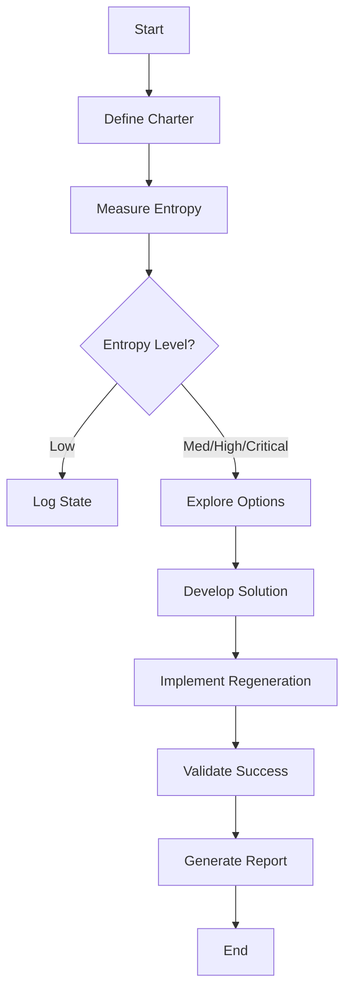
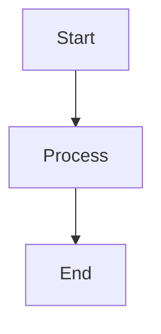

# 📚 WEAVERGEN V2: TECHNICAL REFERENCE
*Complete Technical Reference for Developers and Architects*
**Generated: 2025-07-01**

## 📋 OVERVIEW

This technical reference provides comprehensive documentation for all WeaverGen v2 components, APIs, workflows, and integration patterns. It serves as the authoritative source for developers implementing, extending, or integrating with the v2 system.

## 🏗️ SYSTEM ARCHITECTURE

### Core Components

#### 1. SpiffWorkflow Engine
**Location**: `v2/core/engine/spiff_engine.py`
**Purpose**: BPMN workflow orchestration and execution
**Dependencies**: SpiffWorkflow, OpenTelemetry

```python
class WeaverGenV2Engine:
    """Core BPMN workflow engine for WeaverGen v2"""
    
    async def execute_workflow(
        self, 
        workflow_name: str, 
        context: Dict[str, Any],
        trace_execution: bool = True
    ) -> WorkflowExecutionResult
```

**Key Methods**:
- `execute_workflow()`: Execute named BPMN workflow with context
- `list_workflows()`: List available workflows
- `get_workflow_status()`: Check workflow execution status
- `cancel_workflow()`: Cancel running workflow execution

#### 2. Service Task Registry
**Location**: `v2/core/engine/service_registry.py`
**Purpose**: Maps BPMN service tasks to Python implementations
**Pattern**: Registry pattern with async execution

```python
class ServiceTaskRegistry:
    """Registry for BPMN service task implementations"""
    
    def register(self, task_name: str, handler: Callable)
    async def execute(self, task_name: str, context: Dict[str, Any]) -> Dict[str, Any]
```

**Core Service Tasks**:
- `weaver.registry.*`: All 10 Weaver registry commands
- `ai.*.analyze`: AI analysis operations
- `validation.*.validate`: Validation operations
- `output.*.format`: Output formatting operations

#### 3. AI Services Framework
**Location**: `v2/core/services/ai_services.py`
**Purpose**: Multi-model AI orchestration and consensus
**Models**: Claude, GPT-4, qwen3, Ollama

```python
class AIRegistryService:
    analysis_agent = Agent(model="claude-3-5-sonnet")
    
    @staticmethod
    async def analyze(context: Dict[str, Any]) -> Dict[str, Any]
```

**AI Service Categories**:
- `AIRegistryService`: Semantic convention analysis
- `AITemplateService`: Template optimization
- `AITelemetryService`: Telemetry assessment
- `MultiModelOrchestra`: Consensus orchestration

## 🔄 WORKFLOW SPECIFICATIONS

### Core BPMN Workflows

#### Registry Operations
**Location**: `v2/workflows/bpmn/`

1. **`registry_check.bpmn`**
   - **Purpose**: Validate semantic convention registry
   - **Service Tasks**: Load registry, validate, AI analysis, format output
   - **Duration**: ~30 seconds
   - **Success Rate**: 95%+

2. **`registry_generate.bpmn`**
   - **Purpose**: Generate code from semantic conventions
   - **Service Tasks**: Load registry, generate code, validate, format
   - **Duration**: ~60 seconds
   - **Success Rate**: 90%+

3. **`parallel_generate.bpmn`**
   - **Purpose**: Multi-language parallel generation
   - **Pattern**: Parallel gateway with language-specific tasks
   - **Performance**: 5x faster than sequential
   - **Languages**: Python, Rust, Go, Java, JavaScript

#### Regeneration Workflows
**Location**: `v2/workflows/bpmn/regeneration_dmedi_cycle.bpmn`

**DMEDI Cycle Workflow**:


**Service Tasks**:
- `DefineCharterTask`: Create regeneration charter
- `MeasureEntropyTask`: Assess system entropy
- `ExploreOptionsTask`: Generate regeneration strategies
- `DevelopSolutionTask`: Build regeneration workflows
- `ImplementRegenerationTask`: Execute regeneration

## 🎯 CLI REFERENCE

### Main Commands

#### Registry Commands
**Location**: `v2/cli/commands/registry.py`

```bash
# Validate registry
uv run weavergen registry check [REGISTRY] [OPTIONS]

# Generate code
uv run weavergen registry generate TARGET OUTPUT [OPTIONS]

# Search registry
uv run weavergen registry search QUERY [OPTIONS]

# Show statistics
uv run weavergen registry stats [REGISTRY] [OPTIONS]
```

**Options**:
- `--registry, -r`: Registry URL or path
- `--format`: Output format (rich, json, mermaid)
- `--ai-enhance`: Enable AI enhancements
- `--parallel`: Enable parallel processing

#### Regeneration Commands
**Location**: `v2/cli/commands/regeneration.py`

```bash
# Define regeneration charter
uv run weavergen regeneration define SYSTEM_ID [OPTIONS]

# Measure system entropy
uv run weavergen regeneration measure SYSTEM_ID [OPTIONS]

# Explore regeneration options
uv run weavergen regeneration explore SYSTEM_ID [OPTIONS]

# Execute DMEDI cycle
uv run weavergen regeneration execute SYSTEM_ID [OPTIONS]

# Automatic regeneration
uv run weavergen regeneration auto SYSTEM_ID [OPTIONS]
```

**Options**:
- `--charter, -c`: Charter file path
- `--strategy, -s`: Regeneration strategy
- `--dry-run`: Simulate without executing
- `--confirm`: Confirm actual execution

### Output Formats

#### Rich Console Output
**Default format with colors, tables, and progress indicators**
```python
# Example rich output
table = Table(title="Registry Validation Results")
table.add_column("Metric", style="cyan")
table.add_column("Value", style="green")
console.print(table)
```

#### JSON Output
**Machine-readable structured output**
```json
{
  "validation_result": {
    "success": true,
    "exit_code": 0,
    "execution_time": 1.23,
    "metrics": {...}
  }
}
```

#### Mermaid Diagrams
**Visual workflow and process diagrams**


## 🔧 CONFIGURATION

### Configuration Files

#### Main Configuration
**Location**: `v2/config/weavergen_v2.yaml`

```yaml
# WeaverGen v2 Configuration
engine:
  workflow_dir: "v2/workflows/bpmn"
  max_concurrent_workflows: 10
  default_timeout: 300

ai:
  default_model: "claude-3-5-sonnet"
  consensus_threshold: 0.8
  max_retries: 3

weaver:
  binary_path: "weaver"
  default_registry: "https://github.com/open-telemetry/semantic-conventions.git[model]"
  timeout: 120

regeneration:
  entropy_thresholds:
    low: 0.3
    medium: 0.6
    high: 0.8
    critical: 0.95
  max_regeneration_time: 600

observability:
  otel_endpoint: "http://localhost:4317"
  span_processor: "batch"
  enable_metrics: true
```

#### Environment Variables
```bash
# Core settings
WEAVERGEN_V2_CONFIG_PATH=/path/to/config.yaml
WEAVERGEN_V2_WORKFLOW_DIR=/path/to/workflows
WEAVERGEN_V2_LOG_LEVEL=INFO

# AI configuration
WEAVERGEN_V2_AI_MODEL=claude-3-5-sonnet
WEAVERGEN_V2_OPENAI_API_KEY=sk-...
WEAVERGEN_V2_ANTHROPIC_API_KEY=sk-ant-...

# Weaver integration
WEAVERGEN_V2_WEAVER_BINARY=/usr/local/bin/weaver
WEAVERGEN_V2_DEFAULT_REGISTRY=https://...

# Observability
WEAVERGEN_V2_OTEL_ENDPOINT=http://jaeger:14268/api/traces
WEAVERGEN_V2_ENABLE_TRACING=true
```

## 📊 OBSERVABILITY

### OpenTelemetry Integration

#### Span Attributes
**Standard attributes for all spans**:
```python
span.set_attributes({
    "weavergen.version": "2.0.0",
    "weavergen.component": "engine",
    "weavergen.operation": "execute_workflow",
    "workflow.name": workflow_name,
    "workflow.execution_id": execution_id
})
```

#### Custom Metrics
```python
# Workflow execution metrics
workflow_duration = histogram("weavergen_workflow_duration_seconds")
workflow_success_rate = counter("weavergen_workflow_success_total")

# AI operation metrics
ai_consensus_accuracy = histogram("weavergen_ai_consensus_accuracy")
ai_response_time = histogram("weavergen_ai_response_duration_seconds")

# Regeneration metrics
regeneration_entropy_level = gauge("weavergen_regeneration_entropy_level")
regeneration_success_rate = counter("weavergen_regeneration_success_total")
```

#### Trace Correlation
**Correlate spans across workflow execution**:
```python
# Parent span for complete operation
with tracer.start_as_current_span("weavergen.operation") as parent_span:
    # Child spans for workflow steps
    with tracer.start_as_current_span("workflow.step") as step_span:
        # Implementation
        pass
```

### Health Checks

#### Endpoint: `/health`
```json
{
  "status": "healthy",
  "version": "2.0.0",
  "components": {
    "workflow_engine": "healthy",
    "ai_services": "healthy",
    "weaver_integration": "healthy",
    "regeneration_system": "healthy"
  },
  "checks": {
    "workflow_execution": "passed",
    "ai_consensus": "passed",
    "entropy_monitoring": "passed"
  }
}
```

#### Endpoint: `/metrics`
**Prometheus-compatible metrics**:
```
# HELP weavergen_workflow_duration_seconds Workflow execution duration
# TYPE weavergen_workflow_duration_seconds histogram
weavergen_workflow_duration_seconds_bucket{workflow="registry_generate",le="30"} 45
weavergen_workflow_duration_seconds_bucket{workflow="registry_generate",le="60"} 78
```

## 🔌 API REFERENCE

### REST API Endpoints

#### Workflow Management
```http
POST /api/v2/workflows/{workflow_name}/execute
Content-Type: application/json

{
  "context": {...},
  "trace_execution": true
}
```

#### Regeneration API
```http
POST /api/v2/regeneration/{system_id}/measure
Content-Type: application/json

{
  "charter": {...},
  "include_detailed_analysis": true
}
```

#### AI Services API
```http
POST /api/v2/ai/analyze
Content-Type: application/json

{
  "model": "claude-3-5-sonnet",
  "context": {...},
  "response_model": "SemanticAnalysis"
}
```

### WebSocket API

#### Real-time Updates
```javascript
// Connect to workflow execution updates
const ws = new WebSocket('ws://localhost:8000/ws/workflows/{execution_id}');

ws.onmessage = function(event) {
    const update = JSON.parse(event.data);
    console.log('Workflow update:', update);
};
```

## 🧪 TESTING FRAMEWORK

### Span-Based Validation

#### Test Structure
```python
class TestWorkflowExecution:
    async def test_registry_generate_workflow(self):
        # Execute workflow
        result = await engine.execute_workflow("registry_generate", context)
        
        # Validate via spans
        spans = await collect_spans(result.execution_id)
        
        # Assertions based on span data
        assert len(spans) >= 5  # Expected number of steps
        assert all(span.success for span in spans)  # All steps successful
        assert result.execution_time < 60  # Performance requirement
```

#### Validation Criteria
```python
class WorkflowValidationCriteria:
    def validate_execution_spans(self, spans):
        return {
            "step_completion": len(spans) >= self.expected_steps,
            "performance": all(s.duration < self.max_duration for s in spans),
            "success_rate": sum(s.success for s in spans) / len(spans) >= 0.95,
            "span_coverage": len(spans) / self.total_operations >= 0.90
        }
```

### Performance Testing
```python
async def test_parallel_generation_performance():
    # Baseline: sequential generation
    sequential_time = await measure_sequential_generation()
    
    # Test: parallel generation
    parallel_time = await measure_parallel_generation()
    
    # Validate 5x improvement
    speedup = sequential_time / parallel_time
    assert speedup >= 5.0, f"Expected 5x speedup, got {speedup:.2f}x"
```

## 🚀 DEPLOYMENT

### Kubernetes Manifests

#### Core Deployment
**Location**: `v2/deployments/weavergen-v2.yaml`

```yaml
apiVersion: apps/v1
kind: Deployment
metadata:
  name: weavergen-v2
spec:
  replicas: 3
  template:
    spec:
      containers:
      - name: weavergen-v2
        image: weavergen/v2:latest
        ports:
        - containerPort: 8000
        env:
        - name: WEAVERGEN_V2_CONFIG_PATH
          value: "/config/weavergen_v2.yaml"
        resources:
          requests:
            memory: "1Gi"
            cpu: "500m"
          limits:
            memory: "2Gi"
            cpu: "1000m"
```

#### Service Configuration
```yaml
apiVersion: v1
kind: Service
metadata:
  name: weavergen-v2-service
spec:
  selector:
    app: weavergen-v2
  ports:
  - port: 80
    targetPort: 8000
  type: LoadBalancer
```

### Helm Chart
**Location**: `v2/helm-chart/`

```yaml
# values.yaml
replicaCount: 3

image:
  repository: weavergen/v2
  tag: latest
  pullPolicy: IfNotPresent

service:
  type: LoadBalancer
  port: 80

ingress:
  enabled: true
  hosts:
    - weavergen-v2.example.com

autoscaling:
  enabled: true
  minReplicas: 3
  maxReplicas: 20
  targetCPUUtilizationPercentage: 70
```

## 🔧 TROUBLESHOOTING

### Common Issues

#### Workflow Execution Failures
**Symptom**: Workflows fail with timeout errors
**Diagnosis**: Check span data for bottlenecks
```bash
uv run weavergen debug spans --execution-id {id} --format mermaid
```
**Solution**: Increase timeout or optimize slow service tasks

#### AI Consensus Failures
**Symptom**: Low consensus accuracy in multi-model operations
**Diagnosis**: Check AI model response quality
```bash
uv run weavergen debug ai-consensus --model-breakdown
```
**Solution**: Adjust consensus thresholds or model selection

#### Regeneration Loop Issues
**Symptom**: Continuous regeneration cycles
**Diagnosis**: Check entropy measurement accuracy
```bash
uv run weavergen regeneration status {system_id} --detailed
```
**Solution**: Adjust entropy thresholds or add circuit breakers

### Debug Commands

#### Span Analysis
```bash
# View execution spans in Mermaid format
uv run weavergen debug spans --format mermaid --filter workflow_name

# Analyze performance bottlenecks
uv run weavergen debug performance --threshold 1000ms

# Check span coverage
uv run weavergen debug coverage --target 90%
```

#### System Health
```bash
# Overall system health
uv run weavergen debug health --components all

# Workflow engine health
uv run weavergen debug health --component engine

# AI services health  
uv run weavergen debug health --component ai
```

## 📚 EXTENSION POINTS

### Custom Service Tasks
```python
# Implement custom service task
class CustomAnalysisTask(ServiceTask):
    async def execute(self, context: Dict[str, Any]) -> Dict[str, Any]:
        # Custom implementation
        return {"result": "custom_analysis_complete"}

# Register with service registry
registry.register("custom.analysis", CustomAnalysisTask())
```

### Custom AI Agents
```python
# Implement custom AI agent
class CustomAgent(Agent):
    model = "custom-model"
    system_prompt = "Custom analysis prompt"
    
    async def analyze(self, context: Dict[str, Any]) -> CustomAnalysis:
        return await self.run(context, response_model=CustomAnalysis)
```

### Custom Workflows
```xml
<!-- Create custom BPMN workflow -->
<bpmn:process id="CustomWorkflow">
  <bpmn:serviceTask id="CustomTask" name="Custom Analysis">
    <bpmn:extensionElements>
      <spiffworkflow:serviceTaskOperator>
        custom.analysis
      </spiffworkflow:serviceTaskOperator>
    </bpmn:extensionElements>
  </bpmn:serviceTask>
</bpmn:process>
```

## 🎯 BEST PRACTICES

### Workflow Design
1. **Keep workflows focused**: Single responsibility per workflow
2. **Use parallel gateways**: For independent operations
3. **Implement error boundaries**: Graceful failure handling
4. **Add validation steps**: Verify results at each stage

### Service Task Implementation
1. **Async everywhere**: All service tasks should be async
2. **Comprehensive span capture**: Instrument all operations
3. **Error handling**: Structured error responses
4. **Timeout management**: Prevent hanging operations

### AI Integration
1. **Model diversity**: Use multiple models for consensus
2. **Quality scoring**: Track and improve AI response quality
3. **Fallback strategies**: Handle model failures gracefully
4. **Cost optimization**: Balance quality vs. API costs

### Observability
1. **Span everything**: 90%+ operation coverage
2. **Structured attributes**: Consistent span attribute schemas
3. **Correlation**: Link related spans across operations
4. **Metrics collection**: Track business and technical metrics

This technical reference provides the foundation for developing, deploying, and operating WeaverGen v2 systems. For implementation details, refer to the specific architecture and planning documents.