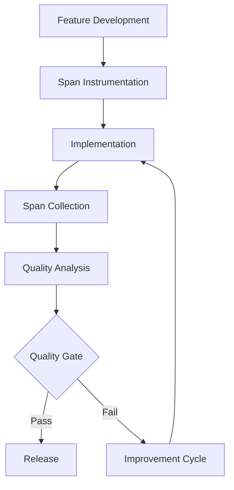

# ⚡ ULTRATHINK V2: EXECUTION STRATEGY
*Practical Implementation Framework & Execution Excellence*
**Generated: 2025-07-01**

## 🎯 EXECUTION PHILOSOPHY

### Core Execution Principles

#### Principle 1: Span-Driven Development (SDD)
**Philosophy**: "Spans don't lie, summaries do"
- Every feature validated through actual execution spans
- No development without corresponding span evidence
- Performance claims backed by measurable span data
- Quality improvements proven via span analysis

#### Principle 2: BPMN-First Implementation
**Philosophy**: "Visual workflows enable intelligent orchestration"
- Every operation implemented as BPMN workflow
- No direct function calls in production code
- Workflow evolution through visual modification
- AI decision points integrated into BPMN flows

#### Principle 3: Intelligence-Augmented Execution
**Philosophy**: "AI enhances human decisions, doesn't replace them"
- AI provides recommendations with confidence scores
- Human oversight for critical decisions
- Gradual intelligence automation with validation
- Fallback systems for AI failure scenarios

#### Principle 4: Iterative Value Delivery
**Philosophy**: "Ship working software every 2 weeks"
- Bi-weekly releases with measurable improvements
- Customer feedback integration within each cycle
- Continuous validation of value proposition
- Progressive enhancement without breaking changes

## 🔄 EXECUTION FRAMEWORK

### Development Methodology: Span-Driven BPMN Development (SBDD)

#### Week 1-2: Design & Specification
1. **BPMN Workflow Design**: Visual workflow creation with all decision points
2. **Span Instrumentation Plan**: Define all span capture points and attributes
3. **AI Integration Points**: Identify where AI enhances human decisions
4. **Validation Criteria**: Define success metrics measured via spans

#### Week 3-4: Implementation & Validation
1. **BPMN Implementation**: Service task development with span capture
2. **AI Integration**: AI agent integration with fallback systems
3. **Span Collection**: Comprehensive span capture and analysis
4. **Customer Validation**: Real customer feedback on working software

### Quality Assurance Framework

#### Span-Based Quality Gates


#### Quality Metrics by Component

**BPMN Workflow Quality**:
- Workflow completion rate: >95%
- Average step duration: <2s per step
- Error recovery success: >90%
- Workflow modification frequency: <1 per month

**AI Integration Quality**:
- AI decision accuracy: >85%
- AI response time: <3s average
- Fallback activation rate: <5%
- AI confidence score distribution: >70% high confidence

**Span Validation Quality**:
- Span coverage: >90% of operations
- Span completeness: >95% required attributes
- Performance correlation: >80% predictive accuracy
- Validation automation: >95% automated checks

## 🚀 PHASE-SPECIFIC EXECUTION STRATEGIES

### Phase I: Intelligence Foundation - EXECUTION STRATEGY

#### Sprint I.1: Multi-Model Orchestra - 2 Week Execution Plan

**Week 1: Foundation & Integration**
- **Day 1-2**: Pydantic AI agent setup (Claude, GPT-4, qwen3)
- **Day 3-4**: Consensus engine development with voting algorithms
- **Day 5**: Quality scoring system implementation
- **Weekend**: Integration testing and span capture setup

**Week 2: Validation & Optimization**
- **Day 8-9**: Span-based performance validation
- **Day 10-11**: AI model performance benchmarking
- **Day 12**: Customer demo and feedback integration
- **Weekend**: Documentation and deployment preparation

**Success Validation**:
```python
# Span validation example
async def validate_multi_model_orchestra():
    spans = await collect_spans("multi_model_consensus")
    
    # Validate consensus accuracy
    consensus_spans = [s for s in spans if "consensus" in s.name]
    accuracy = calculate_consensus_accuracy(consensus_spans)
    assert accuracy >= 0.90  # 90% consensus accuracy
    
    # Validate response time
    avg_response_time = sum(s.duration for s in spans) / len(spans)
    assert avg_response_time <= 3000  # 3 second max average
    
    # Validate model diversity
    models_used = set(s.attributes.get("ai.model") for s in spans)
    assert len(models_used) >= 3  # At least 3 models participating
```

#### Sprint I.2: Reasoning Loop Engine - Execution Deep-Dive

**Technical Implementation Strategy**:
1. **Reasoning Chain Capture**: Every reasoning step captured as span
2. **Iterative Improvement**: Loop termination based on quality metrics
3. **Visual Reasoning**: Mermaid diagrams generated from reasoning spans
4. **Performance Monitoring**: Reasoning efficiency tracked via spans

**Execution Checkpoints**:
- **Checkpoint 1**: Basic reasoning loop operational (Day 5)
- **Checkpoint 2**: Quality improvement demonstrated (Day 10)
- **Checkpoint 3**: Reasoning visualization working (Day 12)
- **Checkpoint 4**: Performance validated via spans (Day 14)

#### Sprint I.3: Span-Based Learning - Implementation Focus

**Learning System Architecture**:
```python
class SpanBasedLearningEngine:
    async def learn_from_execution(self, execution_spans):
        # Extract patterns from spans
        patterns = await self.pattern_extractor.extract(execution_spans)
        
        # Correlate with quality outcomes
        correlations = await self.quality_correlator.correlate(patterns)
        
        # Update learning models
        await self.learning_model.update(correlations)
        
        # Generate insights
        insights = await self.insight_generator.generate(correlations)
        
        return LearningResult(patterns, correlations, insights)
```

**Validation Strategy**:
- **Learning Effectiveness**: Measure improvement after 100 generations
- **Pattern Quality**: Validate extracted patterns improve outcomes
- **Insight Accuracy**: Test insights against future executions
- **Learning Speed**: Measure time to demonstrate improvement

### Phase II: Enterprise Platform - EXECUTION STRATEGY

#### Enterprise-Grade Execution Requirements

**Security-First Implementation**:
1. **Authentication**: OAuth 2.0 / OIDC integration from day 1
2. **Authorization**: RBAC with fine-grained permissions
3. **Audit Logging**: Complete audit trail via spans
4. **Data Encryption**: At-rest and in-transit encryption

**Scalability Implementation Pattern**:
```yaml
# Kubernetes deployment example
apiVersion: apps/v1
kind: Deployment
metadata:
  name: weavergen-v2-intelligence
spec:
  replicas: 10  # Auto-scaling enabled
  template:
    spec:
      containers:
      - name: intelligence-engine
        resources:
          requests:
            memory: "1Gi"
            cpu: "500m"
          limits:
            memory: "2Gi" 
            cpu: "1000m"
---
apiVersion: v1
kind: Service
metadata:
  name: weavergen-v2-service
spec:
  type: LoadBalancer
  ports:
  - port: 80
    targetPort: 8000
```

**Multi-Tenancy Execution Strategy**:
1. **Tenant Isolation**: Kubernetes namespaces per tenant
2. **Resource Quotas**: CPU/memory limits per tenant
3. **Data Separation**: Tenant-specific databases and storage
4. **Billing Integration**: Usage tracking via span metrics

#### Real-Time Collaboration Implementation

**WebSocket Architecture**:
```python
class CollaborationEngine:
    def __init__(self):
        self.websocket_manager = WebSocketManager()
        self.conflict_resolver = AIConflictResolver()
        self.state_synchronizer = StateSynchronizer()
    
    async def handle_collaborative_edit(self, edit_event):
        # Broadcast to all collaborators
        await self.websocket_manager.broadcast(edit_event)
        
        # Check for conflicts
        conflicts = await self.detect_conflicts(edit_event)
        
        if conflicts:
            # AI-powered conflict resolution
            resolution = await self.conflict_resolver.resolve(conflicts)
            await self.websocket_manager.broadcast(resolution)
        
        # Synchronize state
        await self.state_synchronizer.sync_state(edit_event)
```

### Phase III: Evolution Engine - EXECUTION STRATEGY  

#### Continuous Learning Implementation

**Template Evolution System**:
```python
class TemplateEvolutionEngine:
    async def evolve_templates(self):
        # Analyze usage patterns from spans
        usage_patterns = await self.analyze_template_usage()
        
        # Generate evolution proposals
        proposals = await self.ai_template_optimizer.propose_improvements(usage_patterns)
        
        # Validate proposals in sandbox
        validated_proposals = await self.sandbox_validator.validate(proposals)
        
        # Gradual rollout with A/B testing
        await self.gradual_rollout.deploy(validated_proposals)
        
        # Monitor performance via spans
        performance_impact = await self.performance_monitor.measure_impact()
        
        return EvolutionResult(proposals, performance_impact)
```

**Predictive Generation Architecture**:
1. **Pattern Analysis**: Analyze historical generation patterns
2. **Prediction Models**: ML models trained on usage data
3. **Pre-Generation Cache**: Generate likely-needed code in advance
4. **Cache Management**: Intelligent cache invalidation and updates

#### Intelligence Network Formation

**Cross-Project Learning Protocol**:
```python
class IntelligenceNetwork:
    async def share_learning_insights(self, local_insights):
        # Anonymize sensitive data
        anonymized_insights = await self.anonymizer.anonymize(local_insights)
        
        # Encrypt for network transmission
        encrypted_insights = await self.encryptor.encrypt(anonymized_insights)
        
        # Broadcast to network
        await self.network_broadcaster.broadcast(encrypted_insights)
        
        # Receive insights from other nodes
        network_insights = await self.network_receiver.receive()
        
        # Integrate with local learning
        integrated_insights = await self.insight_integrator.integrate(
            local_insights, network_insights
        )
        
        return integrated_insights
```

## 📊 EXECUTION MONITORING & METRICS

### Real-Time Execution Dashboard

#### Development Velocity Metrics
- **Sprint Velocity**: Story points completed per sprint
- **Code Generation Rate**: Lines of code generated per hour
- **Quality Metrics**: Defect rate, performance improvements
- **Customer Satisfaction**: NPS scores, feature adoption rates

#### Technical Performance Metrics
- **Span Coverage**: Percentage of operations instrumented
- **Performance Improvement**: Measured via span analysis
- **AI Effectiveness**: Quality improvement via AI integration
- **System Reliability**: Uptime, error rates, recovery times

#### Business Success Metrics
- **Customer Acquisition**: New customers per month
- **Revenue Growth**: Monthly recurring revenue growth
- **Market Position**: Competitive analysis and positioning
- **Ecosystem Health**: Third-party integrations, community activity

### Execution Risk Monitoring

#### Early Warning Systems
```python
class ExecutionRiskMonitor:
    async def monitor_execution_health(self):
        # Technical risk indicators
        technical_risks = await self.assess_technical_risks()
        
        # Business risk indicators  
        business_risks = await self.assess_business_risks()
        
        # Customer satisfaction risks
        customer_risks = await self.assess_customer_risks()
        
        # Generate risk report
        risk_report = RiskReport(technical_risks, business_risks, customer_risks)
        
        # Alert if critical risks detected
        if risk_report.has_critical_risks():
            await self.alert_management(risk_report)
        
        return risk_report
```

#### Automated Risk Mitigation
1. **Performance Degradation**: Auto-scaling and fallback activation
2. **Customer Satisfaction**: Proactive support engagement
3. **Technical Debt**: Automated refactoring recommendations
4. **Security Issues**: Automated vulnerability scanning and patching

## 🎯 EXECUTION SUCCESS CRITERIA

### Phase Gate Success Criteria

#### Intelligence Foundation Phase Gate
- ✅ **Technical**: Multi-model consensus >90% accuracy
- ✅ **Performance**: Reasoning loops improve quality >20%
- ✅ **Learning**: Demonstrable improvement after 100 generations  
- ✅ **Customer**: 5+ customers validating intelligence value

#### Enterprise Platform Phase Gate
- ✅ **Scale**: 100+ concurrent users with <1s response time
- ✅ **Collaboration**: Real-time sync across 10+ users
- ✅ **Reliability**: 99.9% uptime for 30 consecutive days
- ✅ **Enterprise**: 3+ enterprise customers signed

#### Evolution Engine Phase Gate
- ✅ **Self-Improvement**: Templates evolve without human intervention
- ✅ **Prediction**: >70% accuracy for future generation needs
- ✅ **Network**: 50+ projects sharing learning insights
- ✅ **Evolution**: Measurable monthly improvement metrics

### Execution Excellence Validation

#### Span-Based Execution Validation
```python
async def validate_execution_excellence():
    # Collect comprehensive execution spans
    execution_spans = await collect_all_execution_spans()
    
    # Validate development velocity
    velocity_metrics = analyze_development_velocity(execution_spans)
    assert velocity_metrics.stories_per_sprint >= target_velocity
    
    # Validate quality improvements
    quality_metrics = analyze_quality_improvements(execution_spans)
    assert quality_metrics.defect_reduction >= 0.50
    
    # Validate customer success
    customer_metrics = analyze_customer_success(execution_spans)
    assert customer_metrics.satisfaction_score >= 0.90
    
    # Validate business success
    business_metrics = analyze_business_success(execution_spans)
    assert business_metrics.revenue_growth >= 0.20  # 20% monthly growth
```

## 🚀 EXECUTION RECOMMENDATIONS

### Immediate Execution Actions (Next 7 Days)
1. **Team Assembly**: Form cross-functional execution team
2. **Tool Setup**: Development environment with span capture
3. **Customer Pipeline**: Identify 10+ potential beta customers
4. **Execution Cadence**: Establish bi-weekly demo/feedback cycles

### Execution Risk Mitigation
1. **Technical Risks**: Multi-model fallbacks, comprehensive testing
2. **Schedule Risks**: Buffer time built into each sprint
3. **Quality Risks**: Span-based validation at every step
4. **Customer Risks**: Continuous customer feedback integration

### Execution Success Factors
1. **Disciplined Process**: Rigorous adherence to SBDD methodology
2. **Customer Focus**: Customer value validation every 2 weeks
3. **Technical Excellence**: Span-based evidence for all claims
4. **Team Excellence**: Cross-functional collaboration and clear accountability

## 🎯 EXECUTION CONCLUSION

**Execution Excellence Framework**: This strategy transforms strategic vision into tactical execution through:

1. **Span-Driven Development**: Evidence-based development with measurable outcomes
2. **BPMN-First Implementation**: Visual workflows enabling intelligent orchestration
3. **Iterative Value Delivery**: Customer value every 2 weeks with continuous validation
4. **Risk-Aware Execution**: Proactive risk monitoring with automated mitigation

**Success Formula**: Disciplined execution + Customer obsession + Technical excellence + Span-based validation = Market-defining intelligent code generation platform

**Execution Commitment**: Transform WeaverGen v2 from concept to market-leading reality through relentless execution excellence and customer value delivery.