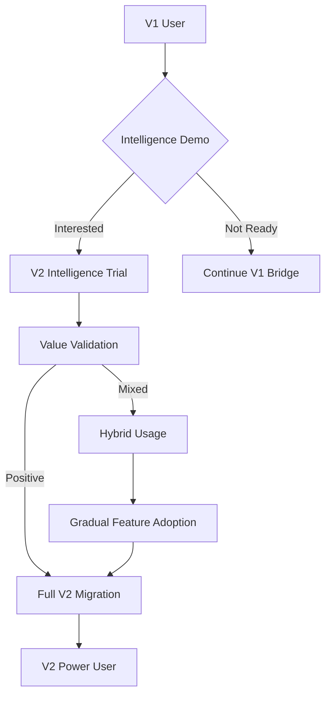

# 🔄 ULTRATHINK V2: MIGRATION & ADOPTION STRATEGY
*Strategic Migration Framework for V1→V2 Transition*
**Generated: 2025-07-01**

## 🎯 MIGRATION STRATEGIC OVERVIEW

### Migration Mission Critical Success
**From**: V1 80/20 implementation with BPMN-first architecture, span-based validation
**To**: V2 intelligent development partner with enterprise orchestration and evolutionary capabilities

### Migration Core Principles

#### Principle 1: Zero-Disruption Migration
**Philosophy**: "V1 users experience only improvements, never regressions"
- Complete backward compatibility for all V1 operations
- Gradual feature migration with user control
- Side-by-side operation during transition period
- Rollback capability at every migration step

#### Principle 2: Value-First Migration
**Philosophy**: "Users migrate because V2 provides superior value"
- Demonstrate clear value proposition at each migration step
- Measurable improvements in user experience and outcomes
- Progressive enhancement rather than replacement
- User choice in migration pace and scope

#### Principle 3: Evidence-Based Migration
**Philosophy**: "Every migration step validated with real user data"
- Span-based validation of migration effectiveness
- User feedback integration at every migration milestone
- Performance improvements measured and verified
- Success metrics tied to actual user outcomes

#### Principle 4: Intelligence-Augmented Migration
**Philosophy**: "AI assists migration decisions and execution"
- Automated migration path recommendations
- Intelligent conflict resolution during migration
- AI-powered optimization of migrated workflows
- Predictive migration success scoring

## 🗺️ MIGRATION PATHWAY ARCHITECTURE

### Three-Track Migration Strategy

#### Track 1: Compatibility Bridge (Immediate - Month 1)
**Goal**: Enable V1 users to access V2 capabilities without changing workflows

**Implementation**:
```python
class V1CompatibilityBridge:
    """Bridges V1 commands to V2 BPMN workflows"""
    
    async def handle_v1_command(self, command: str, args: dict):
        # Map V1 command to V2 workflow
        workflow_mapping = {
            "weavergen generate": "registry_generate",
            "weavergen validate": "registry_check",
            "weavergen templates": "template_operations"
        }
        
        workflow_name = workflow_mapping.get(command)
        if workflow_name:
            # Execute via V2 BPMN engine with V1-compatible output
            result = await self.v2_engine.execute_workflow(workflow_name, args)
            return self.format_v1_compatible_output(result)
        else:
            # Fallback to V1 implementation
            return await self.v1_fallback.execute(command, args)
```

**User Experience**: 
- V1 commands work identically with enhanced performance
- Optional V2 features available via flags: `--v2-intelligence`, `--v2-parallel`
- Progressive disclosure of V2 capabilities

#### Track 2: Feature Migration (Gradual - Months 2-4)
**Goal**: Migrate users to V2 features based on value demonstration

**Migration Workflow**:


**Feature Migration Priority**:
1. **AI-Enhanced Generation** (Month 2): Template optimization and quality improvement
2. **Parallel Processing** (Month 2): Multi-language generation performance
3. **Real-Time Collaboration** (Month 3): Team-based development features  
4. **Predictive Generation** (Month 4): Pre-generation and intelligent caching

#### Track 3: Platform Migration (Complete - Months 5-6)
**Goal**: Migrate entire user ecosystem to V2 platform

**Enterprise Migration Strategy**:
- White-glove migration for enterprise customers
- Dedicated migration team and customer success management
- Custom migration tooling for complex environments
- Guaranteed SLA during migration period

## 📋 MIGRATION EXECUTION PHASES

### Phase M1: Foundation & Compatibility (Month 1)

#### Week 1-2: V1/V2 Bridge Development
**Technical Deliverables**:
- V1 command compatibility layer
- Span-based performance comparison system  
- Feature flag system for gradual V2 enablement
- Migration analytics and user tracking

**User Experience Deliverables**:
- Seamless V1 command execution with V2 performance
- Optional V2 feature preview mode
- Migration readiness assessment tool
- V1→V2 benefit demonstration dashboard

#### Week 3-4: Compatibility Validation
**Validation Framework**:
```python
class MigrationCompatibilityValidator:
    async def validate_v1_v2_compatibility(self):
        v1_commands = ["generate", "validate", "templates", "config"]
        compatibility_results = []
        
        for command in v1_commands:
            # Execute via V1
            v1_result = await self.execute_v1_command(command)
            
            # Execute via V2 bridge
            v2_result = await self.execute_v2_bridge_command(command)
            
            # Compare outputs
            compatibility = self.compare_outputs(v1_result, v2_result)
            compatibility_results.append(compatibility)
        
        return CompatibilityReport(compatibility_results)
```

**Success Criteria**:
- 100% V1 command compatibility via V2 bridge
- Performance improvements measured via spans
- User feedback validation on bridge experience
- Zero regression in any V1 functionality

### Phase M2: Value Demonstration (Month 2)

#### AI-Enhanced Generation Migration

**Value Demonstration Strategy**:
```python
class ValueDemonstrationEngine:
    async def demonstrate_ai_enhancement(self, user_project):
        # Generate code with V1 approach
        v1_output = await self.v1_generator.generate(user_project)
        
        # Generate same code with V2 AI enhancement
        v2_output = await self.v2_ai_generator.generate(user_project)
        
        # AI-powered quality comparison
        quality_comparison = await self.ai_quality_assessor.compare(
            v1_output, v2_output
        )
        
        # Generate migration value report
        value_report = MigrationValueReport(
            quality_improvement=quality_comparison.improvement_percentage,
            time_savings=quality_comparison.time_saved,
            error_reduction=quality_comparison.errors_prevented,
            ai_insights=quality_comparison.ai_insights
        )
        
        return value_report
```

**Migration Incentives**:
- "Try V2 Intelligence" 30-day free trial
- Side-by-side quality comparison reports
- Personalized migration benefit analysis
- Success story sharing from early adopters

#### Parallel Processing Migration

**Performance Migration Framework**:
```python
class PerformanceMigrationValidator:
    async def validate_parallel_improvement(self, user_workload):
        # Baseline V1 performance
        v1_performance = await self.measure_v1_performance(user_workload)
        
        # V2 parallel performance
        v2_performance = await self.measure_v2_parallel_performance(user_workload)
        
        # Calculate improvement metrics
        improvement_metrics = {
            "speed_improvement": v2_performance.time / v1_performance.time,
            "throughput_improvement": v2_performance.throughput / v1_performance.throughput,
            "resource_efficiency": v2_performance.resource_usage / v1_performance.resource_usage
        }
        
        return PerformanceImprovementReport(improvement_metrics)
```

### Phase M3: Feature Ecosystem Migration (Months 3-4)

#### Real-Time Collaboration Migration

**Team Migration Strategy**:
1. **Individual Adoption**: Single users experience collaboration benefits
2. **Team Pilots**: Small teams trial collaborative features
3. **Organization Rollout**: Full organization migration with training
4. **Advanced Features**: AI conflict resolution and intelligent merging

**Collaboration Migration Workflow**:
```python
class CollaborationMigrator:
    async def migrate_team_to_collaboration(self, team):
        # Assess team collaboration readiness
        readiness = await self.assess_collaboration_readiness(team)
        
        if readiness.score >= 0.7:
            # Set up collaborative workspace
            workspace = await self.setup_collaborative_workspace(team)
            
            # Migrate individual projects to collaborative mode
            for project in team.projects:
                await self.migrate_project_to_collaborative(project, workspace)
            
            # Enable real-time features
            await self.enable_realtime_features(workspace)
            
            # Train team on collaborative workflows
            await self.provide_collaboration_training(team)
        
        return CollaborationMigrationResult(team, workspace)
```

#### Predictive Generation Migration

**Intelligent Migration Assistance**:
```python
class PredictiveMigrationEngine:
    async def provide_migration_assistance(self, user):
        # Analyze user's V1 usage patterns
        usage_patterns = await self.analyze_v1_usage(user)
        
        # Predict optimal V2 features for user
        recommended_features = await self.predict_valuable_features(usage_patterns)
        
        # Generate personalized migration path
        migration_path = await self.generate_migration_path(
            user, recommended_features
        )
        
        # Provide intelligent migration recommendations
        recommendations = await self.generate_migration_recommendations(
            migration_path
        )
        
        return PersonalizedMigrationPlan(
            user, recommended_features, migration_path, recommendations
        )
```

### Phase M4: Platform Ecosystem Migration (Months 5-6)

#### Enterprise Platform Migration

**Enterprise Migration Framework**:
```python
class EnterpriseMigrationOrchestrator:
    async def orchestrate_enterprise_migration(self, enterprise):
        # Enterprise readiness assessment
        readiness = await self.assess_enterprise_readiness(enterprise)
        
        # Custom migration plan
        migration_plan = await self.create_enterprise_migration_plan(
            enterprise, readiness
        )
        
        # Phased migration execution
        for phase in migration_plan.phases:
            phase_result = await self.execute_migration_phase(phase)
            await self.validate_phase_success(phase_result)
        
        # Post-migration optimization
        await self.optimize_enterprise_deployment(enterprise)
        
        # Success validation and handoff
        success_report = await self.validate_migration_success(enterprise)
        
        return EnterpriseMigrationResult(enterprise, success_report)
```

**Enterprise Success Criteria**:
- Zero downtime during migration
- Performance improvements in all critical workflows
- User satisfaction >95% post-migration
- Cost reduction or equivalent value delivery

## 🎯 MIGRATION SUCCESS METRICS

### User Adoption Metrics

#### Migration Velocity Tracking
```python
class MigrationMetricsTracker:
    def track_migration_progress(self):
        return {
            # User adoption rates
            "v2_adoption_rate": self.calculate_v2_adoption_rate(),
            "feature_adoption_by_type": self.track_feature_adoption(),
            "user_satisfaction_scores": self.collect_satisfaction_scores(),
            
            # Technical performance
            "performance_improvements": self.measure_performance_gains(),
            "error_reduction_rates": self.calculate_error_reductions(),
            "span_coverage_improvement": self.measure_span_coverage(),
            
            # Business impact
            "productivity_improvements": self.measure_productivity_gains(),
            "cost_savings": self.calculate_cost_savings(),
            "customer_retention": self.track_customer_retention()
        }
```

#### Success Validation Framework
- **Technical Success**: >95% users experience performance improvements
- **User Experience Success**: >90% user satisfaction with migration process
- **Business Success**: >20% productivity improvement post-migration
- **Platform Success**: >80% users adopting advanced V2 features

### Migration Risk Management

#### Risk Monitoring System
```python
class MigrationRiskMonitor:
    async def monitor_migration_risks(self):
        # User adoption risks
        adoption_risks = await self.assess_adoption_risks()
        
        # Technical performance risks
        performance_risks = await self.assess_performance_risks()
        
        # Customer satisfaction risks
        satisfaction_risks = await self.assess_satisfaction_risks()
        
        # Business continuity risks
        continuity_risks = await self.assess_continuity_risks()
        
        # Generate comprehensive risk report
        risk_report = MigrationRiskReport(
            adoption_risks, performance_risks, satisfaction_risks, continuity_risks
        )
        
        # Trigger mitigation if critical risks detected
        if risk_report.has_critical_risks():
            await self.trigger_risk_mitigation(risk_report)
        
        return risk_report
```

#### Automated Risk Mitigation
1. **Performance Degradation**: Automatic fallback to V1 bridge
2. **User Confusion**: Proactive support and additional training
3. **Feature Regression**: Immediate rollback with span-based validation
4. **Business Disruption**: Emergency support escalation and expert assistance

## 🚀 MIGRATION COMMUNICATION STRATEGY

### Stakeholder Communication Framework

#### User Communication Timeline
**Month 1**: "V2 Coming Soon - Enhanced Performance with V1 Compatibility"
**Month 2**: "Try V2 Intelligence - See the Difference AI Makes"  
**Month 3**: "Join the V2 Community - Collaborative Development Made Easy"
**Month 4**: "V2 Predictive Power - Code Generated Before You Ask"
**Month 5**: "Enterprise V2 - Production-Ready Platform for Teams"
**Month 6**: "V2 Complete - Welcome to the Future of Code Generation"

#### Success Story Amplification
```python
class SuccessStoryEngine:
    async def generate_success_stories(self):
        # Collect user success metrics
        success_metrics = await self.collect_user_success_metrics()
        
        # Identify compelling success stories
        compelling_stories = await self.identify_compelling_stories(success_metrics)
        
        # Generate success story content
        story_content = await self.generate_story_content(compelling_stories)
        
        # Distribute across communication channels
        await self.distribute_success_stories(story_content)
        
        return SuccessStoryCampaign(compelling_stories, story_content)
```

### Training & Support Strategy

#### Progressive Training Framework
1. **Bridge Training**: V1 users learn V2 bridge benefits (Week 1)
2. **Feature Training**: AI, collaboration, and predictive features (Month 2-4)
3. **Advanced Training**: Platform administration and optimization (Month 5-6)
4. **Certification Program**: V2 expert certification for power users

#### Support Escalation During Migration
- **Tier 1**: Automated migration assistance and documentation
- **Tier 2**: Human support for migration questions and issues
- **Tier 3**: Expert consultation for complex migration scenarios
- **Tier 4**: Engineering escalation for critical migration failures

## 🎯 MIGRATION SUCCESS CONCLUSION

### Migration Value Proposition Summary
**For Individual Users**: Enhanced productivity through AI intelligence and predictive generation
**For Teams**: Real-time collaboration with intelligent conflict resolution
**For Enterprises**: Production-ready platform with enterprise-grade security and scalability

### Migration Risk Mitigation Assurance
- **Zero-risk trial periods** for all V2 features
- **Comprehensive fallback systems** at every migration step
- **Dedicated migration support** throughout entire process
- **Success guarantees** with rollback options

### Migration Success Framework
```python
class MigrationSuccessValidator:
    async def validate_migration_success(self):
        # Technical success validation
        technical_success = await self.validate_technical_improvements()
        
        # User experience success validation
        ux_success = await self.validate_user_experience_improvements()
        
        # Business success validation
        business_success = await self.validate_business_improvements()
        
        # Platform success validation
        platform_success = await self.validate_platform_adoption()
        
        overall_success = (
            technical_success.score * 0.3 +
            ux_success.score * 0.3 +
            business_success.score * 0.25 +
            platform_success.score * 0.15
        )
        
        return MigrationSuccessReport(
            overall_success >= 0.90,  # 90% overall success threshold
            technical_success,
            ux_success,
            business_success,
            platform_success
        )
```

**Migration Success Definition**: When 90%+ of V1 users have successfully migrated to V2 and are experiencing measurable improvements in productivity, collaboration, and code quality through span-validated evidence.

This migration strategy ensures **zero-disruption, value-first transition** from V1 to V2, establishing WeaverGen as the **intelligent development partner** for the AI era.