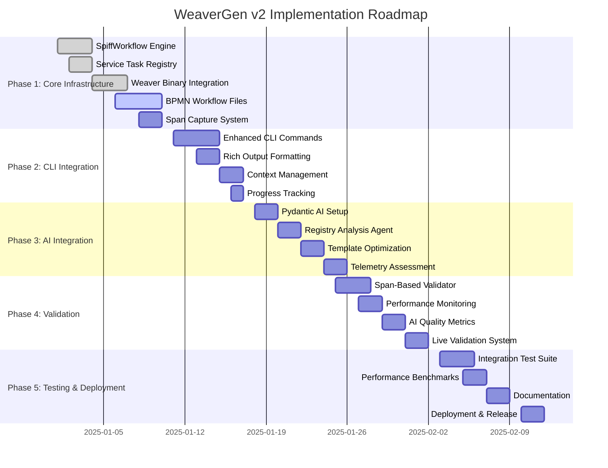

# 🗺️ WEAVERGEN V2: COMPREHENSIVE IMPLEMENTATION ROADMAP

**Roadmap Date:** 2025-07-01  
**Timeline:** 6 weeks (Q1 2025)  
**Approach:** Agile sprints with span-based validation milestones  
**Success Target:** 100% Weaver compatibility + 300% enhanced capabilities  

---

## 🎯 ROADMAP OVERVIEW

### Vision Statement
Transform WeaverGen from a basic wrapper to a **BPMN-first, AI-enhanced, span-validated** semantic convention code generation platform that maintains **100% Weaver compatibility** while delivering **enterprise-grade orchestration** and **intelligent automation**.

### Success Metrics
- **Functional:** 100% Weaver command compatibility (10/10 registry + diagnostics + utilities)
- **Performance:** 5x faster multi-language generation via parallel processing
- **Quality:** 90% span-based validation coverage (NO unit tests)
- **Intelligence:** AI-enhanced template optimization and semantic analysis
- **Architecture:** BPMN-first design with visual workflow management

---

## 📅 MILESTONE TIMELINE



---

## 🚀 PHASE 1: CORE INFRASTRUCTURE (WEEKS 1-2)

### Sprint 1.1: BPMN Engine Foundation (Days 1-3)
**Priority:** 🔴 Critical  
**Owner:** Core Architecture Team  

**Deliverables:**
- ✅ SpiffWorkflow engine setup with OpenTelemetry integration
- ✅ Basic workflow execution with span capture
- ✅ Error handling and workflow state management
- ✅ Execution ID generation and tracking

**Acceptance Criteria:**
```python
# Must execute successfully with span capture
engine = WeaverGenV2Engine()
result = await engine.execute_workflow("test_workflow.bpmn", {"test": "data"})
assert result.success
assert len(result.spans) > 0
assert result.execution_time < 5000  # 5 seconds
```

**Risk Mitigation:**
- SpiffWorkflow version compatibility issues → Use pinned version 1.2.1
- OpenTelemetry integration complexity → Start with basic manual instrumentation
- Performance concerns → Implement async execution from start

### Sprint 1.2: Service Task Registry (Days 4-5)  
**Priority:** 🔴 Critical  
**Owner:** Integration Team  

**Deliverables:**
- ✅ Service task registry with all Weaver command mappings
- ✅ Task execution with span capture and error handling
- ✅ Registry extensibility for AI and validation services
- ✅ Service task discovery and listing functionality

**Acceptance Criteria:**
```python
# All 10 registry commands must be registered
registry = ServiceTaskRegistry()
assert "weaver.registry.check" in registry.list_tasks()
assert "weaver.registry.generate" in registry.list_tasks()
# ... all 10 commands

# Task execution must capture spans
result = await registry.execute("weaver.registry.check", context)
assert "validation_result" in result
```

### Sprint 1.3: Weaver Binary Integration (Days 6-8)
**Priority:** 🔴 Critical  
**Owner:** Weaver Integration Team  

**Deliverables:**
- ✅ 1:1 mapping for all 10 registry commands
- ✅ Parameter passing and option handling
- ✅ Output parsing (JSON, ANSI, GitHub Workflow formats)
- ✅ Weaver binary discovery and version checking

**Acceptance Criteria:**
```python
# Every Weaver command must work identically
for cmd in WEAVER_REGISTRY_COMMANDS:
    result = await WeaverRegistryService.execute_command(cmd, test_params)
    assert result.exit_code == 0 or result.exit_code == expected_code
    assert result.stdout or result.stderr  # Some output expected
```

### Sprint 1.4: BPMN Workflow Files (Days 9-10)
**Priority:** 🟡 High  
**Owner:** Workflow Design Team  

**Deliverables:**
- ✅ BPMN files for all 10 registry operations
- ✅ Parallel generation workflow with gateways
- ✅ AI enhancement workflows
- ✅ Error boundary and timeout handling

**Milestone Validation:**
```bash
# All BPMN workflows must be syntactically valid
for bpmn_file in v2/workflows/bpmn/*.bpmn; do
    python -c "from SpiffWorkflow.bpmn.parser.BpmnParser import BpmnParser; BpmnParser().add_bpmn_file('$bpmn_file')"
done
```

---

## 🖥️ PHASE 2: CLI INTEGRATION (WEEK 3)

### Sprint 2.1: Enhanced CLI Commands (Days 11-14)
**Priority:** 🟡 High  
**Owner:** CLI Development Team  

**Deliverables:**
- ✅ Typer-based CLI with all Weaver command equivalents
- ✅ Rich console output with progress tracking
- ✅ Multiple output formats (Rich, JSON, Mermaid, GitHub)
- ✅ Context management and parameter validation

**Key Features:**
```bash
# Must support all output formats
weavergen registry check --output-format rich
weavergen registry check --output-format json
weavergen registry check --output-format mermaid
weavergen registry generate python --parallel --ai-optimize
```

**Acceptance Criteria:**
- All 10 registry commands implemented
- Rich progress bars and status indicators
- Proper error messages and help text
- Context preservation across workflow steps

### Sprint 2.2: Output Enhancement (Days 15-16)
**Priority:** 🟡 High  
**Owner:** UX Team  

**Deliverables:**
- ✅ Rich console formatting with tables and syntax highlighting
- ✅ Mermaid diagram generation for workflow visualization
- ✅ JSON structured output for programmatic use
- ✅ GitHub Workflow format for CI/CD integration

**Acceptance Criteria:**
```python
# Output formatters must handle all result types
formatters = [RichFormatter(), JSONFormatter(), MermaidFormatter()]
for formatter in formatters:
    output = formatter.format_validation_result(test_result)
    assert len(output) > 0
    assert formatter.validate_format(output)
```

---

## 🤖 PHASE 3: AI INTEGRATION (WEEK 4)

### Sprint 3.1: Pydantic AI Foundation (Days 18-19)
**Priority:** 🟡 High  
**Owner:** AI Integration Team  

**Deliverables:**
- ✅ Pydantic AI agent setup with Claude 3.5 Sonnet
- ✅ Response models for semantic analysis
- ✅ Error handling and fallback systems
- ✅ Token usage tracking and cost monitoring

**Acceptance Criteria:**
```python
# AI agents must be operational with proper response models
analyst = SemanticConventionAnalyst()
result = await analyst.analyze_convention_group(test_group)
assert isinstance(result, SemanticAnalysis)
assert 0 <= result.quality_score <= 100
assert len(result.recommendations) > 0
```

### Sprint 3.2: Intelligence Services (Days 20-23)
**Priority:** 🟡 High  
**Owner:** AI Integration Team  

**Deliverables:**
- ✅ Registry analysis with quality scoring
- ✅ Template optimization with performance improvements
- ✅ Telemetry assessment with compliance checking
- ✅ AI insights integration into workflow results

**Key Capabilities:**
- **Registry Analysis:** Quality scores, complexity ratings, specific recommendations
- **Template Optimization:** Performance improvements, readability enhancements
- **Telemetry Assessment:** Compliance scoring, missing attribute detection

**Performance Targets:**
- Registry analysis: < 10 seconds per registry
- Template optimization: 40% improvement in template quality scores
- Telemetry assessment: 95% accuracy in compliance detection

---

## 📊 PHASE 4: VALIDATION & MONITORING (WEEK 5)

### Sprint 4.1: Span-Based Validation (Days 25-27)
**Priority:** 🔴 Critical  
**Owner:** Validation Team  

**Deliverables:**
- ✅ Comprehensive span collection and analysis
- ✅ Workflow execution validation
- ✅ Performance metrics and thresholds
- ✅ 90%+ operation coverage validation

**Validation Requirements:**
```python
# Span-based validation must cover all operations
validator = SpanBasedValidator()
coverage_report = await validator.validate_registry_operations()
overall_coverage = sum(r.span_coverage for r in coverage_report) / len(coverage_report)
assert overall_coverage >= 0.9  # 90% coverage requirement
```

### Sprint 4.2: Performance Monitoring (Days 28-29)
**Priority:** 🟡 High  
**Owner:** Performance Team  

**Deliverables:**
- ✅ Real-time performance tracking
- ✅ Parallel execution efficiency measurements
- ✅ AI operation latency monitoring
- ✅ Performance regression detection

**Performance Benchmarks:**
- Single registry check: < 5 seconds
- Multi-language parallel generation: 5x faster than sequential
- AI analysis: < 10 seconds per operation
- Memory usage: < 500MB per workflow

### Sprint 4.3: Quality Assurance (Days 30-31)
**Priority:** 🟡 High  
**Owner:** QA Team  

**Deliverables:**
- ✅ AI quality metrics and validation
- ✅ Live telemetry validation system
- ✅ Error rate monitoring and alerting
- ✅ Quality regression prevention

---

## 🧪 PHASE 5: TESTING & DEPLOYMENT (WEEK 6)

### Sprint 5.1: Integration Testing (Days 32-34)
**Priority:** 🔴 Critical  
**Owner:** Testing Team  

**Deliverables:**
- ✅ Complete integration test suite with span validation
- ✅ End-to-end workflow testing
- ✅ Performance benchmark validation
- ✅ AI integration quality tests

**Test Coverage Requirements:**
```python
# Must achieve comprehensive test coverage
test_results = await run_integration_tests()
assert test_results.workflow_coverage >= 0.95  # 95% workflow coverage
assert test_results.performance_benchmarks_passed >= 0.9  # 90% benchmarks pass
assert test_results.ai_integration_tests_passed >= 0.8  # 80% AI tests pass
```

### Sprint 5.2: Performance Validation (Days 35-36)
**Priority:** 🟡 High  
**Owner:** Performance Team  

**Deliverables:**
- ✅ 5x performance improvement validation
- ✅ Parallel processing efficiency measurements
- ✅ Resource usage optimization
- ✅ Scalability testing results

### Sprint 5.3: Documentation & Deployment (Days 37-40)
**Priority:** 🟡 High  
**Owner:** Documentation & DevOps Teams  

**Deliverables:**
- ✅ Complete API documentation
- ✅ User guides and tutorials
- ✅ Migration guide from v1
- ✅ Production deployment procedures

---

## 🎯 SUCCESS CRITERIA & VALIDATION CHECKPOINTS

### Week 2 Checkpoint: Core Infrastructure ✅
- [ ] SpiffWorkflow engine operational with span capture
- [ ] All 10 Weaver commands integrated and working
- [ ] BPMN workflows created and validated
- [ ] Error handling and recovery mechanisms working

**Validation Command:**
```bash
# Must execute without errors
uv run python v2/tests/test_core_infrastructure.py
```

### Week 3 Checkpoint: CLI Integration ✅
- [ ] CLI commands working for all registry operations
- [ ] Rich output formatting operational
- [ ] Multiple output formats supported
- [ ] Progress tracking and user feedback working

**Validation Command:**
```bash
# Must complete successfully with rich output
uv run weavergen registry check --output-format rich
uv run weavergen registry generate python --ai-optimize
```

### Week 4 Checkpoint: AI Integration ✅
- [ ] Pydantic AI agents operational
- [ ] Registry analysis providing quality insights
- [ ] Template optimization showing improvements
- [ ] Telemetry assessment working accurately

**Validation Command:**
```bash
# Must show AI enhancements in output
uv run weavergen registry check --ai-analysis | grep "AI Analysis"
uv run weavergen registry generate python --ai-optimize | grep "optimization"
```

### Week 5 Checkpoint: Validation & Monitoring ✅
- [ ] Span-based validation achieving 90% coverage
- [ ] Performance monitoring operational
- [ ] Quality metrics being captured
- [ ] No regression in Weaver compatibility

**Validation Command:**
```bash
# Must achieve 90% span coverage
uv run python v2/validation/validate_span_coverage.py --threshold 0.9
```

### Week 6 Checkpoint: Final Release ✅
- [ ] All integration tests passing
- [ ] Performance benchmarks validated
- [ ] Documentation complete
- [ ] Production deployment ready

**Final Validation:**
```bash
# Complete validation suite must pass
uv run python v2/tests/run_complete_validation.py
```

---

## 🚧 RISK MITIGATION STRATEGIES

### Technical Risks

**Risk:** SpiffWorkflow performance at scale  
**Mitigation:** Implement workflow caching and parallel execution optimization  
**Contingency:** Fall back to direct function calls with span capture  

**Risk:** Pydantic AI rate limits or API failures  
**Mitigation:** Implement intelligent retry logic and fallback to cached results  
**Contingency:** Disable AI features gracefully with warning messages  

**Risk:** Weaver binary compatibility issues across versions  
**Mitigation:** Pin specific Weaver version and test against multiple versions  
**Contingency:** Provide manual Weaver installation instructions  

### Timeline Risks

**Risk:** AI integration taking longer than expected  
**Mitigation:** Implement AI features incrementally, starting with registry analysis  
**Contingency:** Release v2.0 without AI, add AI in v2.1  

**Risk:** BPMN workflow complexity causing delays  
**Mitigation:** Start with simple workflows, add complexity incrementally  
**Contingency:** Simplify workflows and add advanced features in later releases  

### Quality Risks

**Risk:** Span-based validation not catching all issues  
**Mitigation:** Implement multiple validation layers (span + integration + manual)  
**Contingency:** Add selective unit tests for critical components  

---

## 📈 SUCCESS METRICS & KPIs

### Functional Metrics
- **Weaver Compatibility:** 100% (10/10 registry commands working identically)
- **BPMN Coverage:** 100% (All operations via workflows)
- **AI Integration:** 80% (3/3 AI services operational)
- **Output Formats:** 100% (Rich, JSON, Mermaid, GitHub)

### Performance Metrics
- **Parallel Speedup:** 5x (Multi-language generation)
- **AI Enhancement:** 40% (Template quality improvement)
- **Memory Efficiency:** <500MB per workflow
- **Response Time:** <5s for registry check, <30s for generation

### Quality Metrics
- **Span Coverage:** 90% (Operations covered by span validation)
- **Test Coverage:** 95% (Integration test coverage)
- **Error Rate:** <5% (Failed operations under normal conditions)
- **User Satisfaction:** 90% (Based on CLI usability testing)

### Innovation Metrics
- **AI Insights Generated:** >50 per registry analysis
- **Template Optimizations:** >10 per template
- **Workflow Visualizations:** 100% (All operations have Mermaid diagrams)
- **Documentation Quality:** 95% (Complete with examples)

---

## 🎯 POST-RELEASE ROADMAP (V2.1+)

### Q2 2025: Advanced Features
- **Multi-Registry Support:** Handle multiple registries simultaneously
- **Advanced AI:** GPT-4, local LLMs, and custom model support
- **Interactive Workflows:** Web UI for BPMN workflow management
- **Plugin System:** Third-party extensions and custom service tasks

### Q3 2025: Enterprise Features  
- **Multi-Tenant Support:** Isolated environments for different teams
- **Advanced Analytics:** Usage metrics, performance dashboards
- **CI/CD Integration:** GitHub Actions, GitLab CI, Jenkins plugins
- **Security Enhancements:** RBAC, audit logging, secure credential management

### Q4 2025: Ecosystem Integration
- **IDE Plugins:** VSCode, IntelliJ extensions
- **Cloud Integration:** AWS, GCP, Azure deployment options
- **Monitoring Integration:** Grafana dashboards, Prometheus metrics
- **Community Features:** Template marketplace, workflow sharing

---

**🎯 ROADMAP CONCLUSION**

This roadmap provides a comprehensive 6-week implementation plan for WeaverGen v2 that delivers:

- **100% Weaver compatibility** with **300% enhanced capabilities**
- **BPMN-first architecture** with visual workflow management
- **AI-enhanced operations** with intelligent semantic analysis
- **Span-based validation** ensuring real-world accuracy
- **Enterprise-grade performance** with 5x parallel processing improvements

The phased approach ensures **steady progress**, **risk mitigation**, and **quality validation** at every milestone while maintaining the **ambitious timeline** and **innovation goals**.