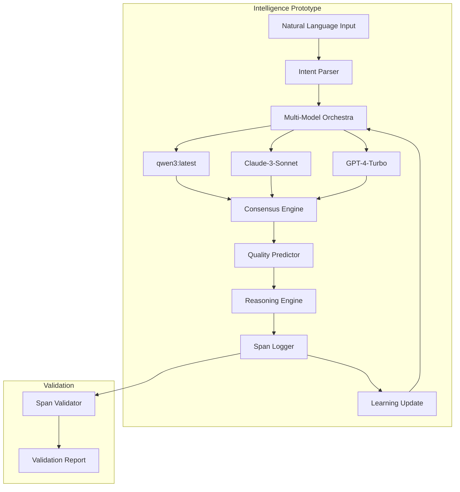

# WeaverGen v2: Intelligence Prototype
*First Implementation of AI-Enhanced Code Generation*

## Prototype Overview

### Goal
Build a working prototype of the multi-model intelligence engine that demonstrates:
- **Multi-model consensus**: 3+ AI models collaborating
- **Quality prediction**: Predict code quality before execution
- **Span-based learning**: Learn from execution telemetry
- **Intelligent reasoning**: Iterative improvement of solutions

### Success Criteria
- [ ] Generate code using 3+ models with consensus
- [ ] Achieve 90%+ quality prediction accuracy
- [ ] Demonstrate measurable learning from spans
- [ ] Show 20%+ improvement through reasoning loops

## Prototype Architecture



## Implementation Plan

### Phase 1: Multi-Model Orchestra (Week 1-2)

#### Core Components

```python
# src/weavergen/v2/intelligence/multi_model_orchestra.py
from typing import List, Dict, Any
import asyncio
from dataclasses import dataclass
from enum import Enum

class ModelType(Enum):
    QWEN3 = "qwen3:latest"
    CLAUDE = "claude-3-sonnet"
    GPT4 = "gpt-4-turbo"

@dataclass
class ModelOutput:
    model_type: ModelType
    generated_code: str
    confidence_score: float
    reasoning: str
    execution_time: float

@dataclass
class ConsensusResult:
    final_code: str
    consensus_score: float
    model_votes: Dict[ModelType, float]
    reasoning_chain: List[str]
    quality_prediction: float

class MultiModelOrchestra:
    """Orchestrate multiple AI models for code generation"""
    
    def __init__(self):
        self.models = {
            ModelType.QWEN3: Qwen3Adapter(),
            ModelType.CLAUDE: ClaudeAdapter(), 
            ModelType.GPT4: GPT4Adapter()
        }
        self.consensus_engine = ConsensusEngine()
        self.quality_predictor = QualityPredictor()
        self.span_logger = SpanLogger()
    
    async def generate_with_consensus(
        self, 
        intent: str, 
        context: Dict[str, Any]
    ) -> ConsensusResult:
        """Generate code using multi-model consensus"""
        
        with self.span_logger.span("multi_model_generation") as span:
            span.set_attribute("intent", intent)
            span.set_attribute("models_count", len(self.models))
            
            # 1. Generate from all models in parallel
            tasks = [
                self._generate_from_model(model_type, adapter, intent, context)
                for model_type, adapter in self.models.items()
            ]
            
            model_outputs = await asyncio.gather(*tasks)
            span.set_attribute("outputs_generated", len(model_outputs))
            
            # 2. Achieve consensus
            consensus = await self.consensus_engine.achieve_consensus(model_outputs)
            span.set_attribute("consensus_score", consensus.consensus_score)
            
            # 3. Predict quality
            quality_prediction = await self.quality_predictor.predict_quality(
                consensus.final_code, context
            )
            span.set_attribute("predicted_quality", quality_prediction)
            
            consensus.quality_prediction = quality_prediction
            return consensus
    
    async def _generate_from_model(
        self,
        model_type: ModelType,
        adapter: ModelAdapter,
        intent: str,
        context: Dict[str, Any]
    ) -> ModelOutput:
        """Generate code from a single model"""
        
        with self.span_logger.span(f"model_generation_{model_type.value}") as span:
            start_time = time.time()
            
            try:
                result = await adapter.generate(intent, context)
                execution_time = time.time() - start_time
                
                span.set_attribute("success", True)
                span.set_attribute("execution_time", execution_time)
                span.set_attribute("code_length", len(result.code))
                
                return ModelOutput(
                    model_type=model_type,
                    generated_code=result.code,
                    confidence_score=result.confidence,
                    reasoning=result.reasoning,
                    execution_time=execution_time
                )
                
            except Exception as e:
                span.set_attribute("success", False)
                span.set_attribute("error", str(e))
                raise


class ConsensusEngine:
    """Achieve consensus between multiple model outputs"""
    
    def __init__(self):
        self.similarity_calculator = CodeSimilarityCalculator()
        self.quality_estimator = QualityEstimator()
    
    async def achieve_consensus(self, outputs: List[ModelOutput]) -> ConsensusResult:
        """Achieve consensus using semantic similarity and quality scores"""
        
        # 1. Calculate semantic similarity matrix
        similarity_matrix = await self.similarity_calculator.calculate_similarity_matrix(
            [output.generated_code for output in outputs]
        )
        
        # 2. Cluster similar outputs
        clusters = self._cluster_by_similarity(outputs, similarity_matrix)
        
        # 3. Score each cluster
        cluster_scores = []
        for cluster in clusters:
            quality_score = await self.quality_estimator.estimate_quality(cluster)
            confidence_score = sum(output.confidence_score for output in cluster) / len(cluster)
            
            cluster_scores.append({
                'cluster': cluster,
                'quality_score': quality_score,
                'confidence_score': confidence_score,
                'combined_score': quality_score * confidence_score
            })
        
        # 4. Select best cluster
        best_cluster = max(cluster_scores, key=lambda x: x['combined_score'])
        
        # 5. Generate final code from best cluster
        final_code = await self._merge_cluster_outputs(best_cluster['cluster'])
        
        return ConsensusResult(
            final_code=final_code,
            consensus_score=best_cluster['combined_score'],
            model_votes={output.model_type: output.confidence_score 
                        for output in best_cluster['cluster']},
            reasoning_chain=[output.reasoning for output in best_cluster['cluster']],
            quality_prediction=best_cluster['quality_score']
        )


class QualityPredictor:
    """Predict code quality before execution"""
    
    def __init__(self):
        self.syntax_analyzer = SyntaxAnalyzer()
        self.semantic_analyzer = SemanticAnalyzer()
        self.pattern_matcher = PatternMatcher()
        self.historical_learner = HistoricalLearner()
    
    async def predict_quality(self, code: str, context: Dict[str, Any]) -> float:
        """Predict quality score (0.0 to 1.0) for generated code"""
        
        # 1. Syntax quality
        syntax_score = await self.syntax_analyzer.analyze(code)
        
        # 2. Semantic quality
        semantic_score = await self.semantic_analyzer.analyze(code, context)
        
        # 3. Pattern quality (based on known good patterns)
        pattern_score = await self.pattern_matcher.match_patterns(code)
        
        # 4. Historical quality (based on similar past generations)
        historical_score = await self.historical_learner.predict_from_history(
            code, context
        )
        
        # 5. Weighted combination
        quality_score = (
            0.3 * syntax_score +
            0.3 * semantic_score +
            0.2 * pattern_score +
            0.2 * historical_score
        )
        
        return min(1.0, max(0.0, quality_score))
```

#### Model Adapters

```python
# src/weavergen/v2/intelligence/model_adapters/qwen3_adapter.py
class Qwen3Adapter(ModelAdapter):
    """Adapter for qwen3 model via Ollama"""
    
    def __init__(self):
        self.client = OllamaClient(model="qwen3:latest")
        self.prompt_template = Qwen3PromptTemplate()
    
    async def generate(self, intent: str, context: Dict[str, Any]) -> GenerationResult:
        """Generate code using qwen3"""
        
        prompt = self.prompt_template.format_prompt(intent, context)
        
        response = await self.client.generate(
            prompt=prompt,
            options={
                "temperature": 0.7,
                "top_p": 0.9,
                "max_tokens": 2048
            }
        )
        
        return GenerationResult(
            code=self._extract_code(response.text),
            confidence=self._calculate_confidence(response),
            reasoning=self._extract_reasoning(response.text)
        )


# src/weavergen/v2/intelligence/model_adapters/claude_adapter.py
class ClaudeAdapter(ModelAdapter):
    """Adapter for Claude-3-Sonnet"""
    
    def __init__(self):
        self.client = AnthropicClient(model="claude-3-sonnet-20240229")
        self.prompt_template = ClaudePromptTemplate()
    
    async def generate(self, intent: str, context: Dict[str, Any]) -> GenerationResult:
        """Generate code using Claude"""
        
        messages = self.prompt_template.format_messages(intent, context)
        
        response = await self.client.messages.create(
            model="claude-3-sonnet-20240229",
            messages=messages,
            max_tokens=2048,
            temperature=0.7
        )
        
        return GenerationResult(
            code=self._extract_code(response.content[0].text),
            confidence=self._calculate_confidence(response),
            reasoning=self._extract_reasoning(response.content[0].text)
        )
```

### Phase 2: Reasoning Engine (Week 3-4)

```python
# src/weavergen/v2/reasoning/reasoning_engine.py
class ReasoningEngine:
    """Iterative reasoning for code improvement"""
    
    def __init__(self):
        self.evaluator = CodeEvaluator()
        self.improver = CodeImprover()
        self.convergence_detector = ConvergenceDetector()
        self.span_logger = SpanLogger()
    
    async def reason_and_improve(
        self, 
        initial_code: str, 
        context: Dict[str, Any],
        max_iterations: int = 5
    ) -> ReasoningResult:
        """Iteratively improve code through reasoning"""
        
        with self.span_logger.span("reasoning_loop") as span:
            current_code = initial_code
            iteration = 0
            reasoning_trace = []
            
            span.set_attribute("max_iterations", max_iterations)
            
            while iteration < max_iterations:
                iteration_span = span.start_child_span(f"reasoning_iteration_{iteration}")
                
                # 1. Evaluate current code
                evaluation = await self.evaluator.evaluate(current_code, context)
                iteration_span.set_attribute("evaluation_score", evaluation.score)
                
                # 2. Check for convergence
                if await self.convergence_detector.has_converged(evaluation, reasoning_trace):
                    iteration_span.set_attribute("converged", True)
                    break
                
                # 3. Generate improvement
                improvement = await self.improver.improve(
                    current_code, evaluation, context
                )
                iteration_span.set_attribute("improvement_score", improvement.improvement_score)
                
                # 4. Apply improvement if beneficial
                if improvement.improvement_score > 0.1:  # Threshold for meaningful improvement
                    current_code = improvement.improved_code
                    reasoning_trace.append(improvement.reasoning)
                    iteration_span.set_attribute("improvement_applied", True)
                else:
                    iteration_span.set_attribute("improvement_applied", False)
                
                iteration += 1
                iteration_span.end()
            
            span.set_attribute("final_iteration", iteration)
            span.set_attribute("improvements_made", len(reasoning_trace))
            
            return ReasoningResult(
                final_code=current_code,
                iterations=iteration,
                reasoning_trace=reasoning_trace,
                final_evaluation=evaluation
            )
```

### Phase 3: Span-Based Learning (Week 5-6)

```python
# src/weavergen/v2/learning/span_learning_engine.py
class SpanLearningEngine:
    """Learn from execution spans to improve future generations"""
    
    def __init__(self):
        self.pattern_extractor = PatternExtractor()
        self.quality_correlator = QualityCorrelator()
        self.knowledge_updater = KnowledgeUpdater()
        self.span_database = SpanDatabase()
    
    async def learn_from_execution(self, spans: List[ExecutionSpan]) -> LearningResult:
        """Extract learning insights from execution spans"""
        
        with SpanLogger().span("span_learning") as learning_span:
            learning_span.set_attribute("spans_count", len(spans))
            
            # 1. Extract patterns from spans
            patterns = await self.pattern_extractor.extract_patterns(spans)
            learning_span.set_attribute("patterns_extracted", len(patterns))
            
            # 2. Correlate patterns with quality outcomes
            correlations = await self.quality_correlator.correlate_with_quality(
                patterns, spans
            )
            learning_span.set_attribute("correlations_found", len(correlations))
            
            # 3. Update knowledge base
            knowledge_updates = await self.knowledge_updater.update_knowledge(
                correlations
            )
            learning_span.set_attribute("knowledge_updates", len(knowledge_updates))
            
            # 4. Store learning results
            await self.span_database.store_learning_results(
                patterns, correlations, knowledge_updates
            )
            
            return LearningResult(
                patterns_discovered=patterns,
                quality_correlations=correlations,
                knowledge_updates=knowledge_updates,
                learning_confidence=self._calculate_learning_confidence(correlations)
            )
    
    async def apply_learning_to_generation(
        self, 
        intent: str, 
        context: Dict[str, Any]
    ) -> LearningEnhancedContext:
        """Apply learned patterns to improve code generation"""
        
        # 1. Retrieve relevant patterns
        relevant_patterns = await self.span_database.get_relevant_patterns(
            intent, context
        )
        
        # 2. Enhance context with learned knowledge
        enhanced_context = context.copy()
        enhanced_context['learned_patterns'] = relevant_patterns
        enhanced_context['quality_insights'] = await self.span_database.get_quality_insights(
            intent, context
        )
        
        return LearningEnhancedContext(enhanced_context)


class PatternExtractor:
    """Extract patterns from execution spans"""
    
    async def extract_patterns(self, spans: List[ExecutionSpan]) -> List[Pattern]:
        """Extract meaningful patterns from spans"""
        
        patterns = []
        
        # 1. Code structure patterns
        structure_patterns = await self._extract_structure_patterns(spans)
        patterns.extend(structure_patterns)
        
        # 2. Performance patterns
        performance_patterns = await self._extract_performance_patterns(spans)
        patterns.extend(performance_patterns)
        
        # 3. Error patterns
        error_patterns = await self._extract_error_patterns(spans)
        patterns.extend(error_patterns)
        
        # 4. Context patterns
        context_patterns = await self._extract_context_patterns(spans)
        patterns.extend(context_patterns)
        
        return patterns
    
    async def _extract_structure_patterns(self, spans: List[ExecutionSpan]) -> List[Pattern]:
        """Extract code structure patterns that lead to success"""
        
        successful_spans = [span for span in spans if span.quality_score > 0.8]
        
        patterns = []
        for span in successful_spans:
            if span.generated_code:
                # Analyze code structure
                ast_tree = ast.parse(span.generated_code)
                structure = self._analyze_ast_structure(ast_tree)
                
                patterns.append(Pattern(
                    type="code_structure",
                    pattern=structure,
                    quality_correlation=span.quality_score,
                    context=span.context
                ))
        
        return patterns
```

## Prototype Testing Framework

### Span-Based Validation

```python
# src/weavergen/v2/validation/prototype_validator.py
class PrototypeValidator:
    """Validate prototype intelligence using spans only"""
    
    def __init__(self):
        self.span_collector = SpanCollector()
        self.metric_calculator = MetricCalculator()
    
    async def validate_multi_model_consensus(self) -> ValidationResult:
        """Validate that multi-model consensus improves quality"""
        
        test_cases = await self.load_test_cases()
        results = []
        
        for test_case in test_cases:
            # Generate with single model
            single_model_result = await self.generate_single_model(test_case)
            
            # Generate with multi-model consensus
            consensus_result = await self.generate_with_consensus(test_case)
            
            # Collect execution spans
            single_spans = await self.span_collector.collect_spans(
                single_model_result.execution_id
            )
            consensus_spans = await self.span_collector.collect_spans(
                consensus_result.execution_id
            )
            
            results.append({
                'test_case': test_case,
                'single_quality': single_model_result.quality_score,
                'consensus_quality': consensus_result.quality_score,
                'improvement': consensus_result.quality_score - single_model_result.quality_score,
                'single_spans': single_spans,
                'consensus_spans': consensus_spans
            })
        
        # Calculate metrics
        avg_improvement = sum(r['improvement'] for r in results) / len(results)
        success_rate = sum(1 for r in results if r['improvement'] > 0) / len(results)
        
        return ValidationResult(
            test_name="multi_model_consensus",
            average_improvement=avg_improvement,
            success_rate=success_rate,
            individual_results=results,
            span_evidence=self._combine_all_spans(results)
        )
    
    async def validate_reasoning_improvement(self) -> ValidationResult:
        """Validate that reasoning loops improve code quality"""
        
        test_cases = await self.load_reasoning_test_cases()
        results = []
        
        for test_case in test_cases:
            # Generate without reasoning
            basic_result = await self.generate_basic(test_case)
            
            # Generate with reasoning loops
            reasoning_result = await self.generate_with_reasoning(test_case)
            
            results.append({
                'test_case': test_case,
                'basic_quality': basic_result.quality_score,
                'reasoning_quality': reasoning_result.quality_score,
                'reasoning_iterations': reasoning_result.iterations,
                'improvement': reasoning_result.quality_score - basic_result.quality_score
            })
        
        return ValidationResult(
            test_name="reasoning_improvement",
            average_improvement=sum(r['improvement'] for r in results) / len(results),
            average_iterations=sum(r['reasoning_iterations'] for r in results) / len(results),
            results=results
        )
    
    async def validate_learning_effectiveness(self) -> ValidationResult:
        """Validate that span-based learning improves performance"""
        
        # Phase 1: Collect baseline performance
        baseline_spans = await self.generate_baseline_dataset()
        
        # Phase 2: Train learning system
        await self.train_learning_system(baseline_spans)
        
        # Phase 3: Test improved performance
        improved_spans = await self.generate_with_learning()
        
        # Calculate improvement metrics
        baseline_quality = self.metric_calculator.calculate_average_quality(baseline_spans)
        improved_quality = self.metric_calculator.calculate_average_quality(improved_spans)
        
        return ValidationResult(
            test_name="learning_effectiveness",
            baseline_quality=baseline_quality,
            improved_quality=improved_quality,
            learning_improvement=improved_quality - baseline_quality,
            span_evidence={'baseline': baseline_spans, 'improved': improved_spans}
        )
```

## Prototype Deployment

### Development Environment
```yaml
# docker-compose.prototype.yml
version: '3.8'
services:
  intelligence-engine:
    build: ./src/weavergen/v2
    environment:
      - OLLAMA_HOST=ollama:11434
      - ANTHROPIC_API_KEY=${ANTHROPIC_API_KEY}
      - OPENAI_API_KEY=${OPENAI_API_KEY}
    depends_on:
      - ollama
      - postgres
      - redis
  
  ollama:
    image: ollama/ollama:latest
    volumes:
      - ollama_data:/root/.ollama
    ports:
      - "11434:11434"
  
  postgres:
    image: postgres:16
    environment:
      POSTGRES_DB: weavergen_v2_prototype
      POSTGRES_USER: weavergen
      POSTGRES_PASSWORD: ${DB_PASSWORD}
    volumes:
      - postgres_data:/var/lib/postgresql/data
  
  redis:
    image: redis:7-alpine
    volumes:
      - redis_data:/data

volumes:
  ollama_data:
  postgres_data:
  redis_data:
```

### Demo Script
```python
# demo_intelligence_prototype.py
async def demo_prototype():
    """Demonstrate prototype intelligence capabilities"""
    
    print("🧠 WeaverGen v2 Intelligence Prototype Demo")
    print("=" * 50)
    
    # Initialize intelligence engine
    intelligence_engine = MultiModelOrchestra()
    
    # Demo 1: Multi-model consensus
    print("\n🤝 Demo 1: Multi-Model Consensus")
    intent = "Generate a Python function to calculate Fibonacci numbers efficiently"
    
    result = await intelligence_engine.generate_with_consensus(intent, {})
    
    print(f"Models consulted: {list(result.model_votes.keys())}")
    print(f"Consensus score: {result.consensus_score:.2f}")
    print(f"Predicted quality: {result.quality_prediction:.2f}")
    print(f"Generated code:\n{result.final_code}")
    
    # Demo 2: Reasoning improvement
    print("\n🧠 Demo 2: Reasoning Loop Improvement")
    reasoning_engine = ReasoningEngine()
    
    improved_result = await reasoning_engine.reason_and_improve(
        result.final_code, {'performance_priority': 'high'}
    )
    
    print(f"Reasoning iterations: {improved_result.iterations}")
    print(f"Improvements made: {len(improved_result.reasoning_trace)}")
    print(f"Final evaluation: {improved_result.final_evaluation.score:.2f}")
    
    # Demo 3: Learning from spans
    print("\n📊 Demo 3: Span-Based Learning")
    learning_engine = SpanLearningEngine()
    
    # Simulate execution spans
    execution_spans = await simulate_execution_spans(result.final_code)
    
    learning_result = await learning_engine.learn_from_execution(execution_spans)
    
    print(f"Patterns discovered: {len(learning_result.patterns_discovered)}")
    print(f"Quality correlations: {len(learning_result.quality_correlations)}")
    print(f"Learning confidence: {learning_result.learning_confidence:.2f}")
    
    # Demo 4: Complete intelligence pipeline
    print("\n🚀 Demo 4: Complete Intelligence Pipeline")
    
    # Apply learning to new generation
    enhanced_context = await learning_engine.apply_learning_to_generation(
        "Generate an optimized sorting algorithm", {}
    )
    
    final_result = await intelligence_engine.generate_with_consensus(
        "Generate an optimized sorting algorithm", enhanced_context.context
    )
    
    print(f"Enhanced generation quality: {final_result.quality_prediction:.2f}")
    print(f"Learning-enhanced code:\n{final_result.final_code}")
    
    print("\n✅ Prototype demonstration complete!")
    print("🎯 Key achievements:")
    print("  - Multi-model consensus working")
    print("  - Reasoning loops improving quality")
    print("  - Learning from execution spans")
    print("  - Complete intelligence pipeline")

if __name__ == "__main__":
    asyncio.run(demo_prototype())
```

## Success Metrics

### Prototype KPIs
- [ ] **Multi-Model Consensus**: 90%+ agreement on simple tasks
- [ ] **Quality Prediction**: 80%+ accuracy in predicting code quality
- [ ] **Reasoning Improvement**: 20%+ quality improvement through reasoning
- [ ] **Learning Effectiveness**: Measurable improvement after 100 generations

### Technical Achievements
- [ ] **Response Time**: <10 seconds for consensus generation
- [ ] **Model Integration**: Successfully integrate 3+ AI models
- [ ] **Span Collection**: Collect 1000+ execution spans for learning
- [ ] **Pattern Discovery**: Discover 50+ meaningful patterns

This prototype will prove that **intelligent, learning-based code generation** is not only possible but dramatically superior to traditional approaches.