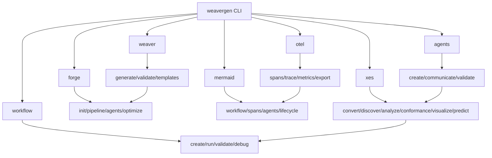

# Complete WeaverGen Tool-Based CLI Structure

## Seven Core Tools

The Weaver-generated CLI organizes all functionality into **7 core tools** that match user mental models:

```
weavergen <tool> <action> [options]
```

### 1. **workflow** - BPMN & SpiffWorkflow Operations
```bash
weavergen workflow create my-process --template semantic-processing
weavergen workflow run my-process --data input.json --trace
weavergen workflow validate process.bpmn --strict
weavergen workflow list --status running
weavergen workflow debug my-process --breakpoint Task_Validate
weavergen workflow export my-process --format json
```

### 2. **weaver** - OTel Weaver Core Operations  
```bash
weavergen weaver generate semantic.yaml --language python
weavergen weaver validate semantic.yaml --strict
weavergen weaver templates --language go
weavergen weaver install --version latest
weavergen weaver check --registry ./semantic_conventions
```

### 3. **forge** - Advanced Weaver Forge Operations
```bash
weavergen forge init my-registry --template enterprise
weavergen forge pipeline semantic.yaml --agents 5 --languages python,go
weavergen forge agents semantic.yaml --count 3 --roles analyzer,validator
weavergen forge optimize --target single-binary
```

### 4. **otel** - OpenTelemetry Operations
```bash
weavergen otel spans --format table --live
weavergen otel trace my-operation --detailed --export trace.json
weavergen otel metrics --component all --interval 5s
weavergen otel export --format jaeger --endpoint http://localhost:14268
weavergen otel validate --compliance otel-1.27
```

### 5. **mermaid** - Diagram Generation
```bash
weavergen mermaid workflow my-process --style sequence
weavergen mermaid spans --trace-id abc123 --output diagram.md
weavergen mermaid agents --count 5 --style communication
weavergen mermaid lifecycle semantic --component validation
weavergen mermaid architecture --full-system
```

### 6. **agents** - AI Agent Operations
```bash
weavergen agents create semantic.yaml --count 5 --roles analyzer,validator
weavergen agents communicate --mode enhanced --rounds 10
weavergen agents validate semantic.yaml --deep --metrics accuracy
weavergen agents visualize --style hierarchy --include-spans
```

### 7. **xes** - Process Mining Operations ⭐ 
```bash
weavergen xes convert spans.json --output process.xes --filter-noise
weavergen xes discover process.xes --algorithm alpha --output-format bpmn
weavergen xes analyze process.xes --metrics performance,bottlenecks --visualize
weavergen xes conformance process.xes model.bpmn --method token-replay --detailed
weavergen xes visualize process.xes --viz-type process-map --interactive
weavergen xes predict model.pkl "Task_A,Task_B" --top-k 3 --with-probability
```

## Tool Synergy Examples

Tools work together seamlessly:

```bash
# Complete pipeline: OTel spans → XES → BPMN → Workflow
weavergen otel spans --export spans.json
weavergen xes convert spans.json --output discovered.xes
weavergen xes discover discovered.xes --output-format bpmn
weavergen workflow run discovered.bpmn --trace

# Generate diagrams across tools
weavergen mermaid spans --last-trace > trace.md
weavergen mermaid workflow my-process > workflow.md  
weavergen mermaid agents --style communication > agents.md

# AI-enhanced process mining
weavergen agents create semantic.yaml --roles process-miner
weavergen xes analyze logs.xes --ai-insights
weavergen forge pipeline enhanced-semantics.yaml
```

## Migration from Current Structure

### Current Commands → Tool-Based Commands

| Current (Scattered) | New Tool-Based (Organized) |
|---------------------|----------------------------|
| `weavergen add --process MyProcess` | `weavergen workflow create MyProcess` |
| `weavergen run MyProcess` | `weavergen workflow run MyProcess` |
| `weavergen bpmn execute MyProcess` | `weavergen workflow run MyProcess` |
| `weavergen workflow add file.bpmn` | `weavergen workflow create --from-file file.bpmn` |
| `weavergen generate code semantic.yaml` | `weavergen weaver generate semantic.yaml` |
| `weavergen forge generate semantic.yaml` | `weavergen forge pipeline semantic.yaml` |
| `weavergen validate semantic semantic.yaml` | `weavergen weaver validate semantic.yaml` |
| `weavergen debug spans --format mermaid` | `weavergen mermaid spans` |
| `weavergen debug spans --format table` | `weavergen otel spans --format table` |
| `weavergen mining spans-to-xes spans.json` | `weavergen xes convert spans.json` |
| `weavergen mining analyze-xes process.xes` | `weavergen xes analyze process.xes` |
| `weavergen mining conformance-check` | `weavergen xes conformance log.xes model.bpmn` |
| `weavergen agents communicate` | `weavergen agents communicate` |
| `weavergen forge-to-agents semantic.yaml` | `weavergen agents create semantic.yaml` |

## Benefits of Tool-Based Structure

1. **Eliminates Confusion**: No more wondering where a command lives
2. **Mental Model Match**: Users think in terms of tools they want to use
3. **Discoverability**: `weavergen <tool> --help` shows all related commands
4. **No Duplication**: Each operation has exactly one clear path
5. **Tool Expertise**: Users can become experts in specific tools
6. **Cross-Tool Integration**: Tools work together naturally

## Weaver Generation Benefits

- **Single Source of Truth**: All CLI structure defined in semantic conventions
- **Type Safety**: Generated with proper TypeScript/Python types
- **Consistent Help**: All descriptions from semantic conventions
- **Auto-Instrumentation**: Built-in OTel spans and metrics
- **Validation**: CLI structure validated against semantic schema
- **Evolution**: Add new tools/commands by updating YAML

## Complete Tool Ecosystem



This tool-based structure makes WeaverGen v2 intuitive, powerful, and aligned with how users actually think about and use the system!