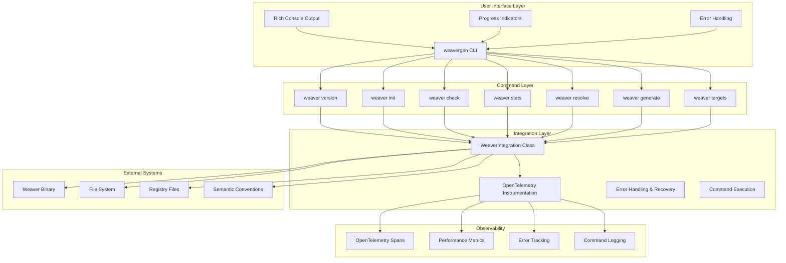
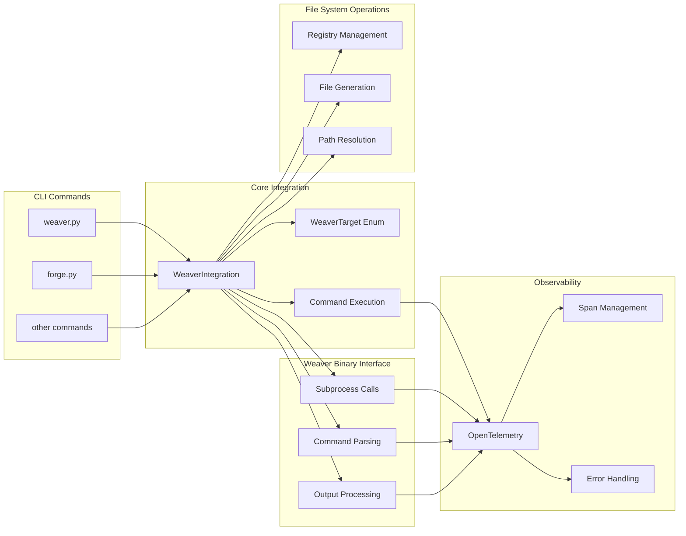
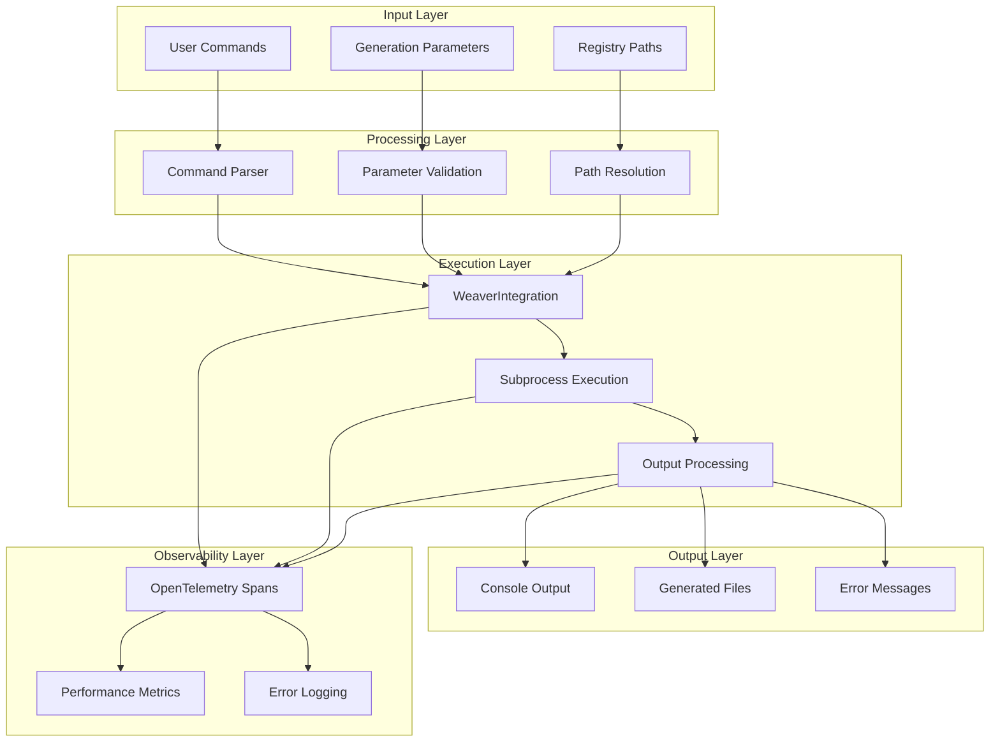
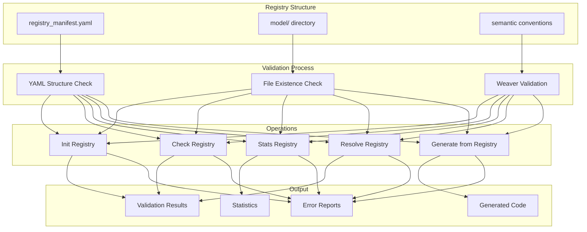
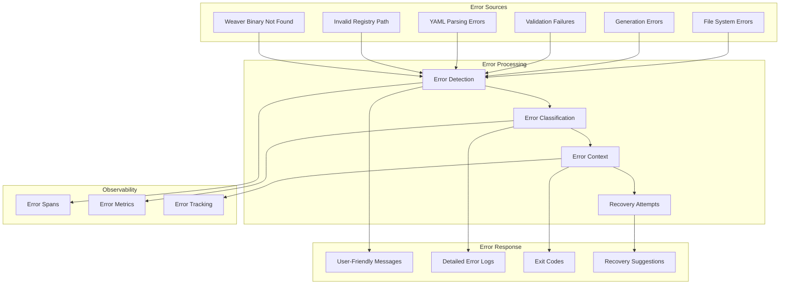
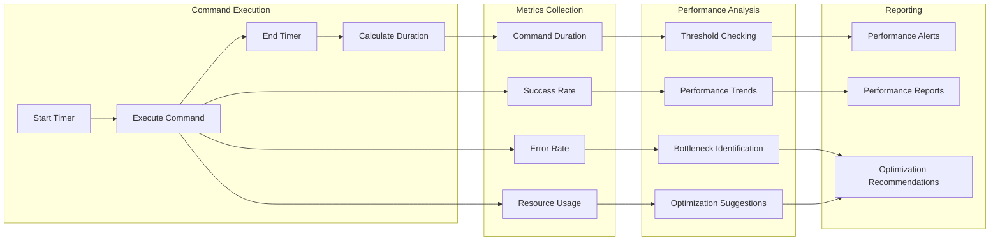
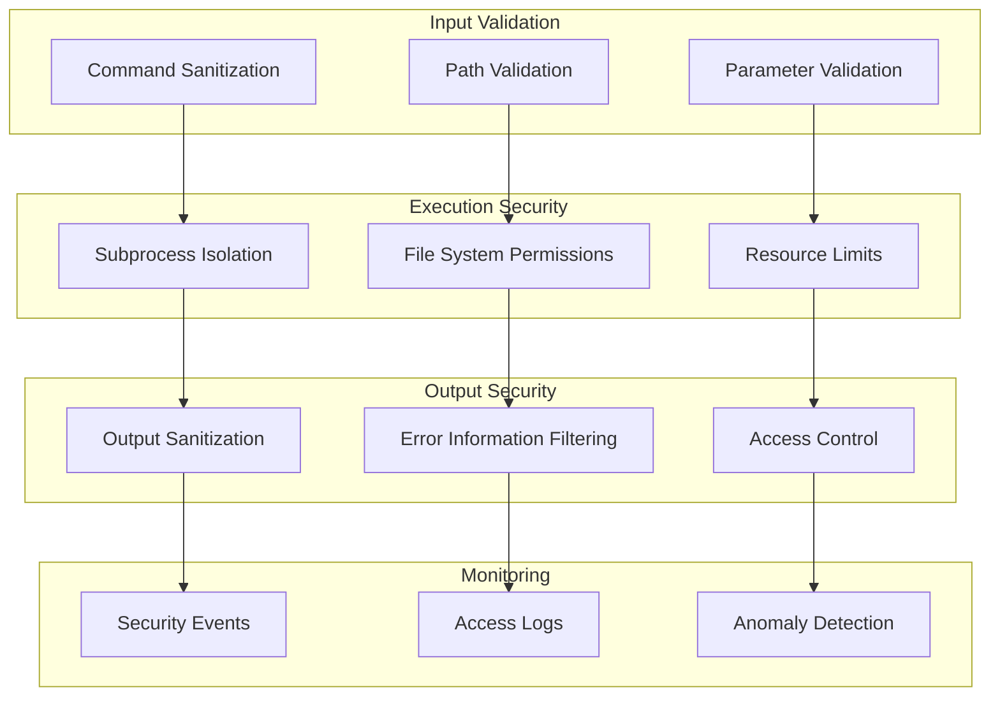
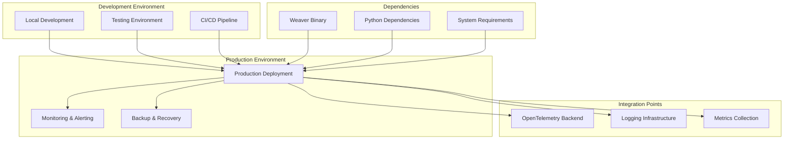
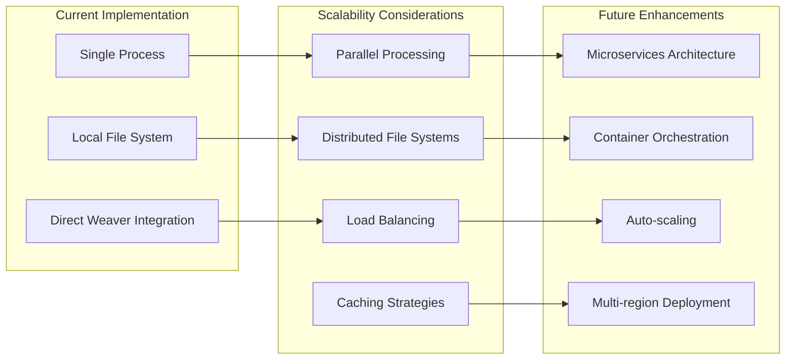

# Weaver Command Architecture Diagrams

This document contains comprehensive architecture diagrams showing the overall system structure, component relationships, and data flow patterns for the Weaver command integration.

## System Architecture Overview

## Component Relationship Diagram

## Data Flow Architecture

## Registry Management Architecture

## Error Handling Architecture

## Performance Monitoring Architecture

## Security Architecture

## Deployment Architecture

## Scalability Architecture

These architecture diagrams provide a comprehensive view of the Weaver command integration system, showing how different components interact, how data flows through the system, and how the system can be scaled and maintained. 