# Weaver Command Diagrams

This document contains Mermaid diagrams for each Weaver command, showing their workflows, user interactions, and system components.

## 1. Version Command

## 2. Init Command

## 3. Check Command

## 4. Stats Command

## 5. Resolve Command

```mermaid
flowchart TD
    A[User: weavergen weaver resolve <registry>] --> B[CLI: Parse arguments]
    B --> C[WeaverIntegration: resolve_registry]
    C --> D[Subprocess: weaver registry resolve]
    D --> E{Resolve successful?}
    E -->|Yes| F[Get resolved file path]
    E -->|No| G[Error: Resolve failed]
    F --> H[Display: ✓ Registry resolved successfully]
    G --> I[Display error message]
    H --> J[Display: 📁 Resolved file path]
    I --> K[Exit with error]
    J --> L[Calculate file size]
    L --> M[Display: 📏 File size]
    M --> N[OpenTelemetry: Record span]
    N --> O[End]
```

## 6. Generate Command

```mermaid
flowchart TD
    A[User: weavergen weaver generate <registry>] --> B[CLI: Parse arguments]
    B --> C[Map target to WeaverTarget enum]
    C --> D{Target supported?}
    D -->|No| E[Error: Unsupported target]
    D -->|Yes| F[Parse template parameters]
    E --> G[Display supported targets]
    F --> H[Configure Weaver settings]
    G --> I[Exit with error]
    H --> I[Progress: Validating registry]
    I --> J[WeaverIntegration: check_registry]
    J --> K{Validation successful?}
    K -->|No| L[Error: Validation failed]
    K -->|Yes| M[Progress: Generating code]
    L --> N[Display validation errors]
    M --> O[WeaverIntegration: generate_code]
    N --> P[Exit with error]
    O --> Q[Subprocess: weaver registry generate]
    Q --> R{Generation successful?}
    R -->|Yes| S[Display: ✓ Generated code]
    R -->|No| T[Error: Generation failed]
    S --> U[List generated files]
    T --> V[Display error details]
    U --> W[Display diagnostics]
    V --> X[Exit with error]
    W --> Y[OpenTelemetry: Record span]
    Y --> Z[End]
```

## 7. Targets Command

## System Architecture Overview

## Error Handling Flow

## OpenTelemetry Instrumentation

## Registry Validation Flow

## Code Generation Flow

## Performance Monitoring

These diagrams provide a comprehensive view of how each Weaver command operates, their error handling strategies, and their integration with the broader WeaverGen ecosystem. 