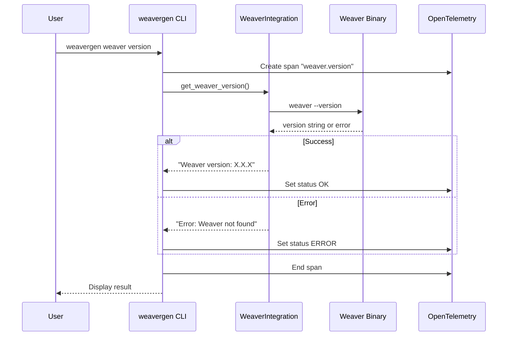
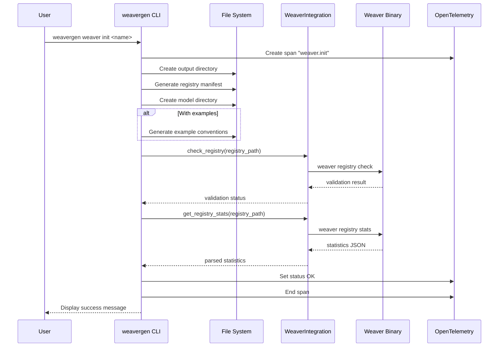
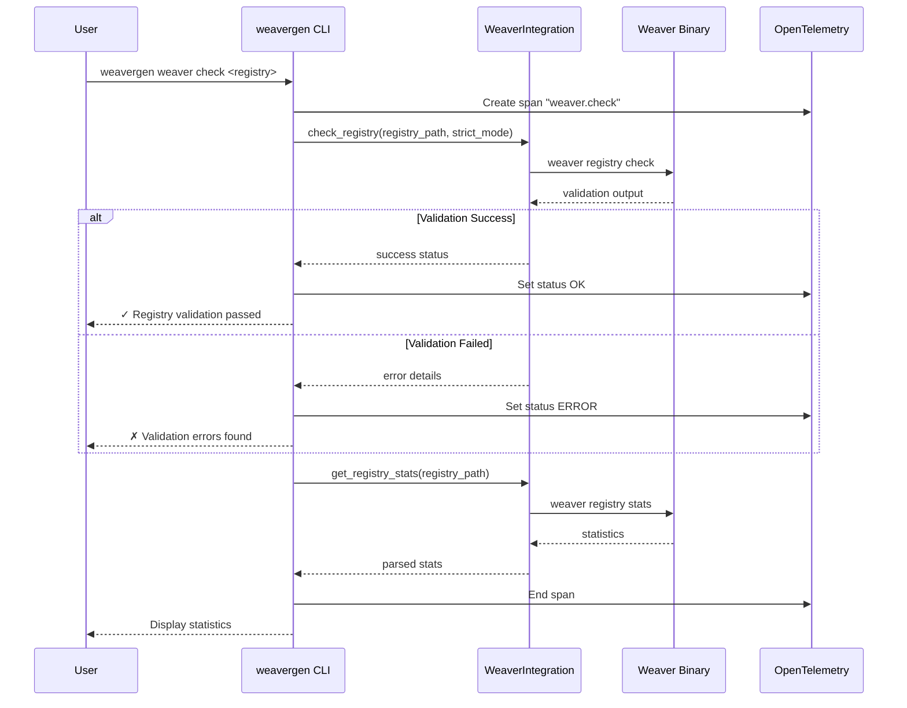
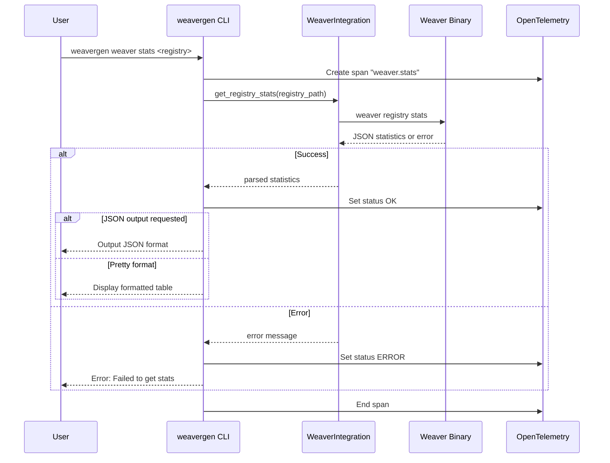
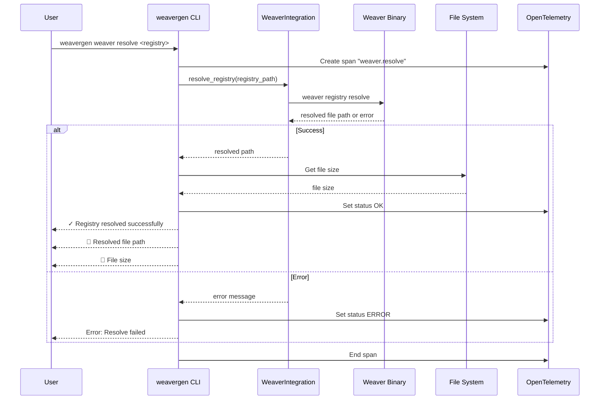
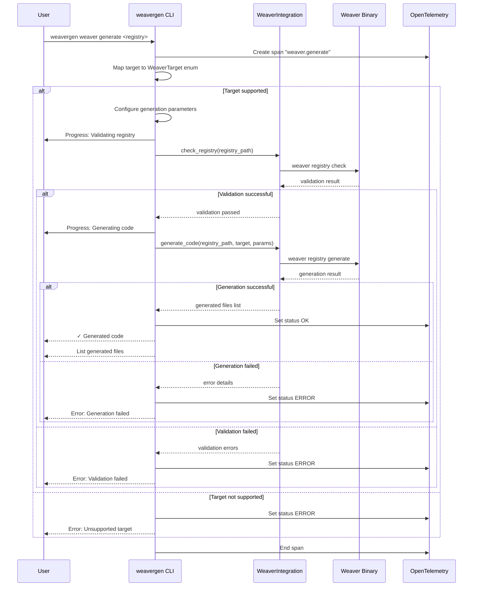
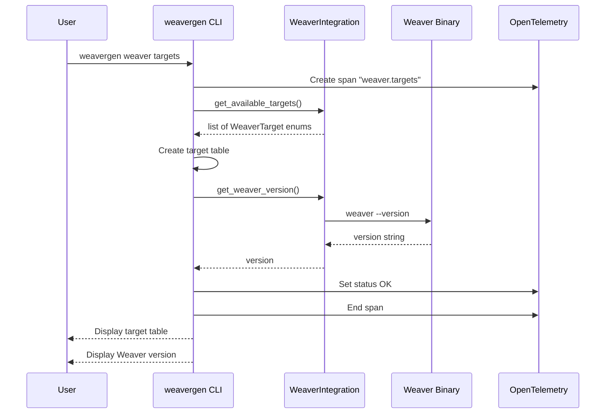
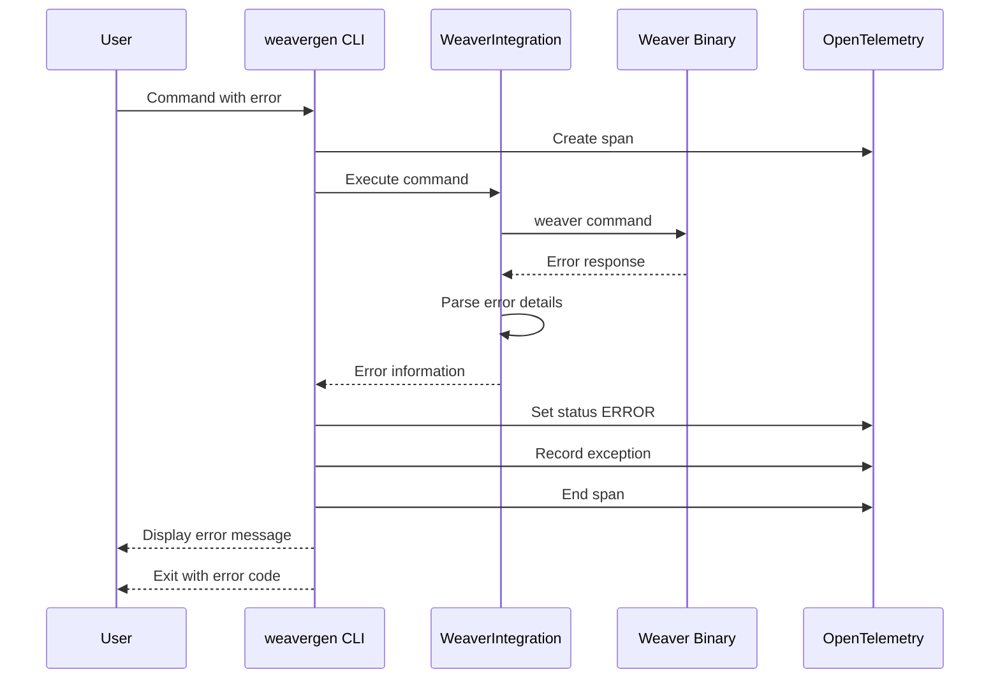
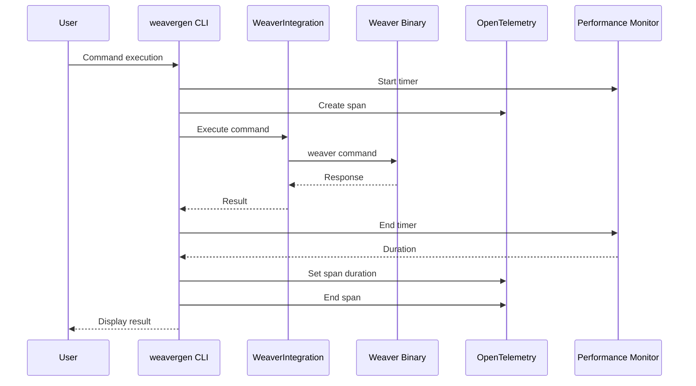
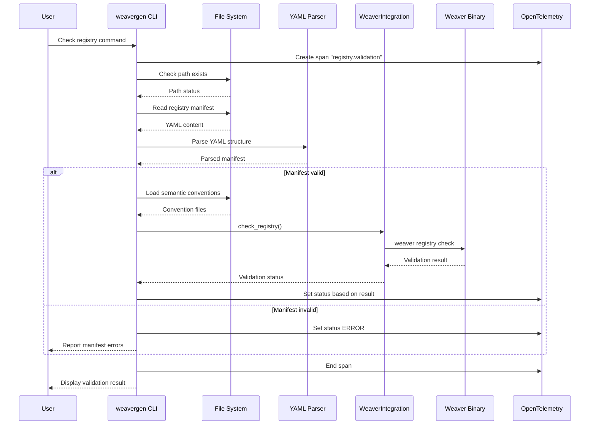

# Weaver Command Sequence Diagrams

This document contains sequence diagrams showing the interaction flows between different components for each Weaver command.

## 1. Version Command Sequence

## 2. Init Command Sequence

## 3. Check Command Sequence

## 4. Stats Command Sequence

## 5. Resolve Command Sequence

## 6. Generate Command Sequence

## 7. Targets Command Sequence

## Error Handling Sequence

## Performance Monitoring Sequence

## Registry Validation Sequence

These sequence diagrams provide detailed views of how each component interacts during command execution, showing the flow of data and control between the user interface, WeaverGen integration layer, Weaver binary, and OpenTelemetry instrumentation. 